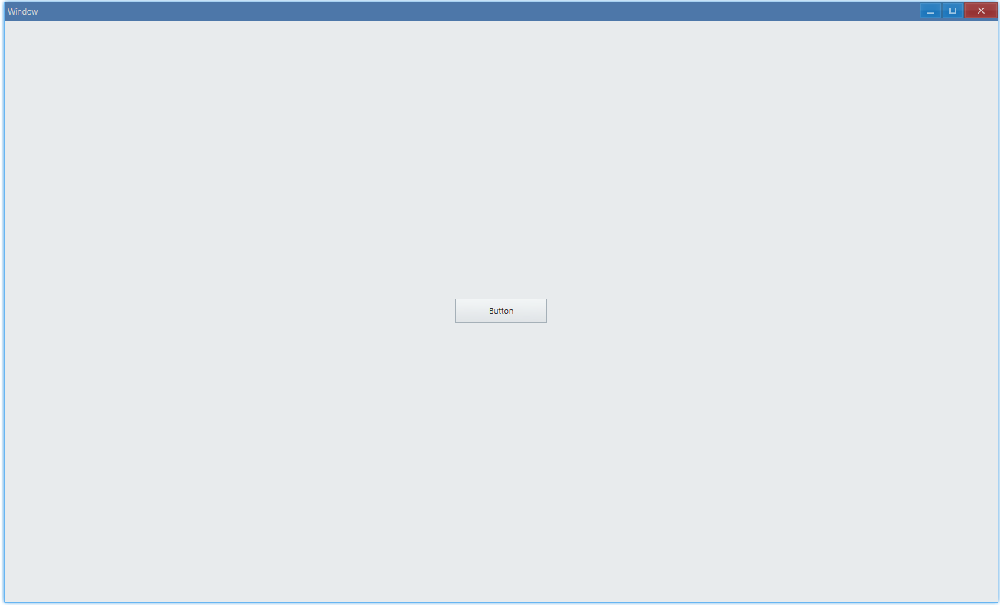
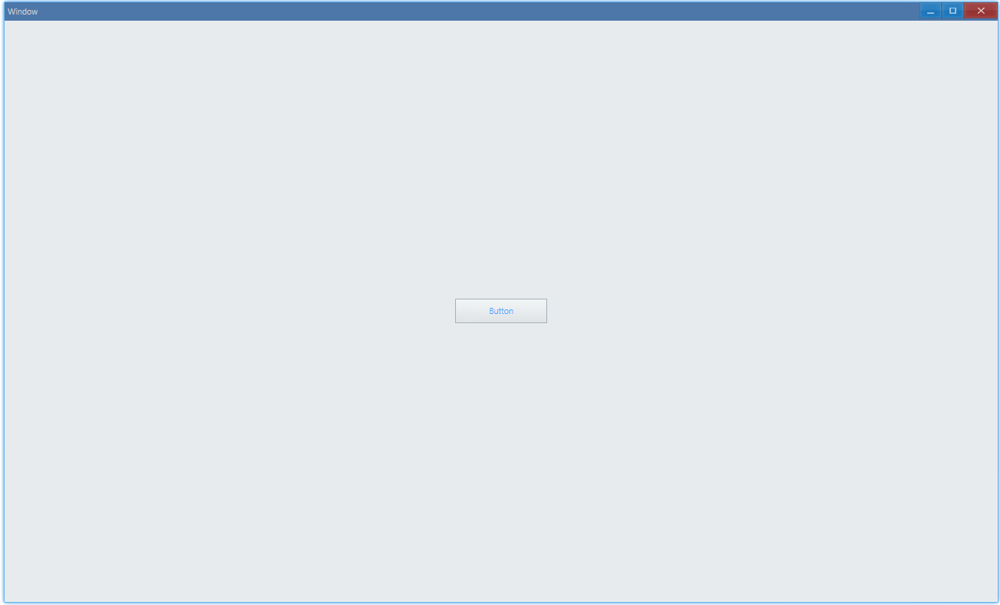
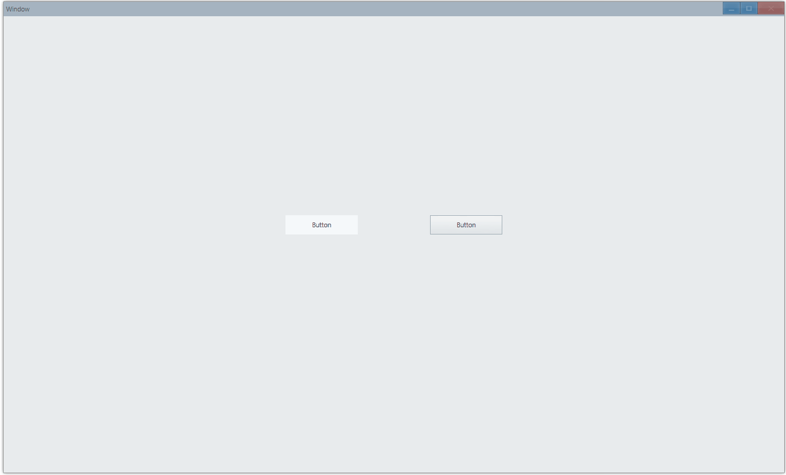
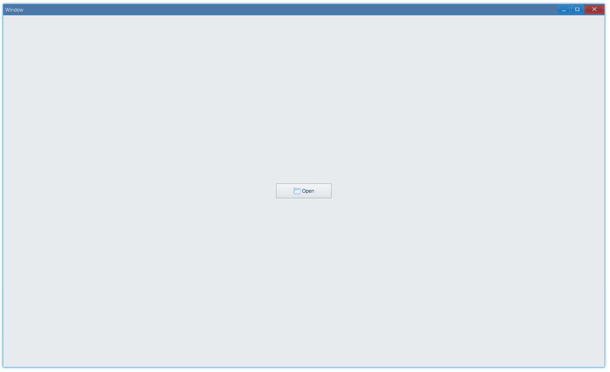

## Examples {#examples}

### Set Text {#example-set-text}

```ts {5}
import { Window, Button } from 'ave-ui';

export function main(window: Window) {
    const button = new Button(window);
    button.SetText('Button');

    const container = getControlDemoContainer(window);
    container.ControlAdd(button).SetGrid(1, 1);
    window.SetContent(container);
}

// boilerplate code: place control at the center of window
export function getControlDemoContainer(window: Window, count = 1) {
    const container = new Grid(window);
    container.ColAddSlice(1);
    container.ColAddDpx(...Array.from<number>({ length: count }).fill(120));
    container.ColAddSlice(1);

    container.RowAddSlice(1);
    container.RowAddDpx(...Array.from<number>({ length: count }).fill(32));
    container.RowAddSlice(1);
    return container;
}
```

:) Button with text "Button":



#### API {#api-button-set-text}

```ts
export interface IButton extends IControl {
    SetText(text: string): IButton;
    GetText(): string;
}
```

### Text Color {#example-set-text-color}

```ts {7,8}
import { Window, Button, Vec4 } from 'ave-ui';

export function main(window: Window) {
    const button = new Button(window);
    button.SetText('Button');

    const lightBlue = new Vec4(0, 146, 255, 255 * 0.75);
    button.SetTextColor(lightBlue);

    const container = getControlDemoContainer(window);
    container.ControlAdd(button).SetGrid(1, 1);
    window.SetContent(container);
}
```

Light blue button text:



#### API {#api-button-text-color}

```ts
export interface IButton extends IControl {
    SetTextColor(color: Vec4): IControl;
    GetTextColor(): Vec4;
}
```

### Button Style {#example-button-style}

```ts {9,16}
import { Window, Button, ButtonStyle } from 'ave-ui';

export function main(window: Window) {
    const container = getControlDemoContainer(window, 3);

    {
        const button = new Button(window);
        button.SetText('Button');
        button.SetButtonStyle(ButtonStyle.Command);
        container.ControlAdd(button).SetGrid(1, 1);
    }

    {
        const button = new Button(window);
        button.SetText('Button');
        button.SetButtonStyle(ButtonStyle.Push);
        container.ControlAdd(button).SetGrid(3, 1);
    }

    window.SetContent(container);
}
```

-   ButtonStyle.Command: no depth effect, just plain button
-   ButtonStyle.Push: likes real button, with feedback of depth effect when you press it



#### API {#api-button-style}

```ts
export interface IButton extends IControl {
    SetButtonStyle(style: ButtonStyle): IButton;
    GetButtonStyle(): ButtonStyle;
}

export enum ButtonStyle {
    Push,
    Command,
}
```

### Click Event {#example-button-event-click}

```ts {6-8}
import { Window, Button } from 'ave-ui';

export function main(window: Window) {
    const button = new Button(window);
    button.SetText('Button');
    button.OnClick((sender) => {
        sender.SetText('Button Clicked');
    });

    const container = getControlDemoContainer(window);
    container.ControlAdd(button).SetGrid(1, 1);
    window.SetContent(container);
}
```

Click and set text:


#### API {#api-button-event-click}

```ts
export interface IButton extends IControl {
    OnClick(callback: (sender: IButton) => void): IButton;
}
```

### Button Icon {#example-set-icon}

> [examples/unit/app/app-resource](https://github.com/qber-soft/Ave-Nodejs/blob/main/Code/Avernakis%20Nodejs/Test-Nodejs/examples/unit/app/app-resource.ts)

```ts {4,6-8}
window.OnCreateContent((sender) => {
    const button = new Button(window);
    button.SetText('Open');
    button.SetVisualTextLayout(VisualTextLayout.HorzVisualText);

    const iconSource = new IconSource(resMap.Open, 16);
    const icon = window.CreateManagedIcon(iconSource);
    button.SetVisual(icon);
    ...
    return true;
});
```

You can add [icon](icon#introduction) alongside text:



#### API {#api-set-icon}

```ts
export interface IButton extends IControl {
    SetVisualTextLayout(n: VisualTextLayout): Button;
    GetVisualTextLayout(): VisualTextLayout;

    SetVisual(v: IVisual): IVisual;
    GetVisual(): IVisual;
}
```
