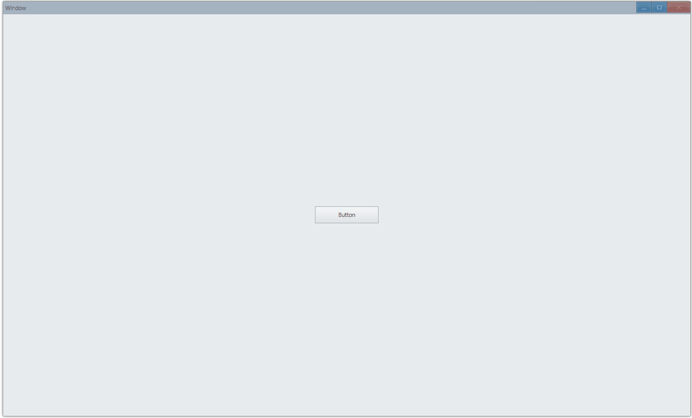

## Examples {#examples}

### Set Text {#example-set-text}

```tsx {5}
export function App() {
    return (
        <Window>
            <DemoLayout>
                <Button text="Button"></Button>
            </DemoLayout>
        </Window>
    );
}

// boilerplate code: place control at the center of window
interface IDemoLayoutProps {
    children?: any[] | any;
    width?: string;
    height?: string;
}

function DemoLayout(props: IDemoLayoutProps) {
    const width = props?.width ?? '120dpx';
    const height = props?.height ?? '32dpx';

    const demoLayout = {
        columns: `1 ${width} 1`,
        rows: `1 ${height} 1`,
        areas: {
            center: { row: 1, column: 1 },
        },
    };
    return (
        <Grid style={{ layout: demoLayout }}>
            <Grid style={{ area: demoLayout.areas.center }}>
                {props.children}
            </Grid>
        </Grid>
    );
}
```

:) Button with text "Button":


#### API {#api-button-set-text}

```ts
export interface IButtonComponentProps extends IComponentProps {
    text?: string;
    ...
}
```

### Text Color {#example-set-text-color}

```tsx {7}
export function App() {
    return (
        <Window>
            <DemoLayout>
                <Button
                    text="Button"
                    style={{ color: new Vec4(0, 146, 255, 255 * 0.75) }}
                ></Button>
            </DemoLayout>
        </Window>
    );
}
```

Light blue button text:


#### API {#api-button-text-color}

```ts
export interface IButtonComponentProps extends IComponentProps {
  style?: IButtonStyle;
  ...
}

export interface IButtonStyle extends IComponentStyle {
  color?: Vec4;
  ...
}
```

### Button Visual Style {#example-button-visual-style}

```tsx {7,11}
export function App() {
    return (
        <Window>
            <DemoLayout>
                <Button
                    text="Button"
                    style={{ visualStyle: ButtonStyle.Command }}
                ></Button>
                <Button
                    text="Button"
                    style={{ visualStyle: ButtonStyle.Push }}
                ></Button>
            </DemoLayout>
        </Window>
    );
}
```

-   ButtonStyle.Command: no depth effect, just plain button
-   ButtonStyle.Push: likes real button, with feedback of depth effect when you press it


#### API {#api-button-visual-style}

```ts
export interface IButtonStyle extends IComponentStyle {
  visualStyle?: ButtonStyle;
  ...
}

export enum ButtonStyle {
    Push,
    Command,
}
```

### Click Event {#example-button-event-click}

```tsx {9}
export function App() {
    const [text, setText] = useState('Button');

    return (
        <Window>
            <DemoLayout>
                <Button
                    text={text}
                    onClick={() => setText('Button Clicked')}
                ></Button>
            </DemoLayout>
        </Window>
    );
}
```

Click and set text:



#### API {#api-button-event-click}

```ts
export interface IButtonComponentProps extends IComponentProps {
  onClick?: Parameters<IButton["OnClick"]>[0];
}
```

### Button Icon {#example-set-icon}

```tsx {14}
import { iconResource } from './icon-resource';

function onInit(app: App) {
    const context = getAppContext();
    context.setIconResource(iconResource as unknown as IIconResource);
}

export function App() {
    return (
        <Window onInit={onInit}>
            <DemoLayout>
                <Button
                    text="Open"
                    iconInfo={{ name: 'open-file', size: 16 }}
                ></Button>
            </DemoLayout>
        </Window>
    );
}
```

```tsx title="icon-resource.ts"
const iconResource = {
    size: [16],
    path: {
        'open-file': [assetsPath('open-file#0.png')],
    },
} as const;

export { iconResource };

export type IconResourceMapType = Record<
    keyof typeof iconResource.path,
    number
>;
```

You can add icon alongside text:


#### API {#api-set-icon}

```ts
export interface IButtonComponentProps extends IComponentProps {
    iconInfo?: {
        name: string;
        size?: number;
    };
    ...
}
```
