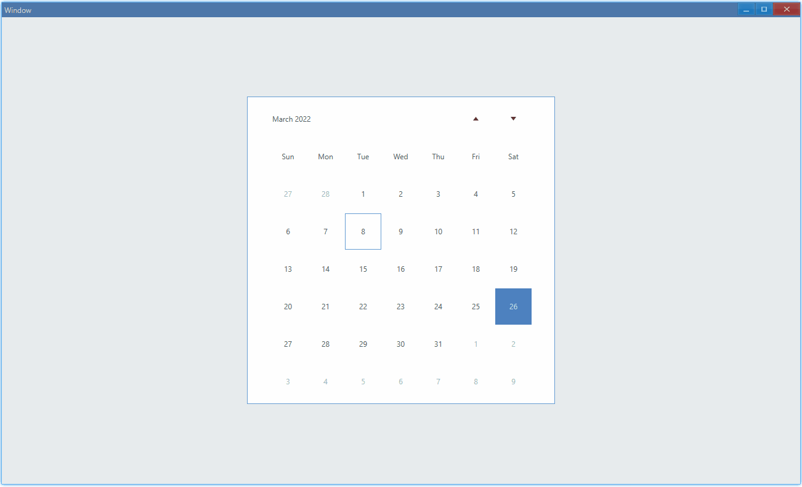
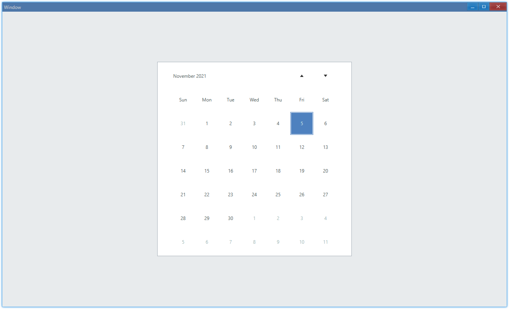

## Examples {#examples}

### Basic {#example-basic}

```ts {5-8}
import { Window, Calendar } from 'ave-ui';

export function main(window: Window) {
    const calendar = new Calendar(window);
    calendar.OnChange((sender) => {
        const timePoint = sender.GetDate();
        console.log(
            `Date: ${timePoint.Year}-${timePoint.Month}-${timePoint.Day}`,
        );
    });

    const container = getControlDemoContainer(window, 1, 500, 500);
    container.ControlAdd(calendar).SetGrid(1, 1);
    window.SetContent(container);
}
```

In this example, we demonstrate the basic usage of calendar:

-   display current date: by default, current date is highlighted
-   get selected date



In console:

```bash
Date: 2022-3-10
Date: 2022-3-30
```

#### API {#api-basic}

```ts
export interface ICalendar extends IControl {
    GetDate(): TimePoint;
    OnChange(callback: (sender: Calendar) => void): Calendar;
}

export class TimePoint {
    get Year(): number;
    get Month(): number;
    get Day(): number;
}
```

### Set Date {#example-set}

By default, current date will be highlighted when you open it, we can customize selected date using `SetDate` and `SetDateMark`.

```ts {5-6}
import { Window, Calendar, TimePoint } from 'ave-ui';

export function main(window: Window) {
    const calendar = new Calendar(window);
    calendar.SetDate(new TimePoint(2021, 11, 5));
    calendar.SetDateMark(new TimePoint(2021, 11, 5));

    const container = getControlDemoContainer(window, 1, 500, 500);
    container.ControlAdd(calendar).SetGrid(1, 1);
    window.SetContent(container);
}
```

In this example, we set date to `2021/11/5`:



-   `SetDate`: outline
-   `SetDateMark`: filled background

The differences between them can be seen from this example:

```diff
-calendar.SetDate(new TimePoint(2021, 11, 5));
+calendar.SetDate(new TimePoint(2021, 11, 6));
```


#### API {#api-set}

```ts
export interface ICalendar extends IControl {
    SetDate(timePoint: TimePoint): Calendar;
    GetDate(): TimePoint;

    SetDateMark(timePoint: TimePoint): Calendar;
    GetDateMark(): TimePoint;
}
```
