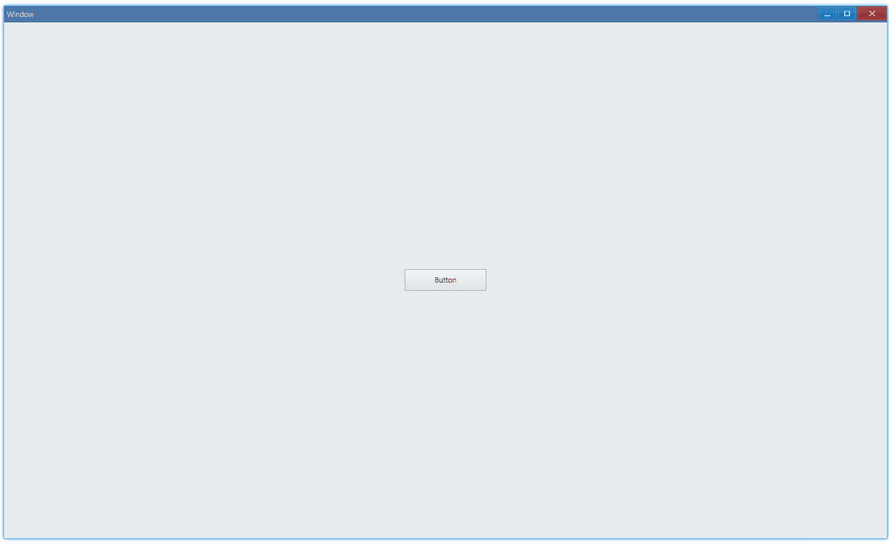
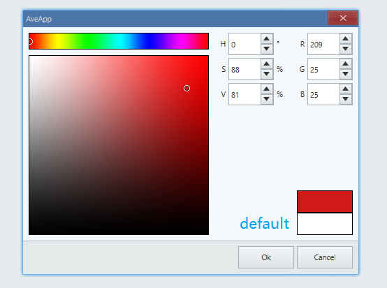
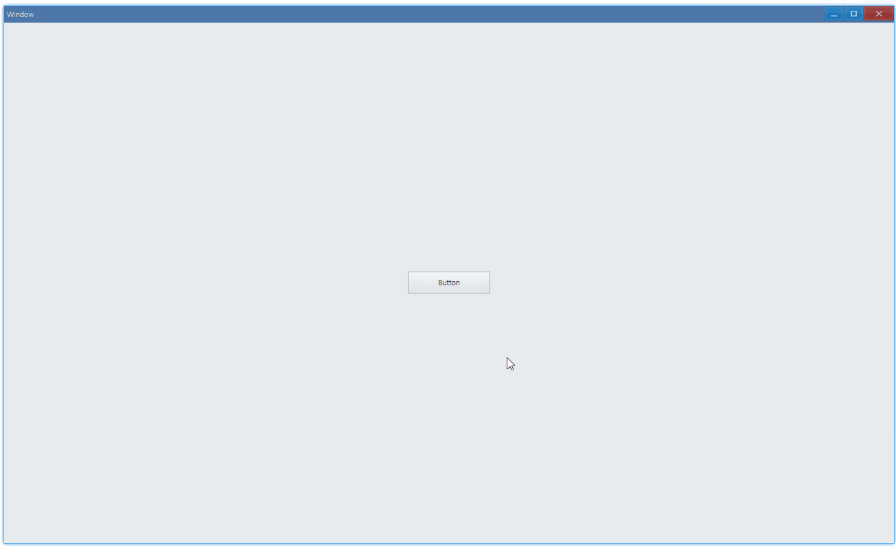

## Examples {#examples}

### Basic {#example-basic}

```ts {7-9}
import { Window, Button, Vec4 } from 'ave-ui';

export function main(window: Window) {
    const button = new Button(window);
    button.SetText('Button');
    button.OnClick((sender) => {
        const commonUi = window.GetCommonUi();
        const result = commonUi.PickColor(new Vec4(255, 255, 255, 255), false);
        sender.SetTextColor(result);
    });

    const container = getControlDemoContainer(window);
    container.ControlAdd(button).SetGrid(1, 1);
    window.SetContent(container);
}
```

Get selected color and use it to set color of button text:



#### API {#api-basic}

```ts
export interface ICommonUi {
    PickColor(defaultColor: Vec4, allowAlpha: boolean): Vec4;
}
```

In the above example, we set `defaultColor` to white(`new Vec4(255, 255, 255, 255)`):



If we want to use the last used color as default, modify code in this way:

```diff
-   const result = commonUi.PickColor(new Vec4(255, 255, 255, 255), false);
+   const result = commonUi.PickColor(sender.GetTextColor(), false);
```



If `allowAlpha` is false, returned alpha of color is always 255, if it's true, we can select not only RGB, bug also alpha channel.
