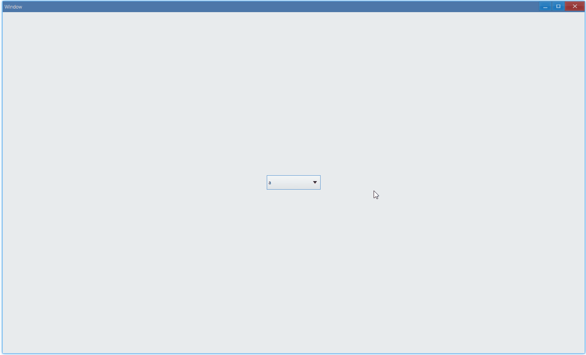
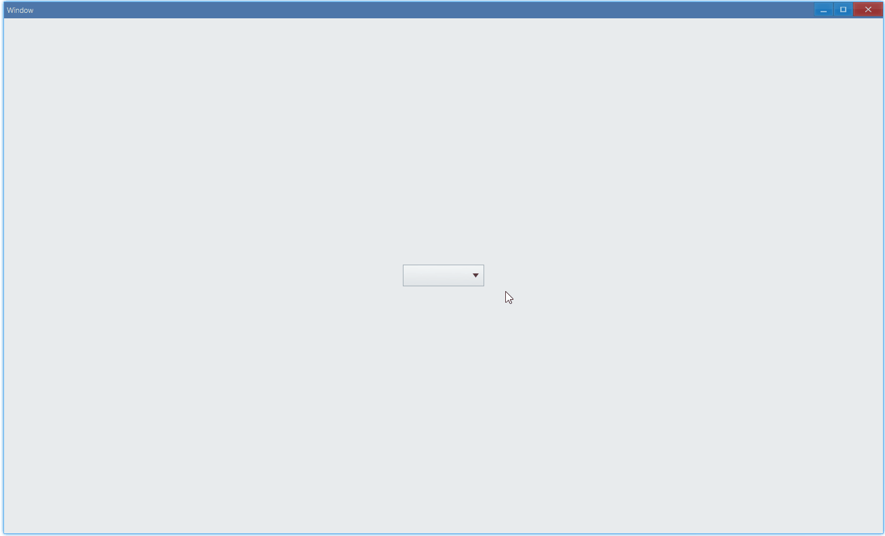

## Examples {#examples}

### Basic {#example-basic}

```ts {4-9}
import { Window, ComboBox } from 'ave-ui';

export function main(window: Window) {
    const comboBox = new ComboBox(window);
    // add items
    comboBox.Append('a', 'b', 'c');
    // display the first one: a
    comboBox.Select(0);
    comboBox.OnSelectionChange((comboBox: ComboBox) => {
        console.log(`current index: ${comboBox.GetSelection()}`);
    });

    const container = getControlDemoContainer(window);
    container.ControlAdd(comboBox).SetGrid(1, 1);
    window.SetContent(container);
}
```

Select list item:



In console:

```bash
current index: 1
current index: 2
current index: 0
```

#### API {#api-combo-box-basic}

```ts
export interface IComboBox extends IControl {
    // add items, and they are displayed in the order you add them
    Append(...items: string[]): IComboBox;

    // index is 0-based
    Select(index: number): IComboBox;
    // get index of current item
    GetSelection(): number;

    // invoked when you select item
    OnSelectionChange(callback: (sender: IComboBox) => void): IComboBox;
}
```

There is no default selected item, remove `comboBox.Select(0)` then we will get this:


