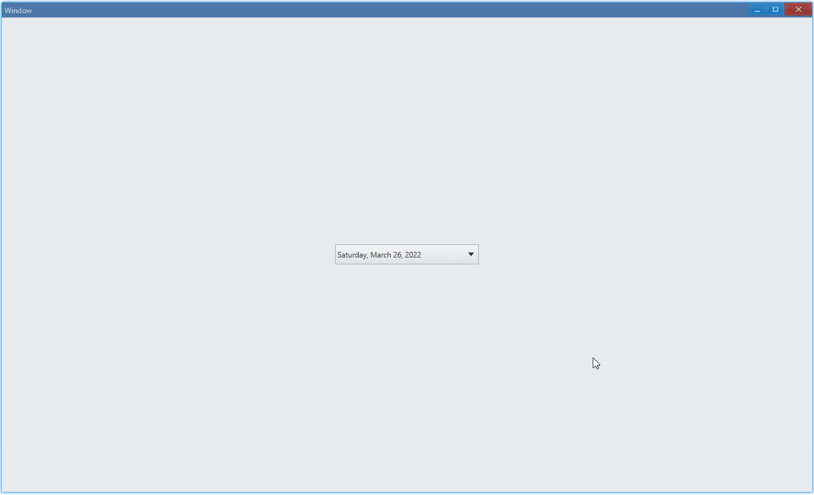
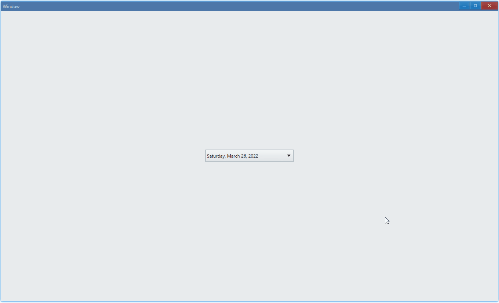

## Examples {#examples}

### Basic {#example-basic}

```ts {5-8}
import { Window, DatePicker } from 'ave-ui';

export function main(window: Window) {
    const datePicker = new DatePicker(window);
    datePicker.OnChange((sender) => {
        const timePoint = sender.GetDate();
        console.log(
            `Date: ${timePoint.Year}-${timePoint.Month}-${timePoint.Day}`,
        );
    });

    const container = getControlDemoContainer(window, 1, 230);
    container.ControlAdd(datePicker).SetGrid(1, 1);
    window.SetContent(container);
}
```

In this example, we demonstrate the basic usage of date picker: pick a date :)



In console:

```bash
Date: 2022-3-27
Date: 2022-3-28
```

#### API {#api-basic}

```ts
export interface IDatePicker extends IControl {
    GetDate(): TimePoint;
    OnChange(callback: (sender: DatePicker) => void): DatePicker;
}
```

### Set Date {#example-set}

Just like that in [Calendar: Set Date](./calendar#example-set):

```ts {10-11}
import { Window, DatePicker } from 'ave-ui';

export function main(window: Window) {
    const datePicker = new DatePicker(window);
    datePicker.OnChange((sender) => {
        const timePoint = sender.GetDate();
        console.log(
            `Date: ${timePoint.Year}-${timePoint.Month}-${timePoint.Day}`,
        );
        datePicker.SetDate(timePoint);
        datePicker.SetDateMark(timePoint);
    });

    const container = getControlDemoContainer(window, 1, 230);
    container.ControlAdd(datePicker).SetGrid(1, 1);
    window.SetContent(container);
}
```

Display the last selected date:



#### API {#api-set}

```ts
export interface IDatePicker extends IControl {
    SetDate(timePoint: TimePoint): DatePicker;
    GetDate(): TimePoint;

    SetDateMark(timePoint: TimePoint): DatePicker;
    GetDateMark(): TimePoint;
}
```
