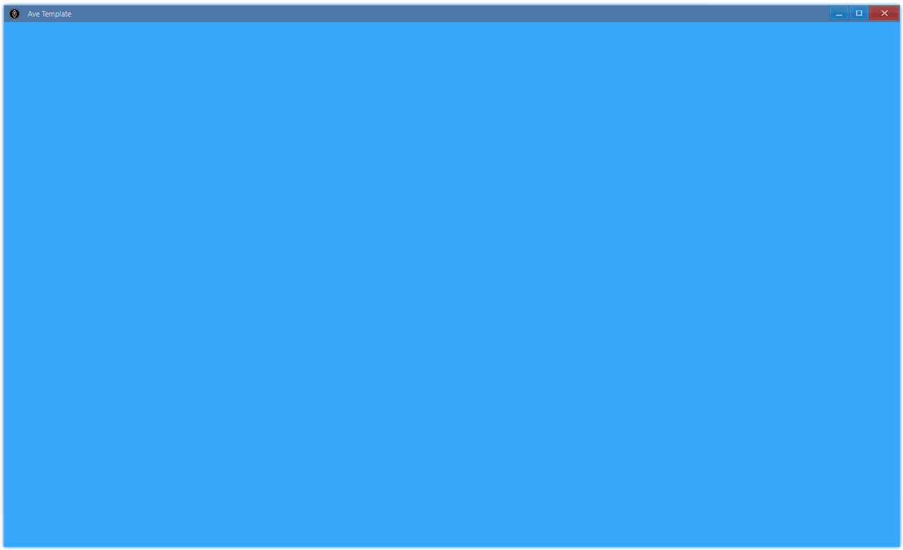
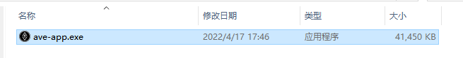

## Usage

```bash
> npm i ave-ui
```

## Hello Window {#hello-window}

This example from [Ave-Nodejs-Template](https://github.com/qber-soft/Ave-Nodejs-Template) is designed to let us get a glimpse of Ave:

> clone template project and `npm run dev`

```ts title="https://github.com/qber-soft/Ave-Nodejs-Template/blob/main/src/index.ts"
import {
    App,
    WindowCreation,
    Window,
    WindowFlag,
    Grid,
    Vec4,
    AveGetSDKVersion,
} from 'ave-ui';
import * as path from 'path';

export function main(window: Window) {
    const grid = new Grid(window);
    const lightBlue = new Vec4(0, 146, 255, 255 * 0.75);
    grid.SetBackColor(lightBlue);

    //
    const version = AveGetSDKVersion();
    console.log(
        `ave sdk version: ${JSON.stringify(
            version.VersionString,
            null,
            4,
        )}, is private: ${version.IsPrivateVersion}`,
    );
    window.SetContent(grid);
}

run(main);

export function run(main: Function) {
    const app = new App();

    const iconDataMap = {
        WindowIcon: [
            path.resolve(__dirname, '../assets/Ave#0.png'),
            path.resolve(__dirname, '../assets/Ave#1.png'),
            path.resolve(__dirname, '../assets/Ave#2.png'),
        ],
    };
    const resMap = app.CreateResourceMap(app, [16, 24, 32], iconDataMap);

    globalThis.app = app;

    //
    const cpWindow = new WindowCreation();
    cpWindow.Title = 'Ave Template';
    cpWindow.Flag |= WindowFlag.Layered;

    const window = new Window(cpWindow);
    globalThis._window = window;

    window.OnCreateContent((window) => {
        window.SetIcon(resMap.WindowIcon);
        main(window);
        return true;
    });

    if (!window.CreateWindow()) process.exit(-1);

    window.SetVisible(true);
    window.Activate();
}

export function get3x3Grid(window: Window, width = 120, height = 32) {
    const container = new Grid(window);
    container.ColAddSlice(1);
    container.ColAddDpx(width);
    container.ColAddSlice(1);

    container.RowAddSlice(1);
    container.RowAddDpx(height);
    container.RowAddSlice(1);
    return container;
}
```

You will get a light blue window:



Let's understand it piece by piece. First, create an instance of App, assign it to global to avoid GC:

```ts {1,3}
const app = new App();
...
globalThis.app = app;
```

Create resource map, which will be used as reference to icon.

```ts {8}
const iconDataMap = {
    WindowIcon: [
        path.resolve(__dirname, '../assets/Ave#0.png'),
        path.resolve(__dirname, '../assets/Ave#1.png'),
        path.resolve(__dirname, '../assets/Ave#2.png'),
    ],
};
const resMap = app.CreateResourceMap(
    app,
    [16, 24, 32] /* icon size list */,
    iconDataMap,
);
```

Create an instance of Window:

```ts {2,6}
// cp: creation param
const cpWindow = new WindowCreation();
cpWindow.Title = 'Ave Template';
cpWindow.Flag |= WindowFlag.Layered;

const window = new Window(cpWindow);
globalThis._window = window;
```

In `OnCreateContent`:

-   set window icon using resource map
-   create content of this simple application: just a grid with background
-   print sdk version

```ts {2,10,15,17}
window.OnCreateContent(window => {
    window.SetIcon(resMap.WindowIcon);
    main(window);
    return true
})

...

export function main(window: Window) {
    const grid = new Grid(window);
	const lightBlue = new Vec4(0, 146, 255, 255 * 0.75);
	grid.SetBackColor(lightBlue);

	//
	const version = AveGetSDKVersion();
	console.log(`ave sdk version: ${JSON.stringify(version.VersionString, null, 4)}, is private: ${version.IsPrivateVersion}`);
	window.SetContent(grid);
}
...
```

Boilerplate code about window creation:

```ts
if (!window.CreateWindow()) process.exit(-1);

window.SetVisible(true);
window.Activate();
```

## Hello Button {#hello-button}

> clone template project and `npm run dev:button`

```ts
export function main(window: Window) {
    const button = new Button(window);
    button.SetText('Button');
    button.OnClick((sender) => {
        sender.SetText('Button Clicked');
        console.log('button clicked');
    });

    const container = get3x3Grid(window);
    container.ControlAdd(button).SetGrid(1, 1);
    window.SetContent(container);
}
```

Replace code in main, which gives us a basic application with button:

<video src={require('./assets/getting-started-template-project.mp4').default} controls autoplay style={{width: 800}}/>

## Debug {#debug}

Ave app is just node app, so you can debug it as usual. For convenience, we add this [launch config](https://github.com/qber-soft/Ave-Nodejs-Template/blob/main/.vscode/launch.json) in template project:

```json
{
    "configurations": [
        {
            "name": "Launch",
            "type": "node",
            "request": "launch",
            "args": ["./src/index.ts"],
            "runtimeArgs": ["--nolazy", "-r", "ts-node/register"],
            "sourceMaps": true,
            "cwd": "${workspaceRoot}",
            "protocol": "inspector"
        }
    ]
}
```

Set some breakpoints and press `Launch`, you are ready to go:

<video src={require('./assets/vscode-debug.mp4').default} controls autoplay style={{width: 800}}/>

## Package {#package}

Clone template project and `npm run release`, the output is a single `exe`:

> 40M = 30M node runtime + 10M sdk node addon



You can config app info in `ave.config.ts`:

```ts
import { IPackConfig } from 'ave-pack';

const config: IPackConfig = {
    build: {
        projectRoot: __dirname,
        target: 'node14-win-x64',
        input: './build/src/index.js',
        output: './bin/ave-app.exe',
    },
    resource: {
        icon: './assets/ave.ico',
        productVersion: '0.0.1',
        productName: 'Ave Template App',
        fileVersion: '0.0.1',
        companyName: 'QberSoft',
        fileDescription: 'The Template App of Ave',
        LegalCopyright: `© ${new Date().getFullYear()} Ave Copyright.`,
    },
};

export default config;
```
