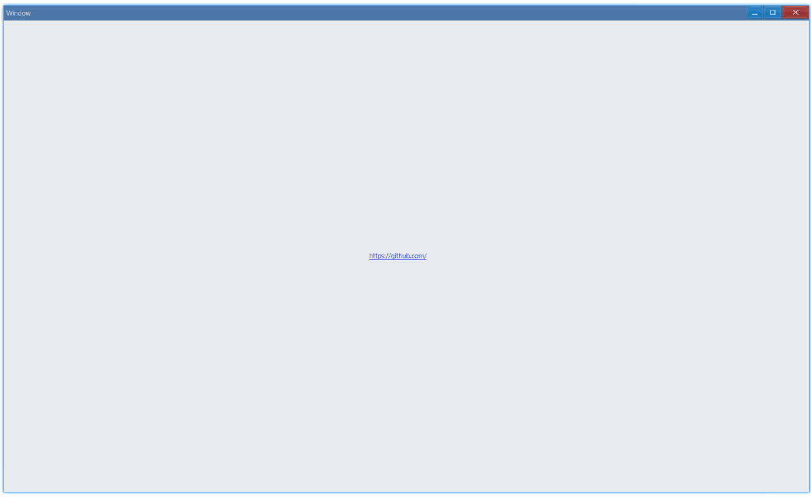

## Examples {#examples}

### Basic {#example-basic}

```ts {5-8}
import { Window, Hyperlink } from 'ave-ui';

export function main(window: Window) {
    const hyperLink = new Hyperlink(window);
    hyperLink.SetText(`<https://github.com/>`);
    hyperLink.OnClick((sender, id) => {
        console.log('hyper link clicked');
    });

    const container = getControlDemoContainer(window);
    container.ControlAdd(hyperLink).SetGrid(1, 1);
    window.SetContent(container);
}
```

Usage:



In console:

```bash
hyper link clicked
```

#### API {#api-basic}

```ts
export interface IHyperlink extends IControl {
    // the format of text: it should be wrapped in "<>", eg. <https://github.com/>
    SetText(text: string): Hyperlink;
    GetText(): string;

    OnClick(callback: (sender: Hyperlink, id: number) => void): Hyperlink;
}
```
