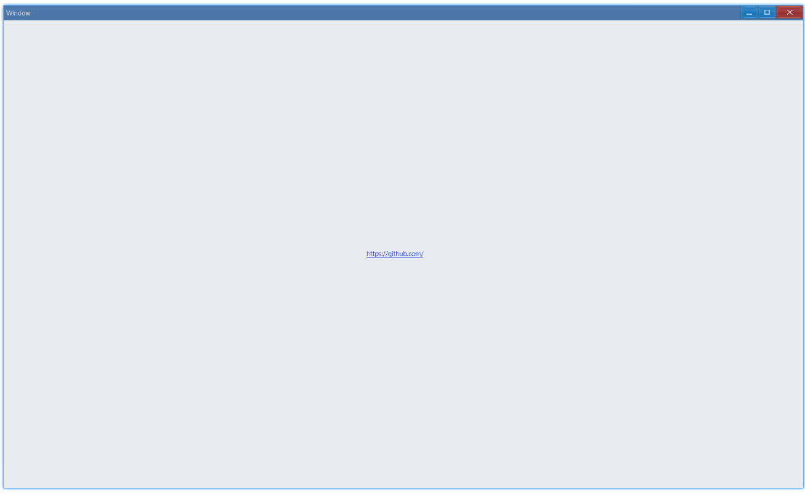

## Examples {#examples}

### Basic {#example-basic}

```tsx
export function App() {
    return (
        <Window>
            <DemoLayout>
                <Hyperlink
                    text="<https://github.com/>"
                    onClick={() => {
                        console.log('hyperlink clicked');
                    }}
                />
            </DemoLayout>
        </Window>
    );
}
```

Usage:



In console:

```bash
hyperlink clicked
```

#### API {#api-basic}

```ts
export interface IHyperlinkComponentProps extends IComponentProps {
    // the format of text: it should be wrapped in "<>", eg. <https://github.com/>
    text: string;
    onClick?: Parameters<IHyperlink['OnClick']>[0];
}
```
