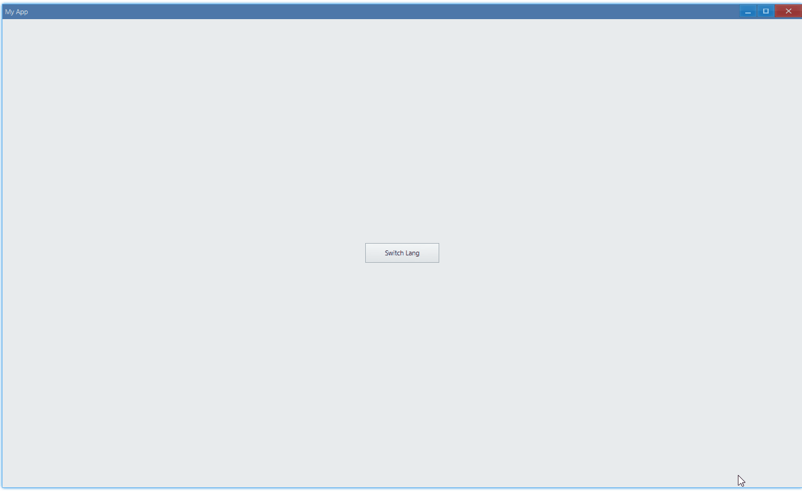

## Examples {#examples}

### Basic {#example-basic}

> [examples/unit/app/app-lang-auto.ts](https://github.com/qber-soft/Ave-Nodejs/blob/main/Code/Avernakis%20Nodejs/Test-Nodejs/examples/unit/app/app-lang-auto.ts)

This is the basic example for i18n:



Basically, we use `LangSetDefaultString` to set language assets(your translations), and then use `LangSetCurrent` to set current language.

We have built-in support for i18n, as long as you create UI component with language key, language change happens automatically.

```ts {23-24,26,52}
interface ILang {
    // ave built-in language key
    AppTitle: string;

    // user defined key
    SwitchLang: string;
}

interface Ii18n {
    t(key: keyof ILang): string;
    switch(id: CultureId): void;
    lang: Partial<Record<CultureId, ILang>>;
}

export function run() {
    const app = new App();

    const i18n: Ii18n = {
        t(key: keyof ILang) {
            return app.LangGetString(key);
        },
        switch(this: Ii18n, id: CultureId) {
            app.LangSetDefaultString(id, this.lang[id]);
            app.LangSetCurrent(id);
        },
        lang: {
            [CultureId.en_us]: {
                AppTitle: 'My App',
                SwitchLang: 'Switch Lang',
            },
            [CultureId.zh_cn]: {
                AppTitle: '我的应用',
                SwitchLang: '切换语言',
            },
        },
    };

    globalThis.app = app;

    const cpWindow = new WindowCreation();
    cpWindow.Flag |= WindowFlag.Layered;

    const window = new Window(cpWindow);
    globalThis._window = window;

    window.OnCreateContent((sender) => {
        //
        let lang = CultureId.en_us;
        i18n.switch(lang);

        //
        const button = new Button(window, 'SwitchLang' as keyof ILang);

        button.OnClick((sender) => {
            if (lang === CultureId.en_us) {
                lang = CultureId.zh_cn;
            } else if (lang === CultureId.zh_cn) {
                lang = CultureId.en_us;
            }
            i18n.switch(lang);
        });

        const container = getControlDemoContainer(window);
        container.ControlAdd(button).SetGrid(1, 1);
        window.SetContent(container);
        return true;
    });

    if (!window.CreateWindow()) process.exit(-1);

    window.SetVisible(true);
    window.Activate();
}
```

#### API {#api-basic}

```ts
export interface IApp {
	LangSetDefaultString(cid: CultureId, v: any): App;
	LangSetCurrent(n: CultureId): App;
}

export enum CultureId {
	Default /**/ = -1,
	en_us /**/ = 0,
	...
	zh_cn /**/ = 562,
    ...
}
```
