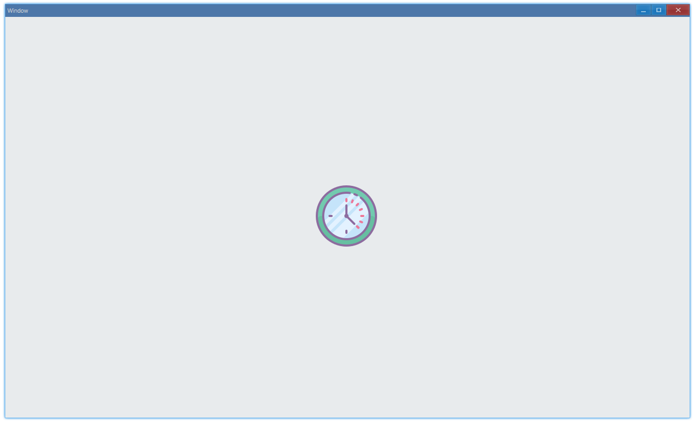

## Examples {#examples}

### Basic {#example-basic}

```tsx {2,6}
export function App() {
    const src = assetsPath('Clock#6.png');
    return (
        <Window>
            <DemoLayout width="1" height="1">
                <Image src={src} />
            </DemoLayout>
        </Window>
    );
}
```

Usage:



#### API {#api-basic}

```ts
export interface IImageComponentProps extends IComponentProps {
	/**
	 * absolute path of image file
	 */
	src: string | AveImage;
}
```
