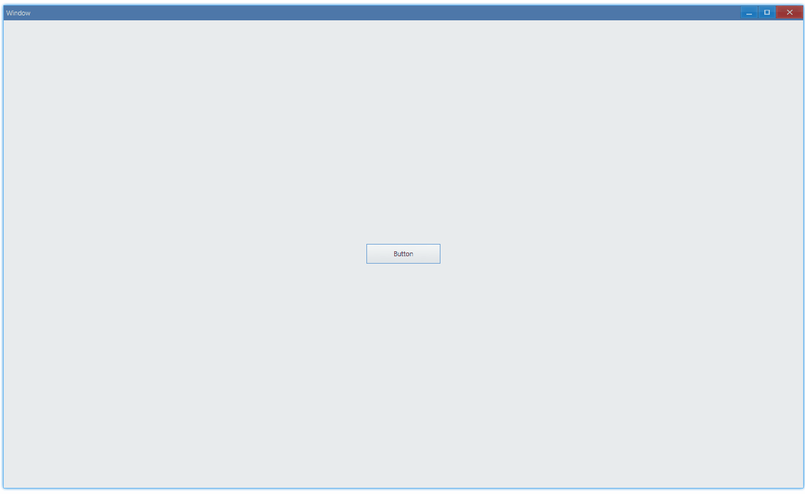

## Examples {#examples}

### Basic {#example-basic}

```ts {7,13}
import { Window, Button } from 'ave-ui';

export function main(window: Window) {
    const button = new Button(window);
    button.SetText('Button');
    button.OnClick((sender) => {
        const commonUi = window.GetCommonUi();
        const label = 'Please input:';
        const placeHolder = 'input here';
        const title = 'Title';
        const value = 'default input';
        const fallback = 'input cancelled';
        const result = commonUi.Input(
            fallback,
            label,
            value,
            placeHolder,
            title,
        );
        console.log(`input result: "${result}"`);
    });

    const container = getControlDemoContainer(window);
    container.ControlAdd(button).SetGrid(1, 1);
    window.SetContent(container);
}
```

Get user input:



Click "Ok":

```bash
# in console
input result: "default"
```

Click "x":

```bash
# in console
input result: "input cancelled" # This value is the fallback we set in code.
```

#### API {#api-basic}

```ts
export interface ICommonUi {
    Input(
        fallback: string,
        label: string,
        value: string,
        placeHolder: string,
        title: string,
    ): string;
}
```
