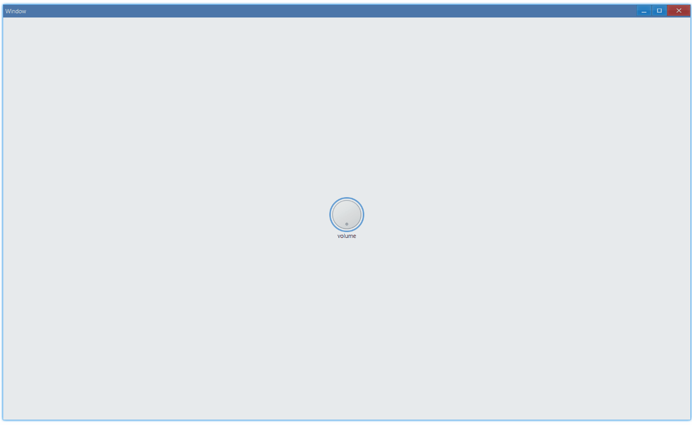

## Examples {#examples}

### Basic {#example-basic}

```ts {5,7,8-10}
import { Window, Knob, Vec4 } from 'ave-ui';

export function main(window: Window) {
    const knob = new Knob(window);
    knob.SetText('volume');
    const lightBlue = new Vec4(0, 146, 255, 255 * 0.75);
    knob.RingSetColor(lightBlue);
    knob.OnChange((sender) => {
        console.log(`value: ${sender.ValueGet()}`);
    });

    const container = getControlDemoContainer(window, 1, 80, 80);
    container.ControlAdd(knob).SetGrid(1, 1);
    window.SetContent(container);
}
```

Usage:



In console:

```bash
value: 0.004
value: 0.013000000000000001
value: 0.019000000000000003
...
```

Note: The value range is [0,1].

#### API {#api-basic}

```ts
export interface IKnob extends IControl {
    SetText(text: string): Knob;
    GetText(): string;

    RingSetColor(color: Vec4): Knob;
    RingGetColor(): Vec4;

    OnChange(callback: (sender: Knob) => void): Knob;
}
```
