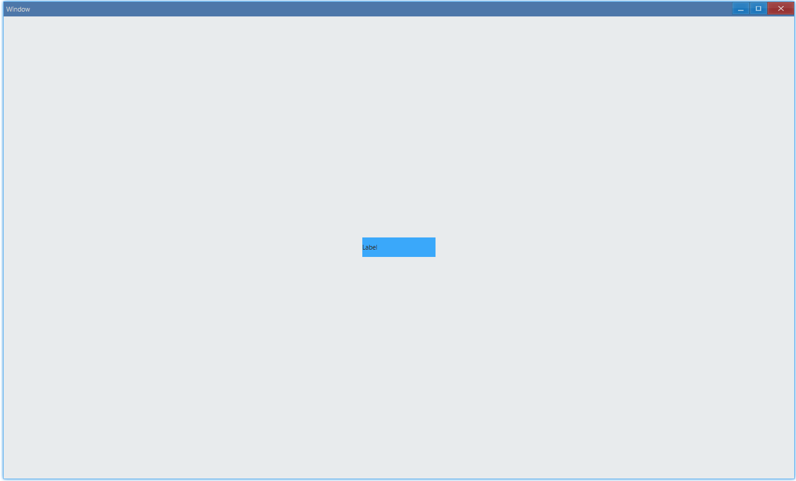
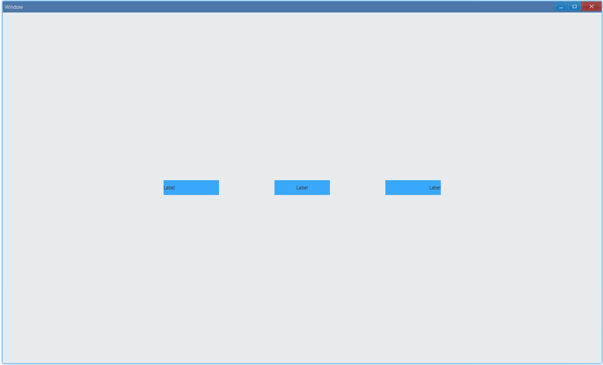
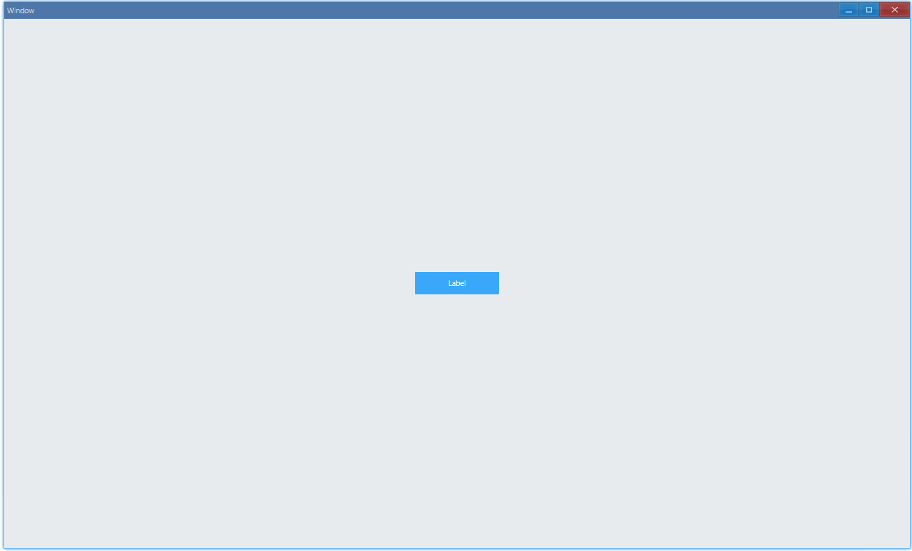

## Examples {#examples}

### Set Text {#example-set-text}

```ts {4-5}
import { Window, Label, Vec4, Grid } from 'ave-ui';

export function main(window: Window) {
    const label = new Label(window);
    label.SetText('Label');

    const backgroundGrid = new Grid(window);
    const lightBlue = new Vec4(0, 146, 255, 255 * 0.75);
    backgroundGrid.SetBackColor(lightBlue).ColAddSlice(1).RowAddSlice(1);
    backgroundGrid.ControlAdd(label).SetGrid(0, 0);

    const container = getControlDemoContainer(window);
    container.ControlAdd(backgroundGrid).SetGrid(1, 1);
    window.SetContent(container);
}
```

Set label text:



As we can see, by default, the label text is aligned to the left.

#### API {#api-label-set-text}

```ts
export class Label {
    SetText(text: string): Label;
}
```

### Background Color {#example-set-background-color}

```ts {7-8}
import { Window, Label, Vec4 } from 'ave-ui';

export function main(window: Window) {
    const label = new Label(window);
    label.SetText('Label');

    const lightBlue = new Vec4(0, 146, 255, 255 * 0.75);
    label.SetBackColor(lightBlue);

    const container = getControlDemoContainer(window);
    container.ControlAdd(label).SetGrid(1, 1);
    window.SetContent(container);
}
```

#### API {#api-label-set-background-color}

```ts
export class Label {
    SetBackColor(color: Vec4): Label;
}
```

### Alignment {#example-text-align}

```ts {10,19,28}
import { Window, Label, Vec4, AlignType } from 'ave-ui';

export function main(window: Window) {
    const container = getControlDemoContainer(window, 5);
    const lightBlue = new Vec4(0, 146, 255, 255 * 0.75);

    {
        const label = new Label(window);
        label.SetText('Label');
        label.SetAlignHorz(AlignType.Near);
        label.SetBackColor(lightBlue);

        container.ControlAdd(label).SetGrid(1, 3);
    }

    {
        const label = new Label(window);
        label.SetText('Label');
        label.SetAlignHorz(AlignType.Center);
        label.SetBackColor(lightBlue);

        container.ControlAdd(label).SetGrid(3, 3);
    }

    {
        const label = new Label(window);
        label.SetText('Label');
        label.SetAlignHorz(AlignType.Far);
        label.SetBackColor(lightBlue);

        container.ControlAdd(label).SetGrid(5, 3);
    }

    window.SetContent(container);
}
```

There are 3 ways to align text:



-   `AlignType.Center`: align center
-   `AlignType.Near`: align left in LTR writing systems, such as English/Chinese
-   `AlignType.Far`: align right (LTR)

#### API {#api-label-text-align}

```ts
export class Label {
    SetAlignHorz(align: Vec4): Label;
}

export enum AlignType {
    Near,
    Center,
    Far,
}
```

### Text Color {#example-set-text-color}

```ts {7-8}
import { Window, Label, Vec4, AlignType } from 'ave-ui';

export function main(window: Window) {
    const label = new Label(window);
    label.SetText('Label');

    const white = new Vec4(255, 255, 255, 255);
    label.SetTextColor(white);

    const lightBlue = new Vec4(0, 146, 255, 255 * 0.75);
    label.SetBackColor(lightBlue);
    label.SetAlignHorz(AlignType.Center);

    const container = getControlDemoContainer(window);
    container.ControlAdd(label).SetGrid(1, 1);
    window.SetContent(container);
}
```

Set text color:



#### API {#api-label-set-text-color}

```ts
export class Label {
    SetTextColor(color: Vec4): Label;
}
```
