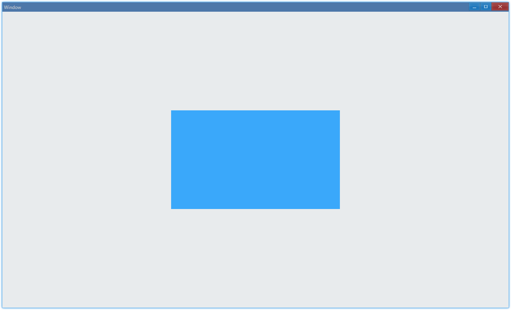
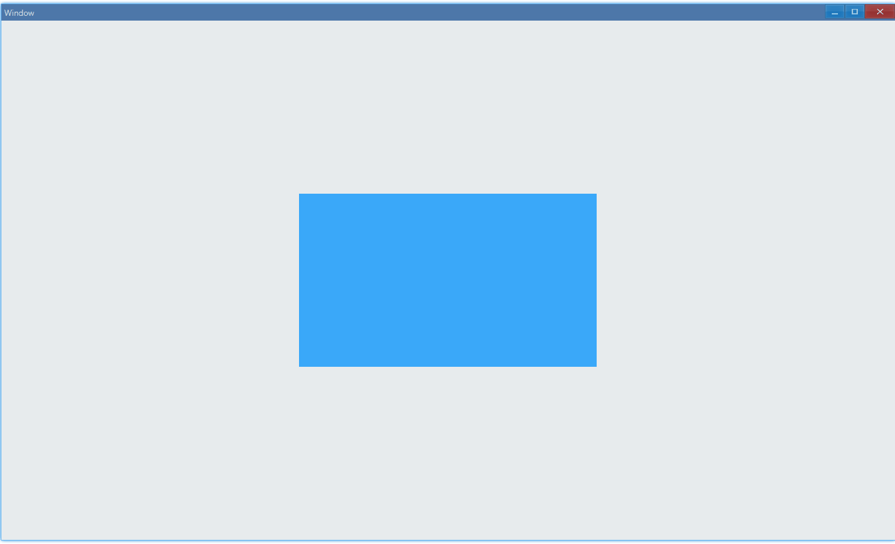
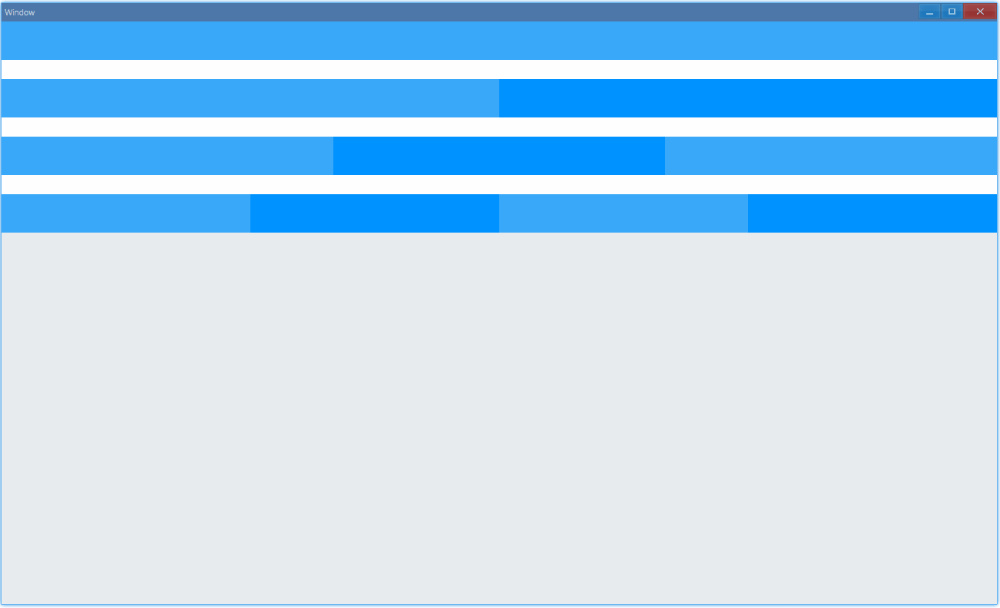
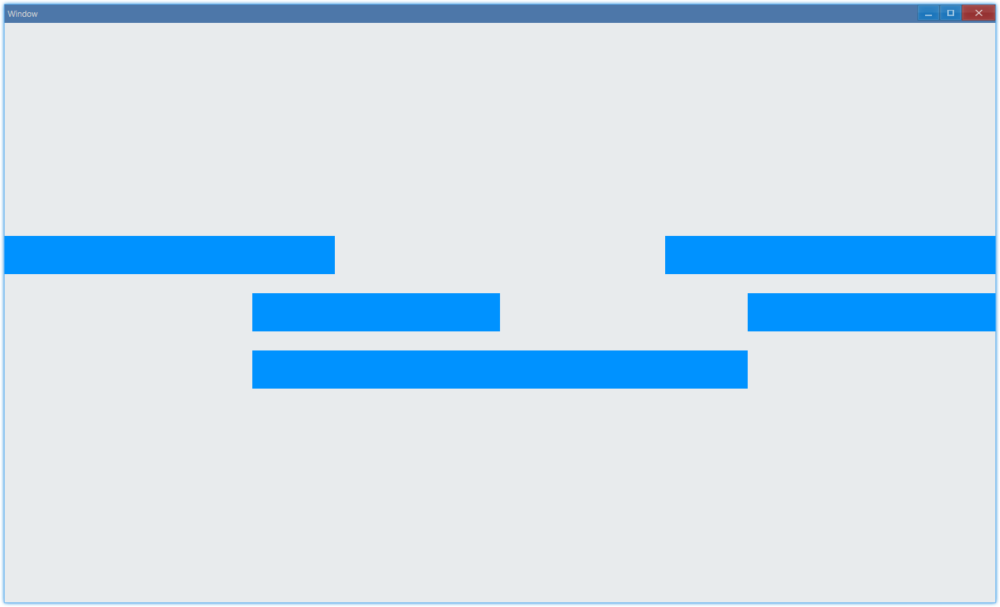
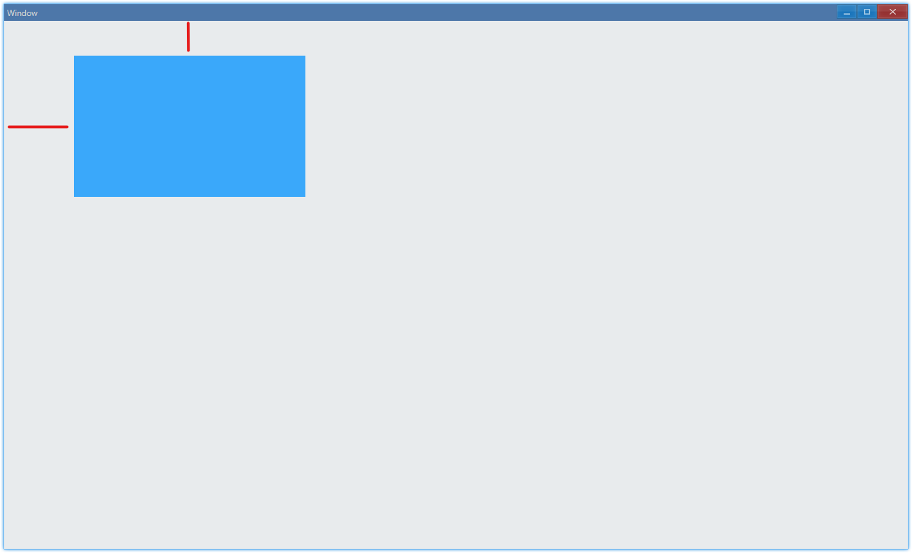
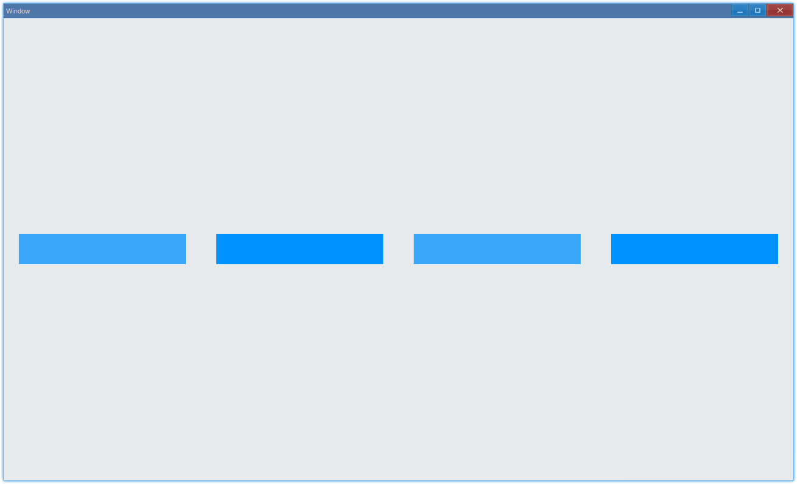
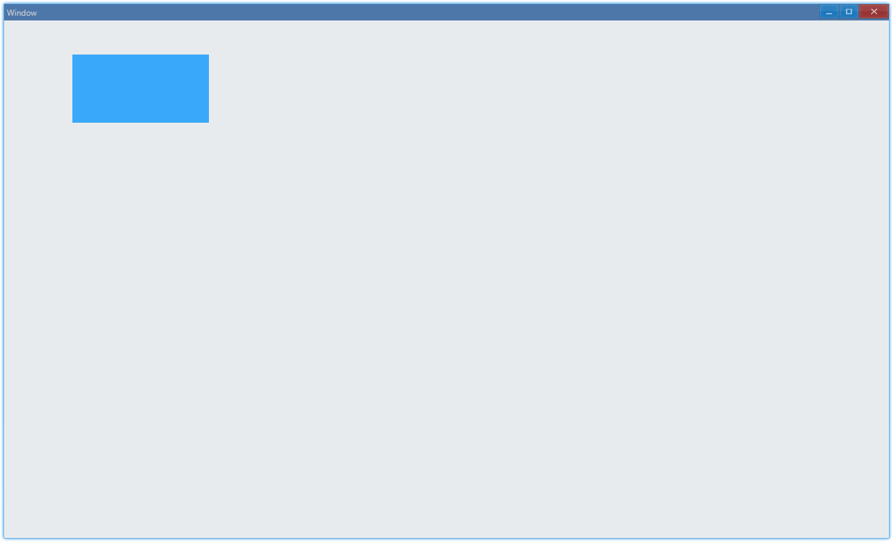

The solution of layout in Ave is Grid, we put all controls in grid, so this document begins with it.

The concept of grid is almost the same as that in [A Complete Guide to Grid](https://css-tricks.com/snippets/css/complete-guide-grid/), the difference is that the implementation in Ave is more flexible.

## Examples {#examples}

### Background Color {#example-grid-background}

```ts {5,6}
import { Window, Grid, Vec4 } from 'ave-ui';

export function main(window: Window) {
    const grid = new Grid(window);
    const lightBlue = new Vec4(0, 146, 255, 255 * 0.75);
    grid.SetBackColor(lightBlue);
    window.SetContent(grid);
}
```

In Ave, we use `Vec4` class to represent color, the range of each component(rgba) is `[0,255]`.

Use `SetBackColor` to set background color:


#### API {#api-background}

```ts
export interface IGrid extends IControl {
    SetBackColor(vColor: Vec4): Grid;
    GetBackColor(): Vec4;
}
```

### Add Control {#example-grid-add-control}

```ts {5,6,12}
import { Window, Grid, Vec4 } from 'ave-ui';

export function main(window: Window) {
    const container = new Grid(window);
    container.ColAddSlice(1, 1, 1);
    container.RowAddSlice(1, 1, 1);

    const center = new Grid(window);
    const lightBlue = new Vec4(0, 146, 255, 255 * 0.75);
    center.SetBackColor(lightBlue);

    container.ControlAdd(center).SetGrid(1, 1, 1, 1);
    window.SetContent(container);
}
```

In this example, we create a 3x3 grid and place another grid at the center:



`RowAddSlice`/`ColAddSlice` is used to add row/column, `slice` makes it responsive, as shown below:



#### API {#api-add-control}

```ts
export class Grid implements IGrid {
	// Add row, arg in x is ratio
	RowAddSlice(...x: number[]);
	ColAddSlice(...x: number[]);

	// Add row, but the arg in x is not ratio, it's dpx
	RowAddDpx(...x: number[]);
	ColAddDpx(...x: number[]);

	RowAddPx(...x: number[]);
	ColAddPx(...x: number[]);
}

export interface IGrid {
	ControlAdd(control: IControl): IGridControl<IControl>;
}

export interface IGridControl<T extends IControl = IControl> {
    // place control in x column y row, takes xspan columns and yspan rows
	// by default, size of control will be the same as the grid
	SetGrid(x: number, y: number, xspan = 1 yspan = 1): IGridControl<T>;
};
```

#### Practice: grid {#grid-practice-grid}

In this practice, we will implement something likes 24 Grids System in web: [Ant Design Grid](https://ant.design/components/grid/).



#### Practice: offset {#grid-practice-offset}

In this practice, we will implement grid offset: [Ant Design Grid: Offset](https://ant.design/components/grid/#components-grid-demo-offset).



### Margin {#example-grid-margin}

```ts {13,21}
import { Window, Grid, Vec4 } from 'ave-ui';

export function main(window: Window) {
    const container = new Grid(window);
    container.ColAddSlice(1, 1, 1);
    container.RowAddSlice(1, 1, 1);

    const center = new Grid(window);
    const lightBlue = new Vec4(0, 146, 255, 255 * 0.75);
    center.SetBackColor(lightBlue);

    //
    const margin = new DpiMargin(
        DpiSize.FromPixelScaled(100), // margin left
        DpiSize.FromPixelScaled(50), // margin top
        DpiSize.FromPixelScaled(0), // margin right
        DpiSize.FromPixelScaled(0), // margin bottom
    );

    const gridControl = container.ControlAdd(center);
    gridControl.SetGrid(0, 0, 1, 1);
    gridControl.SetMargin(margin);

    window.SetContent(container);
}
```

In this example, we set margin of the blue grid as shown below:



#### API {#api-margin}

```ts
export interface IGridControl<T extends IControl = IControl> {
    SetMargin(margin: DpiMargin): IGridControl<T>;
}

export class DpiMargin {
    Left: DpiSize;
    Top: DpiSize;
    Right: DpiSize;
    Bottom: DpiSize;

    static FromPixelScaled(
        left: number,
        top: number,
        right: number,
        bottom: number,
    ): DpiMargin;
}
```

#### Practice: gutter {#grid-practice-gutter}

In this practice, we will implement grid gutter: [Ant Design Grid: Gutter](https://ant.design/components/grid/#components-grid-demo-gutter).



### Position {#example-set-post}

We can also manually set position of control, but remember to set size at the same time.

```ts {17,24}
import { Window, Grid, Vec4, DpiSize, DpiSize_2 } from 'ave-ui';

export function main(window: Window) {
    const container = new Grid(window);
    container.ColAddSlice(1, 1, 1);
    container.RowAddSlice(1, 1, 1);

    const center = new Grid(window);
    const lightBlue = new Vec4(0, 146, 255, 255 * 0.75);
    center.SetBackColor(lightBlue);

    const gridControl = container.ControlAdd(center);
    const pos = {
        x: DpiSize.FromPixelScaled(100),
        y: DpiSize.FromPixelScaled(50),
    };
    gridControl.SetPos(pos.x, pos.y);

    //
    const size = new DpiSize_2(
        DpiSize.FromPixelScaled(200),
        DpiSize.FromPixelScaled(100),
    );
    gridControl.SetSize(size);
    window.SetContent(container);
}
```

Put it at the top left corner:



#### API {#set-pos-size}

```ts
export interface IGridControl<T extends IControl = IControl> {
    SetPos(x: DpiSize, y: DpiSize): IGridControl<T>;
    SetSize(size: DpiSize_2): IGridControl<T>;
}

export class DpiSize {
    static FromPixelScaled(x: number): DpiSize;
}

export class DpiSize_2 {
    constructor(x: DpiSize, y: DpiSize);
}
```

### Opacity {#example-grid-opacity}

There are two ways to get transparent grid, one way is to adjust alpha of background color, another is to invoke `SetOpacity`.

```ts {10,16}
import { Window, Grid, Vec4 } from 'ave-ui';

export function main(window: Window) {
    const container = new Grid(window);
    container.ColAddSlice(1, 1, 1, 1, 1);
    container.RowAddSlice(1, 1, 1, 1, 1);

    const gridA = new Grid(window);
    const aColor = new Vec4(0, 146, 255, 255 * 0.25);
    gridA.SetBackColor(aColor);
    container.ControlAdd(gridA).SetGrid(1, 1, 1, 1);

    const gridB = new Grid(window);
    const bColor = new Vec4(0, 146, 255, 255);
    gridB.SetBackColor(bColor);
    gridB.SetOpacity(0.25);
    container.ControlAdd(gridB).SetGrid(3, 1, 1, 1);

    window.SetContent(container);
}
```

As shown below:


Differences are:

-   SetOpacity: all controls in grid will be affected
-   setBackColor: only background of grid will be affected

## Practice Solutions {#practice-solutions}

### grid {#practice-solution-grid}

> [Practice Description](#grid-practice-grid)

```ts {17,19}
import { Window, Grid, Vec4 } from 'ave-ui';

const Color = {
    White: new Vec4(255, 255, 255, 255),
    DarkBlue: new Vec4(0, 146, 255, 255),
    LightBlue: new Vec4(0, 146, 255, 255 * 0.75),
};

function createGrid(color: Vec4, window: Window) {
    return new Grid(window).SetBackColor(color);
}

export function main(window: Window) {
    const grid = new Grid(window);

    //
    grid.ColAddSlice(...Array.from<number>({ length: 24 }).fill(1));
    //
    grid.RowAddDpx(...[50, 25, 50, 25, 50, 25, 50, 25]);

    //
    grid.ControlAdd(createGrid(Color.LightBlue, window)).SetGrid(0, 0, 24, 1);
    grid.ControlAdd(createGrid(Color.White, window)).SetGrid(0, 1, 24, 1);

    grid.ControlAdd(createGrid(Color.LightBlue, window)).SetGrid(0, 2, 12, 1);
    grid.ControlAdd(createGrid(Color.DarkBlue, window)).SetGrid(12, 2, 12, 1);
    grid.ControlAdd(createGrid(Color.White, window)).SetGrid(0, 3, 24, 1);

    grid.ControlAdd(createGrid(Color.LightBlue, window)).SetGrid(0, 4, 8, 1);
    grid.ControlAdd(createGrid(Color.DarkBlue, window)).SetGrid(8, 4, 8, 1);
    grid.ControlAdd(createGrid(Color.LightBlue, window)).SetGrid(16, 4, 8, 1);
    grid.ControlAdd(createGrid(Color.White, window)).SetGrid(0, 5, 24, 1);

    grid.ControlAdd(createGrid(Color.LightBlue, window)).SetGrid(0, 6, 6, 1);
    grid.ControlAdd(createGrid(Color.DarkBlue, window)).SetGrid(6, 6, 6, 1);
    grid.ControlAdd(createGrid(Color.LightBlue, window)).SetGrid(12, 6, 6, 1);
    grid.ControlAdd(createGrid(Color.DarkBlue, window)).SetGrid(18, 6, 6, 1);

    window.SetContent(grid);
}
```

### offset {#practice-solution-offset}

> [Practice Description](#grid-practice-offset)

```ts {29-30}
import { Window, Grid, Vec4 } from 'ave-ui';

const Color = {
    White: new Vec4(255, 255, 255, 255),
    DarkBlue: new Vec4(0, 146, 255, 255),
    LightBlue: new Vec4(0, 146, 255, 255 * 0.75),
};

function createGrid(color: Vec4, window: Window) {
    return new Grid(window).SetBackColor(color);
}

export function main(window: Window) {
    const grid = new Grid(window);

    //
    grid.ColAddSlice(...Array.from<number>({ length: 24 }).fill(1));

    //
    grid.RowAddSlice(1);
    grid.RowAddDpx(50, 25, 50, 25, 50);
    grid.RowAddSlice(1);

    {
        const span = 8;
        const offset1 = 0;
        const offset2 = offset1 + span + 8;
        grid.ControlAdd(createGrid(Color.DarkBlue, window)).SetGrid(
            offset1,
            1,
            span,
            1,
        );
        grid.ControlAdd(createGrid(Color.DarkBlue, window)).SetGrid(
            offset2,
            1,
            span,
            1,
        );
    }

    {
        const span = 6;
        const offset1 = 6;
        const offset2 = offset1 + span + 6;
        grid.ControlAdd(createGrid(Color.DarkBlue, window)).SetGrid(
            offset1,
            3,
            span,
            1,
        );
        grid.ControlAdd(createGrid(Color.DarkBlue, window)).SetGrid(
            offset2,
            3,
            span,
            1,
        );
    }

    {
        const span = 12;
        const offset = 6;
        grid.ControlAdd(createGrid(Color.DarkBlue, window)).SetGrid(
            offset,
            5,
            span,
            1,
        );
    }

    window.SetContent(grid);
}
```

### gutter {#practice-solution-gutter}

> [Practice Description](#grid-practice-gutter)

We will use margin to simulate gutter:

```ts {25,26-31,33}
import { Window, Grid, Vec4, DpiMargin, DpiSize } from 'ave-ui';

const Color = {
    White: new Vec4(255, 255, 255, 255),
    DarkBlue: new Vec4(0, 146, 255, 255),
    LightBlue: new Vec4(0, 146, 255, 255 * 0.75),
};

function createGrid(color: Vec4, window: Window) {
    return new Grid(window).SetBackColor(color);
}

export function main(window: Window) {
    const grid = new Grid(window);

    //
    grid.ColAddSlice(...Array.from<number>({ length: 24 }).fill(1));

    //
    grid.RowAddSlice(1);
    grid.RowAddDpx(50);
    grid.RowAddSlice(1);

    const gutter = 50; // dpx
    const margin = new DpiMargin(
        DpiSize.FromPixelScaled(gutter / 2),
        DpiSize.FromPixelScaled(0),
        DpiSize.FromPixelScaled(gutter / 2),
        DpiSize.FromPixelScaled(0),
    );

    grid.ControlAdd(createGrid(Color.LightBlue, window))
        .SetGrid(0, 1, 6, 1)
        .SetMargin(margin);
    grid.ControlAdd(createGrid(Color.DarkBlue, window))
        .SetGrid(6, 1, 6, 1)
        .SetMargin(margin);
    grid.ControlAdd(createGrid(Color.LightBlue, window))
        .SetGrid(12, 1, 6, 1)
        .SetMargin(margin);
    grid.ControlAdd(createGrid(Color.DarkBlue, window))
        .SetGrid(18, 1, 6, 1)
        .SetMargin(margin);

    window.SetContent(grid);
}
```
