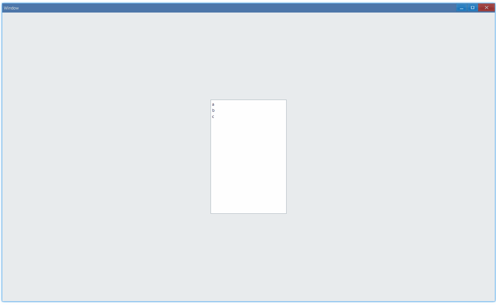

## Examples {#examples}

### Basic {#example-basic}

```ts {5-10}
import { Window, ListBox } from 'ave-ui';

export function main(window: Window) {
    const listBox = new ListBox(window);
    listBox.Append('a');
    listBox.Append('b');
    listBox.Append('c');
    listBox.OnSelectionEnd((sender) => {
        console.log(sender.GetSelection());
    });

    const container = getControlDemoContainer(window, 1, 200, 300);
    container.ControlAdd(listBox).SetGrid(1, 1);
    window.SetContent(container);
}
```

Display a list of items, and get index of selected item:



In console:

```bash
0
1
2
```

#### API {#api-basic}

```ts
export interface IKnob extends IControl {
    Append(text: string): ListBox;
    OnSelectionEnd(callback: (sender: ListBox) => void): ListBox;
    GetSelection(): number;
}
```
