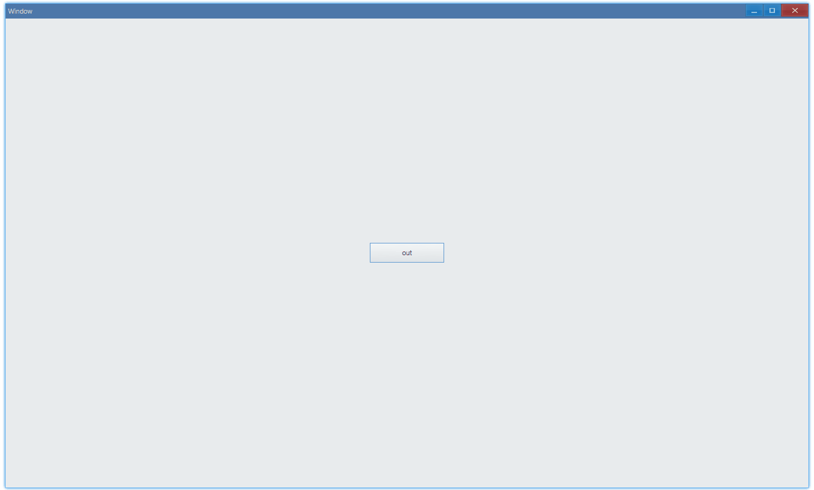

## Examples {#examples}

### Basic {#example-basic}

> [examples/unit/mouse-event/event-basic.ts](https://github.com/qber-soft/Ave-Nodejs/blob/main/Code/Avernakis%20Nodejs/Test-Nodejs/examples/unit/mouse-event/event-basic.ts)



This example shows how to listen to basic mouse events:

-   Enter & Leave
-   Press & Release
-   Move
-   Hover

```ts {16,20,26,29,34,38}
function formatMessagePointer(m: MessagePointer) {
    return `pos: (${m.Position.x}, ${m.Position.y})`;
}

export function main(window: Window) {
    const button = new Button(window);
    let entered = false;
    let pos = Vec2.Zero;

    const updateButton = () =>
        button.SetText(`${entered ? `at ${pos.x}, ${pos.y}` : 'out'}`);

    updateButton();

    //
    button.OnPointerEnter((sender, mp) => {
        entered = true;
        updateButton();
    });
    button.OnPointerLeave((sender, mp) => {
        entered = false;
        updateButton();
    });

    //
    button.OnPointerPress((sender, mp) => {
        console.log(`on press: ${formatMessagePointer(mp)}`);
    });
    button.OnPointerRelease((sender, mp) => {
        console.log(`on release: ${formatMessagePointer(mp)}`);
    });

    //
    button.OnPointerMove((sender, mp) => {
        pos = mp.Position;
        updateButton();
    });
    button.OnPointerHover((sender, mp) => {
        console.log('on hover');
    });

    const container = getControlDemoContainer(window);
    container.ControlAdd(button).SetGrid(1, 1);
    window.SetContent(container);
}
```

#### API {#api-basic}

```ts
export interface IControl extends IControlExtension {
    //
    OnPointerEnter(
        fn: (sender: IControl, mp: MessagePointer) => void,
    ): IControl;
    OnPointerLeave(
        fn: (sender: IControl, mp: MessagePointer) => void,
    ): IControl;

    //
    OnPointerPress(
        fn: (sender: IControl, mp: MessagePointer) => void,
    ): IControl;
    OnPointerRelease(
        fn: (sender: IControl, mp: MessagePointer) => void,
    ): IControl;

    //
    OnPointerMove(fn: (sender: IControl, mp: MessagePointer) => void): IControl;
    OnPointerHover(
        fn: (sender: IControl, mp: MessagePointer) => void,
    ): IControl;
}

export class MessagePointer {
    // Common
    Id: number;
    Type: PointerType;
    Position: Vec2;
    Modifier: InputModifier;
    Button: PointerButton;
    Count: number;

    ...
}
```
