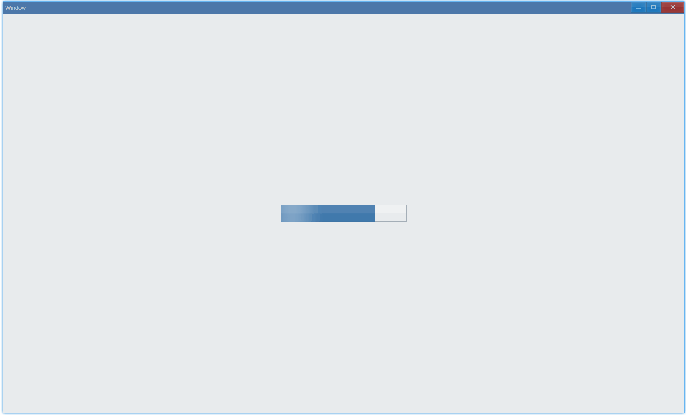

import Tabs from '@theme/Tabs';
import TabItem from '@theme/TabItem';

## Examples {#examples}

### Basic {#example-basic}

```ts {5-6}
import { Window, ProgressBar, Grid } from 'ave-ui';

export function main(window: Window) {
    const progressBar = new ProgressBar(window);
    progressBar.SetMaximum(100).SetAnimation(true);
    progressBar.SetValue(75);

    const container = getControlDemoContainer(window);
    container.ControlAdd(progressBar).SetGrid(1, 1);
    window.SetContent(container);
}

function getControlDemoContainer(window: Window, count = 1) {
    const container = new Grid(window);
    container.ColAddSlice(1);
    container.ColAddDpx(...Array.from<number>({ length: count }).fill(240));
    container.ColAddSlice(1);

    container.RowAddSlice(1);
    container.RowAddDpx(...Array.from<number>({ length: count }).fill(32));
    container.RowAddSlice(1);
    return container;
}
```

In this example, we demonstrate the basic usage of progress.

`SetAnimation` controls the flowing light.



#### API {#api-basic}

```ts
export interface IProgressBar extends IControl {
    SetMaximum(value: number): ProgressBar;
    GetMaximum(): number;

    SetValue(value: number): ProgressBar;
    GetValue(): number;

    SetAnimation(enableAnimation: boolean): ProgressBar;

    // animation is enabled: return true, else false
    GetAnimation(): boolean;
}
```

### State {#example-state}

Use `SetState` to change the status of progress:

```ts {7}
import { Window, ProgressBar, Grid, ProgressBarState } from 'ave-ui';

export function main(window: Window) {
    const progressBar = new ProgressBar(window);
    progressBar.SetMaximum(100).SetAnimation(true);
    progressBar.SetValue(75);
    progressBar.SetState(ProgressBarState.Normal);

    const container = getControlDemoContainer(window);
    container.ControlAdd(progressBar).SetGrid(1, 1);
    window.SetContent(container);
}
```

<Tabs
    defaultValue="normal"
    values={[
        { label: 'Normal', value: 'normal' },
        { label: 'Paused', value: 'paused' },
        { label: 'Error', value: 'error' },
        { label: 'Pulse', value: 'pulse' },
    ]}>
    <TabItem value="normal">
        
    </TabItem>
    <TabItem value="paused">
        
    </TabItem>
    <TabItem value="error">
        
    </TabItem>
    <TabItem value="pulse">
        
    </TabItem>
</Tabs>

#### API {#api-state}

```ts
export interface IProgressBar extends IControl {
    SetState(state: ProgressBarState): ProgressBar;
    GetState(): ProgressBarState;
}

export enum ProgressBarState {
    Normal,
    Paused,
    Error,
    Pulse,
    None,
}
```

### Step {#example-step}

Step is used to set the completion percentage of each increment.

```ts
import { Window, ProgressBar, Grid } from 'ave-ui';

export function main(window: Window) {
    const progressBar = new ProgressBar(window);
    progressBar.SetMaximum(100).SetAnimation(true);

    // grow from 0%
    progressBar.SetValue(0);

    // each increment is 1%
    progressBar.SetStep(1);

    const container = getControlDemoContainer(window);
    container.ControlAdd(progressBar).SetGrid(1, 1);
    window.SetContent(container);

    const id = setInterval(() => {
        if (progressBar.GetValue() < 100) {
            //
            progressBar.Step();
        } else {
            clearInterval(id);
        }
    }, 100);
}
```

This example shows how to implement loading:


#### API {#api-step}

```ts
export interface IProgressBar extends IControl {
    SetStep(value: number): ProgressBar;
    GetStep(): number;
    Step(): ProgressBar;
}
```
