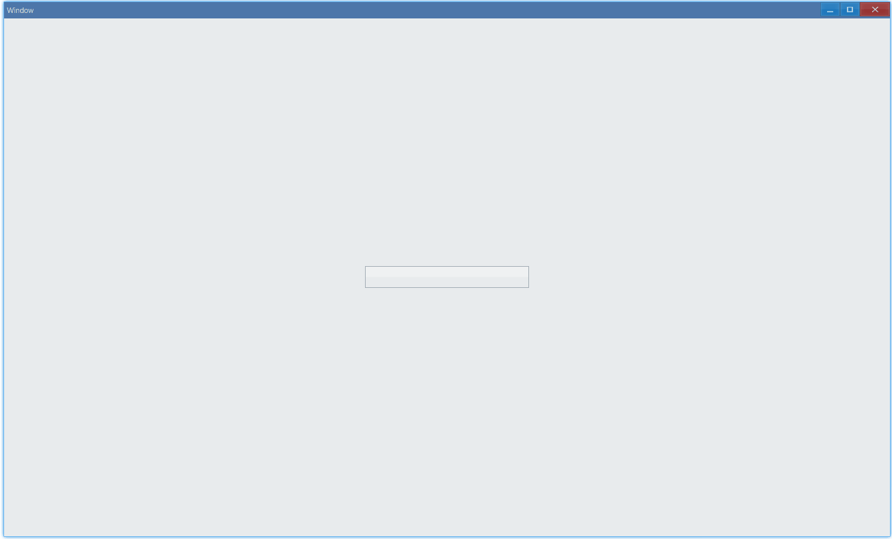

import Tabs from '@theme/Tabs';
import TabItem from '@theme/TabItem';

## Examples {#examples}

### Basic {#example-basic}

```tsx
export function App() {
    return (
        <Window>
            <DemoLayout>
                <Progress value={75} max={100} animation></Progress>
            </DemoLayout>
        </Window>
    );
}

interface IDemoLayoutProps {
    children?: any[] | any;
    width?: string;
    height?: string;
}

function DemoLayout(props: IDemoLayoutProps) {
    const width = props?.width ?? '240dpx';
    const height = props?.height ?? '32dpx';

    const demoLayout = {
        columns: `1 ${width} 1`,
        rows: `1 ${height} 1`,
        areas: {
            center: { row: 1, column: 1 },
        },
    };
    return (
        <Grid style={{ layout: demoLayout }}>
            <Grid style={{ area: demoLayout.areas.center }}>
                {props.children}
            </Grid>
        </Grid>
    );
}
```

In this example, we demonstrate the basic usage of progress.

`animation` controls the flowing light.


#### API {#api-basic}

```ts
export interface IProgressComponentProps extends IComponentProps {
    value: number;
    max?: number;
    animation?: boolean;
}
```

### State {#example-state}

Use `state` to change the status of progress:

```tsx {9}
export function App() {
    return (
        <Window>
            <DemoLayout>
                <Progress
                    value={75}
                    max={100}
                    animation
                    state={ProgressBarState.Normal}
                ></Progress>
            </DemoLayout>
        </Window>
    );
}
```

<Tabs
    defaultValue="normal"
    values={[
        { label: 'Normal', value: 'normal' },
        { label: 'Paused', value: 'paused' },
        { label: 'Error', value: 'error' },
        { label: 'Pulse', value: 'pulse' },
    ]}
>
    <TabItem value="normal">
        
    </TabItem>
    <TabItem value="paused">
        
    </TabItem>
    <TabItem value="error">
        
    </TabItem>
    <TabItem value="pulse">
        
    </TabItem>
</Tabs>

#### API {#api-state}

```ts
export enum ProgressBarState {
    Normal,
    Paused,
    Error,
    Pulse,
    None,
}
```

### Step {#example-step}

```tsx
export function App() {
    const [value, setValue] = useState(0);
    useEffect(() => {
        setInterval(() => {
            if (value < 100) {
                setValue((prev) => prev + 1); // step is 1
            }
        }, 100);
    }, []);
    return (
        <Window>
            <DemoLayout>
                <Progress value={value}></Progress>
            </DemoLayout>
        </Window>
    );
}
```

This example shows how to implement loading:


