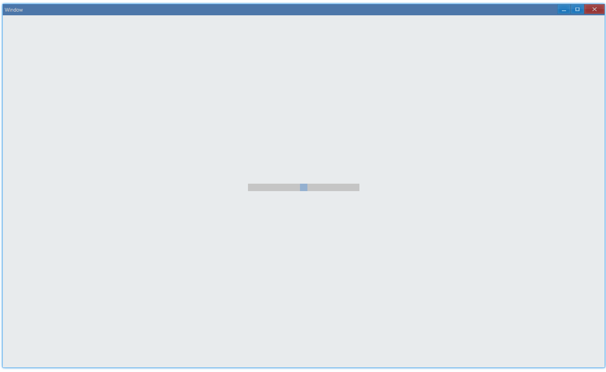
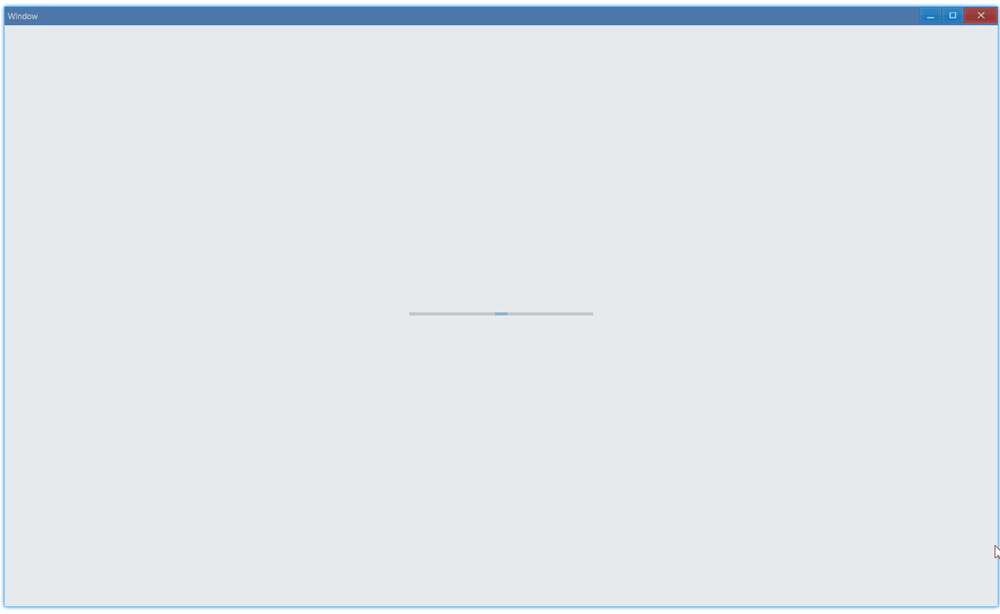

## Examples {#examples}

### Basic {#example-basic}

```ts {5-8}
import { Window, ScrollBar } from 'ave-ui';

export function main(window: Window) {
    const scrollBar = new ScrollBar(window);
    scrollBar.SetMinimum(0).SetMaximum(100).SetValue(50).SetShrink(false);
    scrollBar.OnScrolling((sender: ScrollBar) => {
        console.log(sender.GetValue());
    });

    const container = getControlDemoContainer(window, 2, 120, 16);
    container.ControlAdd(scrollBar).SetGrid(1, 1, 2, 1);
    window.SetContent(container);
}
```

In this example, we demonstrate the basic usage of scroll bar.

Drag it and get the current positon:



Log in console:

```bash
50
49
49
48
48
47
...
36
36
35
35
34
34
```

In the above example, we set `shrink` to `false`, which gives us a fixed size scroll bar. To be dynamically sized, set it to `true`:



#### API {#api-basic}

```ts
export interface IScrollBar extends IControl {
    SetMinimum(min: number): ScrollBar;
    GetMinimum(): number;

    SetMaximum(max: number): ScrollBar;
    GetMaximum(): number;

    SetValue(value: number): ScrollBar;
    GetValue(): number;

    SetShrink(shrink: boolean): ScrollBar;
    GetShrink(): boolean;

    OnScrolling(callback: (sender: ScrollBar) => void): ScrollBar;
}
```
