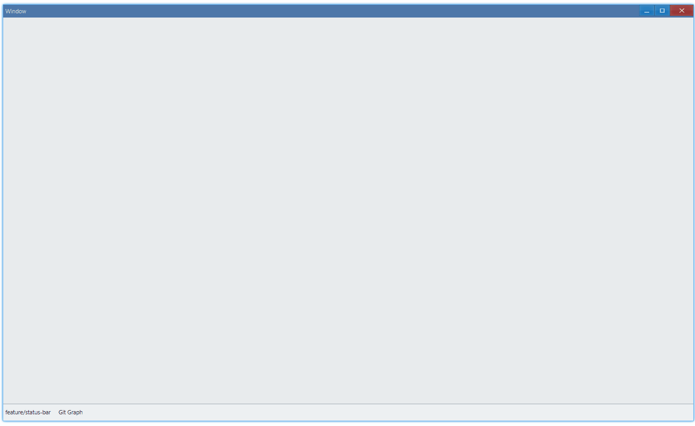

## Examples {#examples}

### Basic {#example-basic}

```ts {7,12-14}
import { Window, StatusBar, DpiSize, Grid } from 'ave-ui';

export function main(window: Window) {
    const statusBar = new StatusBar(window);

    //
    statusBar.SetPart([
        DpiSize.FromPixelScaled(100),
        DpiSize.FromPixelScaled(100),
        DpiSize.FromSlice(1),
    ]);
    statusBar.SetText(0, 'feature/status-bar').SetClickable(0, true);
    statusBar.SetText(1, 'Git Graph').SetClickable(1, true);
    statusBar.OnClick((sender, index) => {
        console.log(`index: ${index}`);
    });

    //
    const container = getControlDemoContainer(window);
    container.ControlAdd(statusBar).SetGrid(0, 1);
    window.SetContent(container);
}

export function getControlDemoContainer(window: Window) {
    const container = new Grid(window);
    container.ColAddSlice(1);

    container.RowAddSlice(1);
    container.RowAddDpx(32);
    return container;
}
```

Usage:



Print index of clicked part:

```bash
index: 1
index: 0
```

#### API {#api-basic}

```ts
export interface IStatusBar extends IControl {
    // set the layout of status bar: the width of each part
    SetPart(partWidthList: DpiSize[]): StatusBar;
    GetPart(): DpiSize[];

    SetText(index: number, text: string): StatusBar;
    GetText(index: number): string;

    OnClick(callback: (sender: StatusBar, index: number) => void): StatusBar;
}
```
