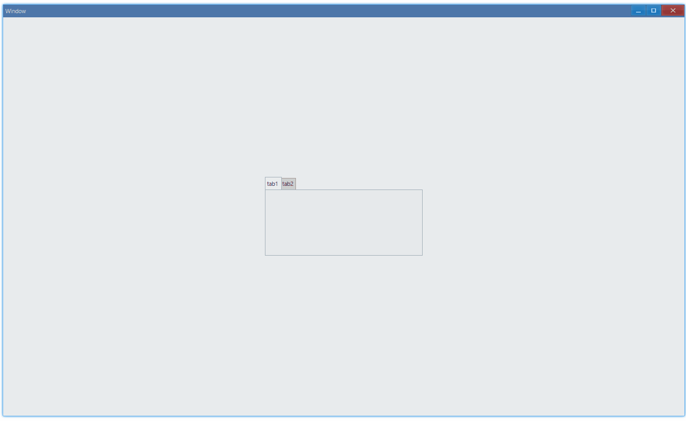
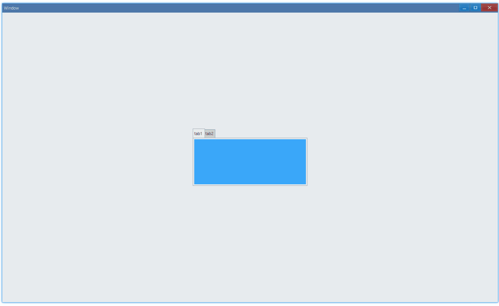

## Examples {#examples}

### Basic {#example-basic}

```ts {4,6,9}
import { Window, Tab, TabItem } from 'ave-ui';

export function main(window: Window) {
    const tab = new Tab(window);

    const tabItem1 = new TabItem();
    tabItem1.Id = 1;
    tabItem1.Text = 'tab1';
    tab.TabInsert(tabItem1);

    const tabItem2 = new TabItem();
    tabItem2.Id = 2;
    tabItem2.Text = 'tab2';
    tab.TabInsert(tabItem2);

    const container = getControlDemoContainer(window, 1, 300, 150);
    container.ControlAdd(tab).SetGrid(1, 1);
    window.SetContent(container);
}
```

Switch between `tab1` and `tab2`:



#### API {#api-basic}

```ts
export interface ITab extends IControl {
    // add tab, return true when success
    TabInsert(tabItem: TabItem): boolean;
}

export class TabItem {
    // 0 is reserved, don't use it as your tab id
    Id: number = 0;
    Order: number = 0;
    Icon: IconCache = 0;
    // title of tab
    Text: string = '';
    StackGroup: string = '';
    StackText: string = '';
    GroupId: number = 0;
    Misc: TabItemMisc = TabItemMisc.None;
    ButtonMask: number = 0;
    Color: Vec4 = new Vec4();
}
```

### Set Content {#set-content}

We can put any control in tab:

```ts {11-15}
import { Window, Tab, TabItem, Grid, Vec4 } from 'ave-ui';

export function main(window: Window) {
    const tab = new Tab(window);

    const tabItem1 = new TabItem();
    tabItem1.Id = 1;
    tabItem1.Text = 'tab1';
    tab.TabInsert(tabItem1);

    {
        const grid = new Grid(window);
        grid.SetBackColor(new Vec4(0, 146, 255, 255 * 0.75));
        tab.ContentSet(1, grid);
    }

    const tabItem2 = new TabItem();
    tabItem2.Id = 2;
    tabItem2.Text = 'tab2';
    tab.TabInsert(tabItem2);

    {
        const grid = new Grid(window);
        grid.SetBackColor(new Vec4(238, 39, 70, 255));
        tab.ContentSet(2, grid);
    }

    const container = getControlDemoContainer(window, 1, 300, 150);
    container.ControlAdd(tab).SetGrid(1, 1);
    window.SetContent(container);
}
```

Usage:



#### API {#api-set-content}

```ts
export interface ITab extends IControl {
    ContentSet(index: number, control: IControl);
}
```
