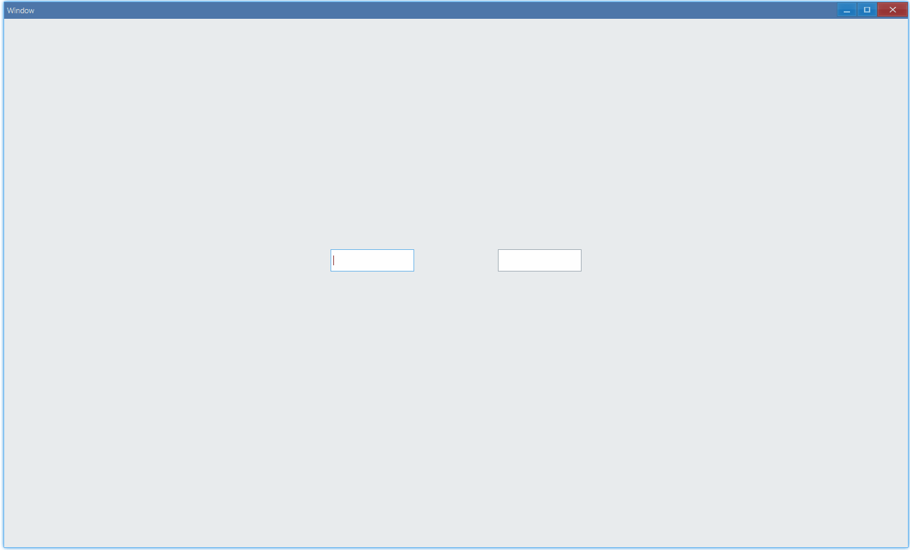

## Examples {#examples}

### Basic {#example-basic}

```ts {5}
import { Window, TextBox } from 'ave-ui';

export function main(window: Window) {
    const textBox = new TextBox(window);
    textBox.OnChange((sender, reason) => {
        console.log(reason);
        console.log(sender.GetText());
    });

    const container = getControlDemoContainer(window);
    container.ControlAdd(textBox).SetGrid(1, 1);
    window.SetContent(container);
}
```

Usage:


Log in console:

```bash
0
a
0
ab
0
abc
0
abc1
0
abc12
0
abc123
```

As we set callback using `textBox.OnChange`, text content will be printed in log together with the reason for text change.

#### API {#api-text-box-basic}

```ts
export enum TextBoxChangeReason {
    Input, // 0: type text in text box
    UpDown,
    Reset,
    Spin,
    SpinCommit,
    SpinCancel,
}

export class TextBox {
    SetText(text: string): TextBox;
    GetText(): string;

    OnChange(
        callback: (sender: TextBox, reason: TextBoxChangeReason) => void,
    ): TextBox;
}
```

### IME {#example-use-ime}

By default, we can only enter text in English characters or number. To use Chinese or other characters, we must set IME(input method):

```ts {9,15}
import { Window, TextBox } from 'ave-ui';

export function main(window: Window) {
    const container = getControlDemoContainer(window, 3);

    {
        //
        const textBox = new TextBox(window);
        console.log(textBox.GetIme()); // expected: false
        container.ControlAdd(textBox).SetGrid(1, 1);
    }

    {
        const textBox = new TextBox(window);
        textBox.SetIme(true);
        container.ControlAdd(textBox).SetGrid(3, 1);
    }

    window.SetContent(container);
}
```



#### API {#api-text-box-ime}

```ts
export class TextBox {
    SetIme(useIme: boolean): TextBox;
    GetIme(): boolean;
}
```
