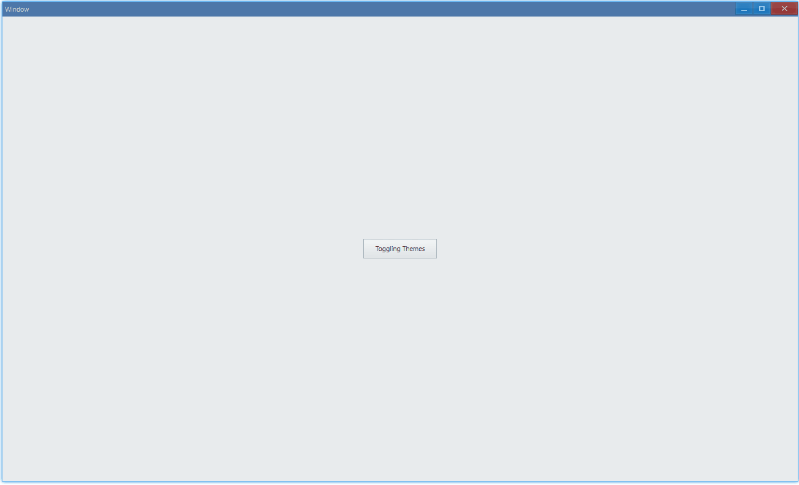

## Examples {#examples}

### Basic {#example-basic}

```ts {15,17}
import { Window, Button, ThemeImage, ThemePredefined_Dark } from 'ave-ui';

export interface IThemeManager {
    theme: ThemeImage;
    themeDark: ThemePredefined_Dark;
}

export function main(window: Window, themeManager: IThemeManager) {
    const button = new Button(window);
    button.SetText('Toggling Themes');

    let isDark = false;
    button.OnClick((sender) => {
        if (!isDark) {
            themeManager.themeDark.SetStyle(themeManager.theme, 0); // switch to dark theme
        } else {
            themeManager.theme.ResetTheme(); // reset to light theme
        }
        isDark = !isDark;
    });

    const container = getControlDemoContainer(window);
    container.ControlAdd(button).SetGrid(1, 1);
    window.SetContent(container);
}
```

This example shows how to toggle theme:



The creation of `themeManager`:

```ts {3,7,9-10,16}
export function run(main: Function) {
    // ...
    const theme = new ThemeImage();
    if (!theme) process.exit(-1);

    cpWindow.Theme = theme;
    globalThis.theme = theme; // avoid GC

    const themeDark = new ThemePredefined_Dark();
    globalThis.themeDark = themeDark; // avoid GC

    const window = new Window(cpWindow);
    globalThis.window = window;

    window.OnCreateContent((sender) => {
        const themeManager = { theme, themeDark };
        main(window, themeManager);
        return true;
    });
    // ...
}
```

#### API {#api-basic}

```ts
export interface IThemePredefined_Dark {
    SetStyle(theme: IThemeImage, nStyle: number): void;
}

export interface IThemeImage {
    ResetTheme(): void;
}
```
