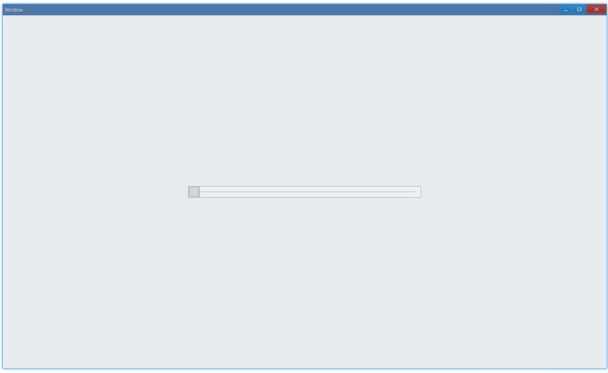

## Examples {#examples}

### Basic {#example-basic}

```ts {4-7}
import { Window, TrackBar } from 'ave-ui';

export function main(window: Window) {
    const trackBar = new TrackBar(window);
    trackBar.OnThumbRelease((sender) => {
        console.log(`on thumb release, current value: ${sender.GetValue()}`);
    });

    const container = getControlDemoContainer(window, 1, 500, 25);
    container.ControlAdd(trackBar).SetGrid(1, 1);
    window.SetContent(container);
}
```

Drag it and get value:



In console:

```bash
on thumb release, current value: 0
on thumb release, current value: 22
on thumb release, current value: 46
on thumb release, current value: 69
on thumb release, current value: 75
on thumb release, current value: 85
on thumb release, current value: 100
...
```

#### API {#api-basic}

```ts
export interface ITrackBar extends IControl {
    // range is [0,100]
    GetValue(): number;
    SetValue(nValue: number): TrackBar;

    //
    OnThumbRelease(fn: (sender: TrackBar) => void): TrackBar;
}
```
