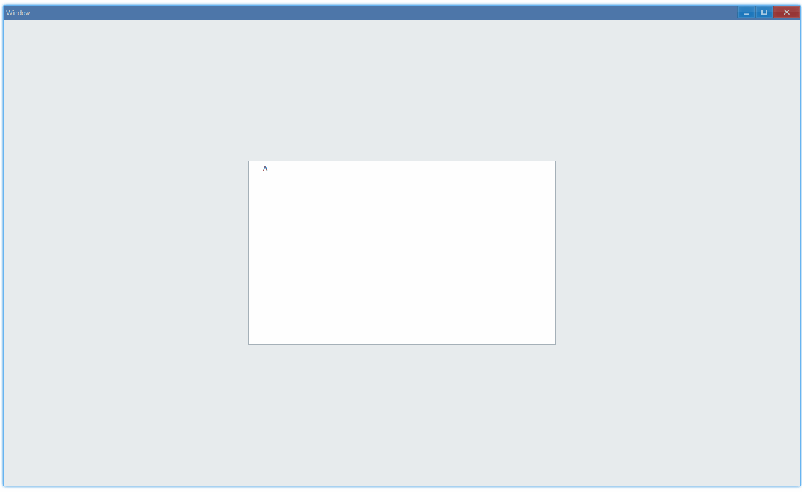

## Examples {#examples}

### Basic {#example-basic}

```tsx
export function App() {
    const nodes: ITreeComponentProps['nodes'] = [
        {
            text: 'A',
            children: [
                { text: 'C', children: [{ text: 'D', children: [] }] },
                { text: 'B', children: [] },
            ],
        },
    ];
    return (
        <Window>
            <DemoLayout width="500dpx" height="300dpx">
                <Tree
                    nodes={nodes}
                    onSelect={(sender, selected) => {
                        console.log(`select ${selected.text}`);
                    }}
                ></Tree>
            </DemoLayout>
        </Window>
    );
}
```

Usage:



In console:

```bash
select A
select C
select D
select B
```

#### API {#api-basic}

```ts
export interface ITreeComponentProps extends IComponentProps {
    nodes: ITreeNode[];
    onSelect?: (sender: NativeTree, selected: ITreeNode) => void;
}

export interface ITreeNode {
    text: string;
    children: ITreeNode[];
}
```
