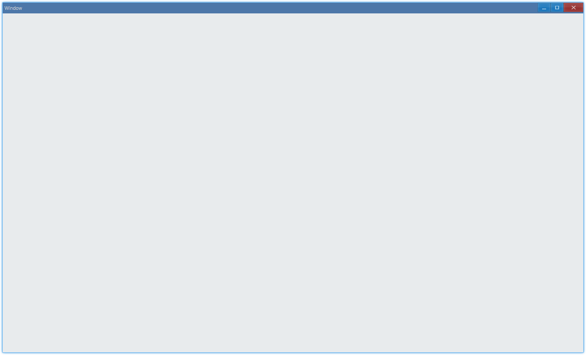
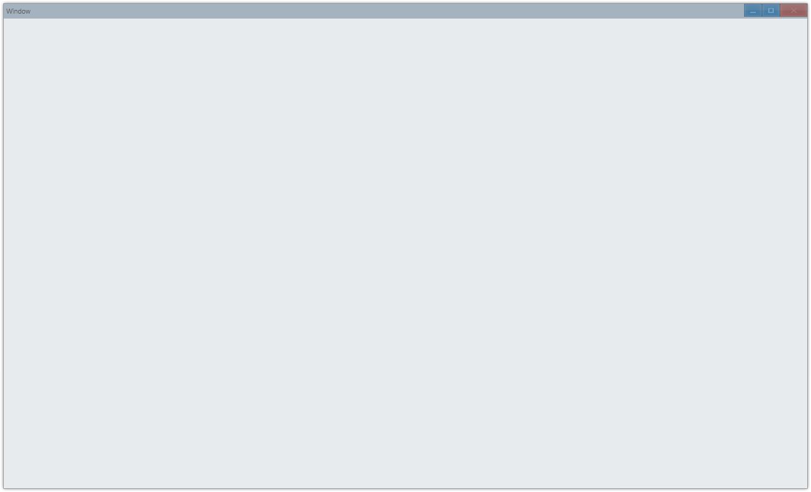
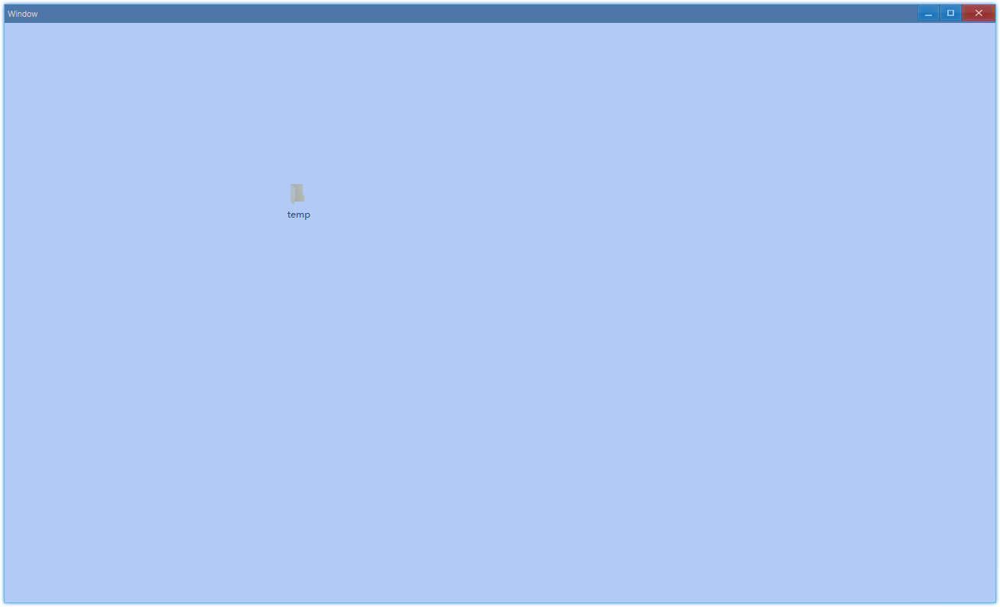

## Examples {#examples}

### Basic {#example-window-basic}

```ts
import { App, WindowCreation, WindowFlag, Window } from 'ave-ui';

// create Ave app instance, assign it to global to avoid GC
const app = new App();
globalThis.app = app;

// cp:creation param
const cpWindow = new WindowCreation();
cpWindow.Title = 'Window';
cpWindow.Flag |= WindowFlag.Layered;

const window = new Window(cpWindow);
// avoid GC
globalThis._window = window;

// set callback
window.OnCreateContent((sender) => {
    // and create window content here
    return true;
});

// boilerplate code
if (!window.CreateWindow()) process.exit(-1);

window.SetVisible(true);
window.Activate();
```

Run, and get this basic window:



#### API {#api-window-basic}

```ts
export interface IWindow extends IControl {
    // callback:return true for success, or return false
    OnCreateContent(callback: (sender: Window) => boolean): Window;

    // success: true, fail: false
    CreateWindow(): boolean;

    SetVisible(visible: boolean): IControl;

    // activate it, or you will get gray window
    Activate(): Window;

    // enable/disable background of window
    SetBackground(useBackground: boolean): Window;
}

export class WindowCreation {
    Title: string = '';
    Flag: WindowFlag = WindowFlag.Default;
}

export enum WindowFlag {
    MainWindow /**/ = 0x00000001, // program will terminate when window created with this flag closed
    Sizable /**/ = 0x00000004,
    Minimum /**/ = 0x00000008,
    Layered /**/ = 0x00000040, // enable transparency
    Default /**/ = MainWindow | Sizable | Minimum,
}
```

Inactive window:



### Transparency {#example-window-opacity}

`Layered` flag controls transparency feature:



You can implement it this way:

```ts {24,33}
import {
    App,
    WindowCreation,
    WindowFlag,
    Window,
    Grid,
    Vec4,
    DockMode,
} from 'ave-ui';

export function run() {
    const app = new App();
    globalThis.app = app;

    const cpWindow = new WindowCreation();
    cpWindow.Title = 'Window';
    cpWindow.Flag |= WindowFlag.Layered;

    const window = new Window(cpWindow);
    globalThis._window = window;

    window.OnCreateContent((sender) => {
        // by default we get white background, to enable transparency, we disable it here
        sender.SetBackground(false);

        const grid = new Grid(sender);
        {
            const gridChild = new Grid(sender);
            grid.ControlAdd(gridChild).SetDock(DockMode.Fill);
            const color = new Vec4(100, 149, 237, 255);
            gridChild.SetBackColor(color);
            // the opacity of gridChild will be the opacity of the content of window
            gridChild.SetOpacity(0.5);
        }
        window.SetContent(grid);
        return true;
    });

    if (!window.CreateWindow()) process.exit(-1);

    window.SetVisible(true);
    window.Activate();
}
```

About grid opacity, see [Transparent Grid](layout#example-grid-opacity).
