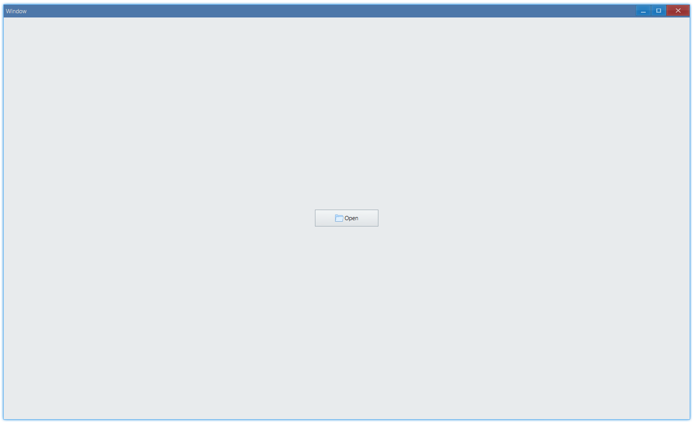

<!-- ## 简介 {#introduction}

TODO：以后添加对按钮的整体介绍。 -->

## 例子 {#examples}

### 设置文案 {#example-set-text}

```ts {5}
import { Window, Button } from 'ave-ui';

export function main(window: Window) {
    const button = new Button(window);
    button.SetText('Button');

    const container = getControlDemoContainer(window);
    container.ControlAdd(button).SetGrid(1, 1);
    window.SetContent(container);
}

// 我们将待演示的控件放置于窗口中心，创建layout的代码是重复的，在之后的例子中将不再赘述。
export function getControlDemoContainer(window: Window, count = 1) {
    const container = new Grid(window);
    container.ColAddSlice(1);
    container.ColAddDpx(...Array.from<number>({ length: count }).fill(120));
    container.ColAddSlice(1);

    container.RowAddSlice(1);
    container.RowAddDpx(...Array.from<number>({ length: count }).fill(32));
    container.RowAddSlice(1);
    return container;
}
```

我们使用`SetText`来设置按钮上的文案，运行之后：


#### API {#api-button-set-text}

```ts
export interface IButton extends IControl {
    SetText(text: string): IButton;
    GetText(): string;
}
```

### 设置文字颜色 {#example-set-text-color}

```ts {7,8}
import { Window, Button, Vec4 } from 'ave-ui';

export function main(window: Window) {
    const button = new Button(window);
    button.SetText('Button');

    const lightBlue = new Vec4(0, 146, 255, 255 * 0.75);
    button.SetTextColor(lightBlue);

    const container = getControlDemoContainer(window);
    container.ControlAdd(button).SetGrid(1, 1);
    window.SetContent(container);
}
```

运行之后：


#### API {#api-button-text-color}

```ts
export interface IButton extends IControl {
    SetTextColor(color: Vec4): IControl;
    GetTextColor(): Vec4;
}
```

### 样式 {#example-button-style}

```ts {9,16}
import { Window, Button, ButtonStyle } from 'ave-ui';

export function main(window: Window) {
    const container = getControlDemoContainer(window, 3);

    {
        const button = new Button(window);
        button.SetText('Button');
        button.SetButtonStyle(ButtonStyle.Command);
        container.ControlAdd(button).SetGrid(1, 1);
    }

    {
        const button = new Button(window);
        button.SetText('Button');
        button.SetButtonStyle(ButtonStyle.Push);
        container.ControlAdd(button).SetGrid(3, 1);
    }

    window.SetContent(container);
}
```

这两种样式在功能上没有任何区别，只是外观上看起来不同。push 的意思是说这个按钮是有按下弹起的样式（比较有层次感那种），command 就是有点类似超链接那种的样式。以下是点击的效果：


#### API {#api-button-style}

```ts
export interface IButton extends IControl {
    SetButtonStyle(style: ButtonStyle): IButton;
    GetButtonStyle(): ButtonStyle;
}

export enum ButtonStyle {
    Push,
    Command,
}
```

### 点击事件 {#example-button-event-click}

```ts {6-8}
import { Window, Button } from 'ave-ui';

export function main(window: Window) {
    const button = new Button(window);
    button.SetText('Button');
    button.OnClick((sender) => {
        sender.SetText('Button Clicked');
    });

    const container = getControlDemoContainer(window);
    container.ControlAdd(button).SetGrid(1, 1);
    window.SetContent(container);
}
```

以下演示点击按钮之后修改按钮上的文案：


#### API {#api-button-event-click}

```ts
export interface IButton extends IControl {
    OnClick(callback: (sender: IButton) => void): IButton;
}
```

### 设置图标 {#example-set-icon}

> [examples/unit/app/app-resource](https://github.com/qber-soft/Ave-Nodejs/blob/main/Code/Avernakis%20Nodejs/Test-Nodejs/examples/unit/app/app-resource.ts)

```ts {4,6-8}
window.OnCreateContent((sender) => {
    const button = new Button(window);
    button.SetText('Open');
    button.SetVisualTextLayout(VisualTextLayout.HorzVisualText);

    const iconSource = new IconSource(resMap.Open, 16);
    const icon = window.CreateManagedIcon(iconSource);
    button.SetVisual(icon);
    ...
    return true;
});
```

可以在文字旁边设置一个[图标](icon#introduction):



#### API {#api-set-icon}

```ts
export interface IButton extends IControl {
    SetVisualTextLayout(n: VisualTextLayout): Button;
    GetVisualTextLayout(): VisualTextLayout;

    SetVisual(v: IVisual): IVisual;
    GetVisual(): IVisual;
}
```
