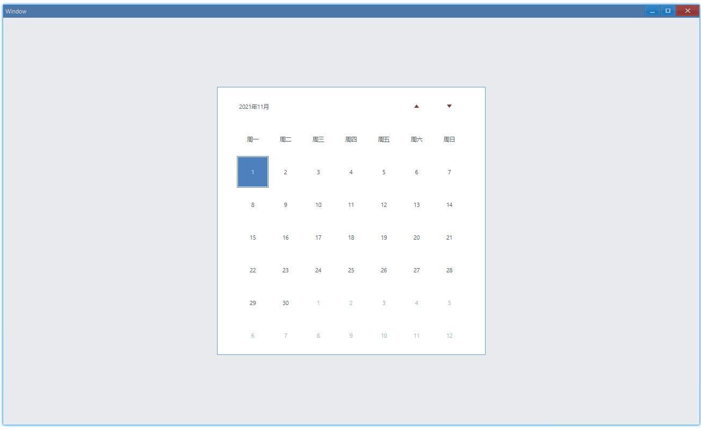
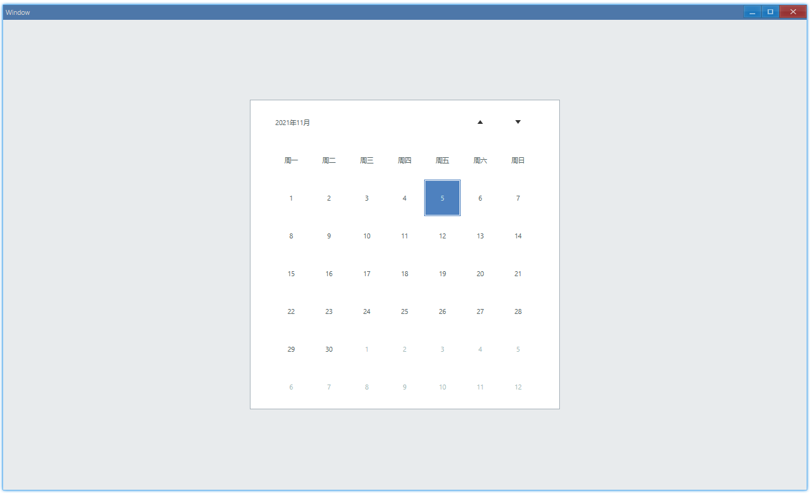

<!-- ## 简介 {#introduction}

TODO：以后添加对日历的整体介绍。 -->

## 例子 {#examples}

### 基本用法 {#example-basic}

```ts {5-8}
import { Window, Calendar } from 'ave-ui';

export function main(window: Window) {
    const calendar = new Calendar(window);
    calendar.OnChange((sender) => {
        const timePoint = sender.GetDate();
        console.log(
            `Date: ${timePoint.Year}-${timePoint.Month}-${timePoint.Day}`,
        );
    });

    const container = getControlDemoContainer(window, 1, 500, 500);
    container.ControlAdd(calendar).SetGrid(1, 1);
    window.SetContent(container);
}
```

在这个例子中，我们演示了日历的基本用法：默认高亮显示当前日期、响应点击事件获取日期。



控制台有如下输出：

```bash
Date: 2021-11-10
Date: 2021-11-19
```

#### API {#api-basic}

```ts
export interface ICalendar extends IControl {
    GetDate(): TimePoint;
    OnChange(callback: (sender: Calendar) => void): Calendar;
}

export class TimePoint {
    get Year(): number;
    get Month(): number;
    get Day(): number;
}
```

### 设置日期 {#example-set}

默认情况下打开日历显示的是当天日期，这是可以修改的：

```ts {5-6}
import { Window, Calendar, TimePoint } from 'ave-ui';

export function main(window: Window) {
    const calendar = new Calendar(window);
    calendar.SetDate(new TimePoint(2021, 11, 5));
    calendar.SetDateMark(new TimePoint(2021, 11, 5));

    const container = getControlDemoContainer(window, 1, 500, 500);
    container.ControlAdd(calendar).SetGrid(1, 1);
    window.SetContent(container);
}
```

在这个例子中，我们将日期设置在了 2021 年 11 月 5 日：



其中，`SetDate`影响的是外面边框，`SetDateMark`影响的是填充的颜色。

我们将`SetDate`的日期改为 11 月 6 日就可以看出区别了：


#### API {#api-set}

```ts
export interface ICalendar extends IControl {
    SetDate(timePoint: TimePoint): Calendar;
    GetDate(): TimePoint;

    SetDateMark(timePoint: TimePoint): Calendar;
    GetDateMark(): TimePoint;
}
```
