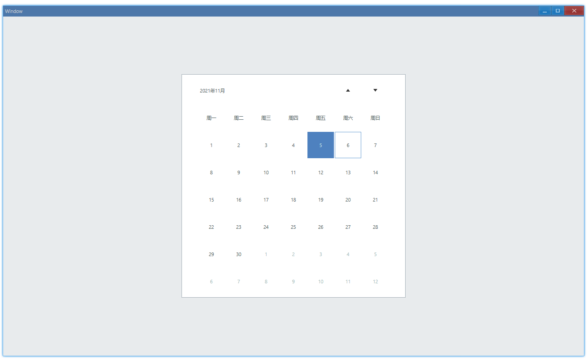

<!-- ## 简介 {#introduction}

TODO：以后添加对日历的整体介绍。 -->

## 例子 {#examples}

### 基本用法 {#example-basic}

```tsx
export function App() {
    return (
        <Window>
            <DemoLayout width="500dpx" height="500dpx">
                <Calendar
                    onChange={(sender) => {
                        const timePoint = sender.GetDate();
                        console.log(
                            `Date: ${timePoint.Year}-${timePoint.Month}-${timePoint.Day}`,
                        );
                    }}
                ></Calendar>
            </DemoLayout>
        </Window>
    );
}
```

在这个例子中，我们演示了日历的基本用法：默认高亮显示当前日期、响应点击事件获取日期。


控制台有如下输出：

```bash
Date: 2021-11-10
Date: 2021-11-19
```

#### API {#api-basic}

```ts
export interface ICalendarComponentProps extends IComponentProps {
    onChange?: Parameters<ICalendar['OnChange']>[0];
}
```

### 设置日期 {#example-set}

默认情况下打开日历显示的是当天日期，这是可以修改的：

```tsx
export function App() {
    const timestamp = new TimePoint(2021, 11, 5).JsDateTime;
    const [date, setDate] = useState(timestamp);
    const [dateMark, setDateMark] = useState(timestamp);

    return (
        <Window>
            <DemoLayout width="500dpx" height="500dpx">
                <Calendar
                    date={date}
                    dateMark={dateMark}
                    onChange={(sender) => {
                        const timePoint = sender.GetDate();
                        const timestamp = timePoint.JsDateTime;
                        setDate(timestamp);
                        setDateMark(timestamp);
                    }}
                ></Calendar>
            </DemoLayout>
        </Window>
    );
}
```

在这个例子中，我们将日期设置在了 2021 年 11 月 5 日：


其中，`date`影响的是外面边框，`dateMark`影响的是填充的颜色。

我们将`date`的日期改为 11 月 6 日就可以看出区别了：

```diff
-const timestamp = new TimePoint(2021, 11, 5).JsDateTime;
+const timestamp = new TimePoint(2021, 11, 6).JsDateTime;
```



#### API {#api-set}

```ts
export interface ICalendarComponentProps extends IComponentProps {
    date?: number;
    dateMark?: number;
}
```
