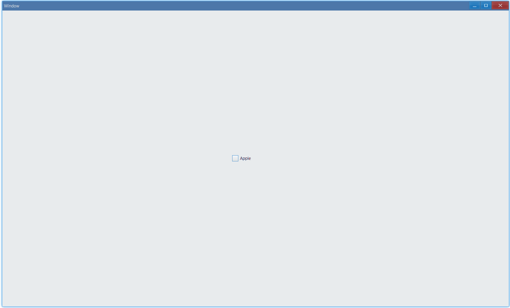
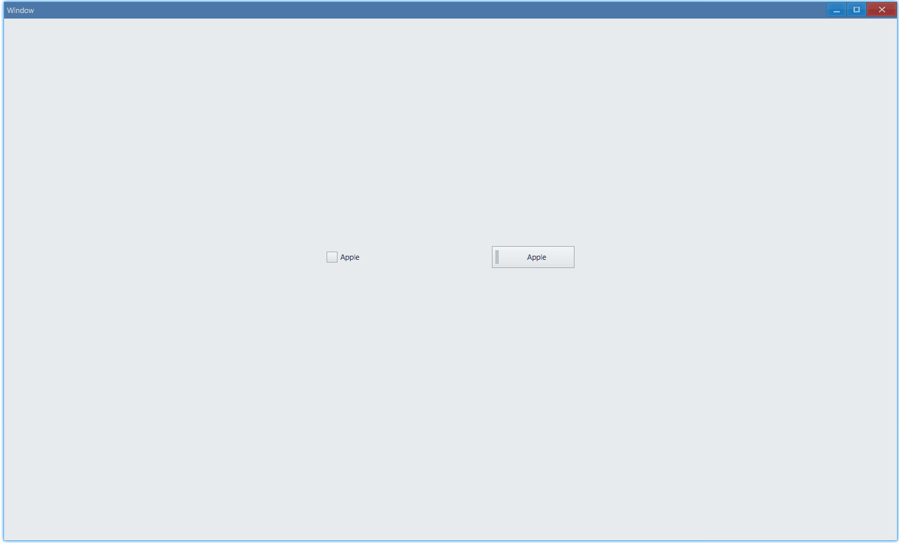
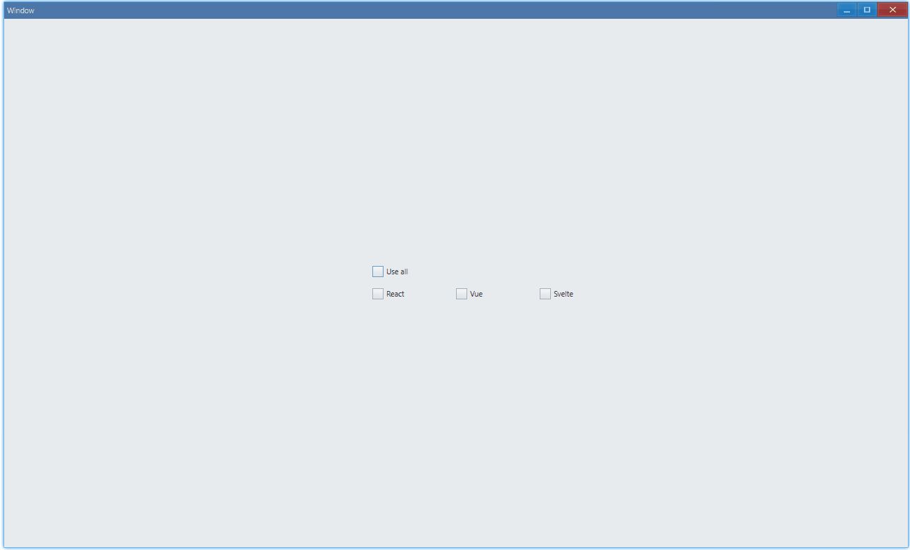
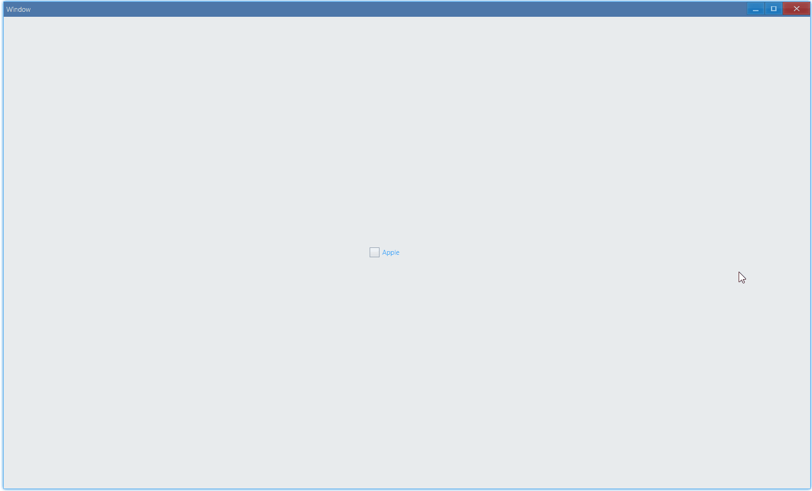

<!-- ## 简介 {#introduction}

TODO：以后添加对多选框的整体介绍。 -->

## 例子 {#examples}

### 基本用法 {#example-basic}

```ts {5-6}
import { Window, CheckBox, CheckValue } from 'ave-ui';

export function main(window: Window) {
    const checkBox = new CheckBox(window);
    checkBox.SetText('Apple');
    checkBox.OnCheck((sender: CheckBox) => {
        const checkValue = sender.GetValue();
        console.log(`check value: ${checkValue}(${CheckValue[checkValue]})`);
    });

    const container = getControlDemoContainer(window);
    container.ControlAdd(checkBox).SetGrid(1, 1);
    window.SetContent(container);
}
```

在这个例子中，我们演示了多选框的基本用法：勾选与取消勾选


另外，控制台会有这样的输出：

```bash
check value: 1(Checked)
check value: 0(Unchecked)
check value: 1(Checked)
check value: 0(Unchecked)
```

这是设置了`OnCheck`回调的原因。另外，我们还可以设置`OnChecking`回调：

```ts {2-4}
checkBox.SetText('Apple');
checkBox.OnChecking((sender: CheckBox) => {
    return false;
});
checkBox.OnCheck((sender: CheckBox) => {
    const checkValue = sender.GetValue();
    console.log(`check value: ${checkValue}(${CheckValue[checkValue]})`);
});
```

它的返回值控制勾选是否生效，比如像上面这样返回`false`的话，勾选就不会生效:



而且观察控制台我们发现没有输出，所以实际上`OnCheck`也不会被调用。

#### API {#api-basic}

```ts
export interface ICheckBox extends IControl {
    SetText(text: string): CheckBox;
    GetText(): string;

    SetValue(value: CheckValue): CheckBox;
    GetValue(): CheckValue;

    OnCheck(callback: (sender: CheckBox) => void): CheckBox;
    OnChecking(callback: (sender: CheckBox) => boolean): CheckBox;
}

export enum CheckValue {
    Unchecked,
    Checked,
    Mixed,
}
```

### 样式 {#example-style}

```ts {9,17}
import { Window, CheckBox, CheckBoxStyle } from 'ave-ui';

export function main(window: Window) {
    const container = getControlDemoContainer(window, 3);

    {
        const checkBox = new CheckBox(window);
        checkBox.SetText('Apple');
        checkBox.SetCheckBoxStyle(CheckBoxStyle.Checking);

        container.ControlAdd(checkBox).SetGrid(1, 1);
    }

    {
        const checkBox = new CheckBox(window);
        checkBox.SetText('Apple');
        checkBox.SetCheckBoxStyle(CheckBoxStyle.Pushing);

        container.ControlAdd(checkBox).SetGrid(3, 1);
    }

    window.SetContent(container);
}
```

除了默认的样式，我们还可以把它设置成按钮式的：



#### API {#api-style}

```ts
export interface ICheckBox extends IControl {
    SetCheckBoxStyle(style: CheckBoxStyle): CheckBox;
    GetCheckBoxStyle(): CheckBoxStyle;
}

export enum CheckBoxStyle {
    Checking,
    Pushing,
}
```

### 状态 {#example-triple}

```ts {9,17}
import { Window, CheckBox, CheckBoxStyle } from 'ave-ui';

export function main(window: Window) {
    const container = getControlDemoContainer(window, 3);

    {
        const checkBox = new CheckBox(window);
        checkBox.SetText('Check all');
        checkBox.SetTriple(true);

        container.ControlAdd(checkBox).SetGrid(1, 1);
    }

    {
        const checkBox = new CheckBox(window);
        checkBox.SetText('Check all');
        checkBox.SetTriple(true);
        checkBox.SetCheckBoxStyle(CheckBoxStyle.Pushing);

        container.ControlAdd(checkBox).SetGrid(3, 1);
    }

    window.SetContent(container);
}
```

除了勾选/没勾选，多选框还有另一种状态：`Mixed`:


#### API {#api-style}

```ts {9}
export interface ICheckBox extends IControl {
    SetTriple(enableTriple: boolean): CheckBox;
    GetTriple(): boolean;
}

export enum CheckValue {
    Unchecked,
    Checked,
    Mixed,
}
```

#### 练习: select all {#practice-select-all}

这个练习的目的是实现类似 web 中的全选效果，例如 [Ant Design CheckBox](https://ant.design/components/checkbox-cn/)，在 Ave 中如何实现如下效果呢？



### 设置文字颜色 {#example-text-color}

```ts {7,8}
import { Window, CheckBox, Vec4 } from 'ave-ui';

export function main(window: Window) {
    const checkBox = new CheckBox(window);
    checkBox.SetText('Apple');

    const lightBlue = new Vec4(0, 146, 255, 255 * 0.75);
    checkBox.SetTextColor(lightBlue);

    const container = getControlDemoContainer(window);
    container.ControlAdd(checkBox).SetGrid(1, 1);
    window.SetContent(container);
}
```

运行之后：



#### API {#api-text-color}

```ts
export interface ICheckBox extends IControl {}
export interface IControl {
    SetTextColor(color: Vec4): IControl;
    GetTextColor(): Vec4;
}
```

## 练习答案 {#practice-solutions}

### select all {#solution-select-all}

> [练习描述](#practice-select-all)

```ts
import { Window, CheckBox, Grid, CheckValue } from 'ave-ui';

export function main(window: Window) {
    const container = getControlDemoContainer(window);

    //
    let useAllCheckbox: CheckBox = null;

    //
    const checkBoxes: CheckBox[] = [];
    const updateCheckBoxes = (checkAll: boolean) => {
        checkBoxes.forEach((each) =>
            each.SetValue(checkAll ? CheckValue.Checked : CheckValue.Unchecked),
        );
    };

    //
    const currentChecked: Set<string> = new Set();
    const updateCurrentChecked = (name: string, checked: boolean) => {
        if (checked) {
            currentChecked.add(name);
        } else {
            currentChecked.delete(name);
        }

        if (currentChecked.size === 0) {
            useAllCheckbox.SetValue(CheckValue.Unchecked);
        } else if (currentChecked.size === checkBoxes.length) {
            useAllCheckbox.SetValue(CheckValue.Checked);
        } else {
            useAllCheckbox.SetValue(CheckValue.Mixed);
        }
    };

    //
    const checkBoxCallback = (sender: CheckBox) => {
        const checkValue = sender.GetValue();
        updateCurrentChecked(
            sender.GetText(),
            checkValue === CheckValue.Checked,
        );
    };

    //
    {
        const checkBox = new CheckBox(window);
        useAllCheckbox = checkBox;

        checkBox.SetText('Use all');
        checkBox.SetTriple(true);
        checkBox.OnChecking((sender: CheckBox) => {
            const current = sender.GetValue();
            console.log('current', current);
            console.log('next', sender.GetNextValue());

            if (current === CheckValue.Unchecked) {
                updateCheckBoxes(true);
                return true;
            } else if (current === CheckValue.Checked) {
                checkBox.SetValue(CheckValue.Unchecked);
                updateCheckBoxes(false);
                return false;
            } else if (current === CheckValue.Mixed) {
                checkBox.SetValue(CheckValue.Checked);
                updateCheckBoxes(true);
                return false;
            }
        });

        container.ControlAdd(checkBox).SetGrid(1, 1);
    }

    {
        const checkBox = new CheckBox(window);
        checkBoxes.push(checkBox);

        checkBox.SetText('React');
        checkBox.OnCheck(checkBoxCallback);

        container.ControlAdd(checkBox).SetGrid(1, 2);
    }

    {
        const checkBox = new CheckBox(window);
        checkBoxes.push(checkBox);

        checkBox.SetText('Vue');
        checkBox.OnCheck(checkBoxCallback);

        container.ControlAdd(checkBox).SetGrid(2, 2);
    }

    {
        const checkBox = new CheckBox(window);
        checkBoxes.push(checkBox);

        checkBox.SetText('Svelte');
        checkBox.OnCheck(checkBoxCallback);

        container.ControlAdd(checkBox).SetGrid(3, 2);
    }

    window.SetContent(container);
}

function getControlDemoContainer(window: Window, count = 1) {
    const container = new Grid(window);
    container.ColAddSlice(1);
    container.ColAddDpx(...Array.from<number>({ length: count }).fill(120));
    container.ColAddDpx(...Array.from<number>({ length: count }).fill(120));
    container.ColAddSlice(1);

    container.RowAddSlice(1);
    container.RowAddDpx(...Array.from<number>({ length: count }).fill(32));
    container.RowAddDpx(...Array.from<number>({ length: count }).fill(32));
    container.RowAddSlice(1);
    return container;
}
```
