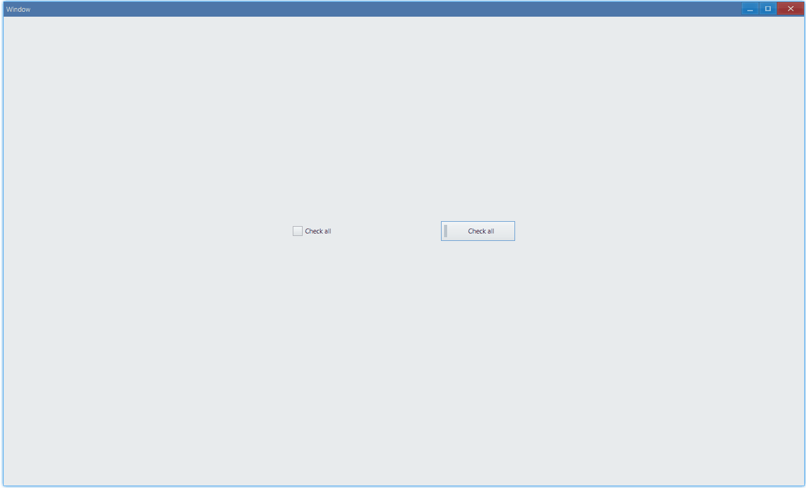

<!-- ## 简介 {#introduction}

TODO：以后添加对多选框的整体介绍。 -->

## 例子 {#examples}

### 基本用法 {#example-basic}

```tsx
export function App() {
    return (
        <Window>
            <DemoLayout>
                <CheckBox
                    text="Apple"
                    onCheck={(sender) => {
                        const checkValue = sender.GetValue();
                        console.log(
                            `check value: ${checkValue}(${CheckValue[checkValue]})`,
                        );
                    }}
                ></CheckBox>
            </DemoLayout>
        </Window>
    );
}
```

在这个例子中，我们演示了多选框的基本用法：勾选与取消勾选


另外，控制台会有这样的输出：

```bash
check value: 1(Checked)
check value: 0(Unchecked)
check value: 1(Checked)
check value: 0(Unchecked)
```

这是设置了`onCheck`回调的原因。另外，我们还可以设置`onChecking`回调：

```tsx {14}
export function App() {
    return (
        <Window>
            <DemoLayout>
                <CheckBox
                    text="Apple"
                    onCheck={(sender) => {
                        const checkValue = sender.GetValue();
                        console.log(
                            `check value: ${checkValue}(${CheckValue[checkValue]})`,
                        );
                    }}
                    onChecking={(sender) => {
                        return false;
                    }}
                ></CheckBox>
            </DemoLayout>
        </Window>
    );
}
```

它的返回值控制勾选是否生效，比如像上面这样返回`false`的话，勾选就不会生效:


而且观察控制台我们发现没有输出，所以实际上`onCheck`也不会被调用。

#### API {#api-basic}

```ts
export interface ICheckBoxComponentProps extends IComponentProps {
    text: string;
    onCheck?: Parameters<ICheckBox['OnCheck']>[0];
    onChecking?: Parameters<ICheckBox['OnChecking']>[0];
}

export enum CheckValue {
    Unchecked,
    Checked,
    Mixed,
}
```

### 样式 {#example-style}

```tsx {8,14}
export function App() {
    return (
        <Window>
            <DemoLayout>
                <CheckBox
                    text="Apple"
                    style={{
                        visualStyle: CheckBoxStyle.Checking,
                    }}
                ></CheckBox>
                <CheckBox
                    text="Apple"
                    style={{
                        visualStyle: CheckBoxStyle.Pushing,
                    }}
                ></CheckBox>
            </DemoLayout>
        </Window>
    );
}

interface IDemoLayoutProps {
    children?: any[] | any;
    width?: string;
    height?: string;
}

function DemoLayout(props: IDemoLayoutProps) {
    const width = props?.width ?? '120dpx';
    const height = props?.height ?? '32dpx';

    const demoLayout = {
        columns: `1 ${width} ${width} ${width} 1`,
        rows: `1 ${height} 1`,
        areas: {
            left: { row: 1, column: 1 },
            right: { row: 1, column: 3 },
        },
    };
    const [left, right] = props.children;
    return (
        <Grid style={{ layout: demoLayout }}>
            <Grid style={{ area: demoLayout.areas.left }}>{left}</Grid>
            <Grid style={{ area: demoLayout.areas.right }}>{right}</Grid>
        </Grid>
    );
}
```

除了默认的样式，我们还可以把它设置成按钮式的：


#### API {#api-style}

```ts
export interface ICheckBoxComponentProps extends IComponentProps {
    style?: ICheckBoxStyle;
}

export interface ICheckBoxStyle extends IComponentStyle {
    visualStyle?: CheckBoxStyle;
}

export enum CheckBoxStyle {
    Checking,
    Pushing,
}
```

### 状态 {#example-triple}

```tsx
export function App() {
    return (
        <Window>
            <DemoLayout>
                <CheckBox text="Apple" triple></CheckBox>
                <CheckBox
                    text="Apple"
                    triple
                    style={{ visualStyle: CheckBoxStyle.Pushing }}
                ></CheckBox>
            </DemoLayout>
        </Window>
    );
}
```

除了勾选/没勾选，多选框还有另一种状态：`Mixed`:



#### API {#api-style}

```ts
export interface ICheckBoxComponentProps extends IComponentProps {
    triple?: boolean;
}
```

#### 练习: select all {#practice-select-all}

这个练习的目的是实现类似 web 中的全选效果，例如 [Ant Design CheckBox](https://ant.design/components/checkbox-cn/)，在 Ave 中如何实现如下效果呢？


### 设置文字颜色 {#example-text-color}

```tsx
export function App() {
    return (
        <Window>
            <DemoLayout>
                <CheckBox
                    text="Apple"
                    style={{ color: new Vec4(0, 146, 255, 255 * 0.75) }}
                ></CheckBox>
            </DemoLayout>
        </Window>
    );
}
```

运行之后：


#### API {#api-text-color}

```ts
export interface ICheckBoxComponentProps extends IComponentProps {
    style?: ICheckBoxStyle;
}

export interface ICheckBoxStyle extends IComponentStyle {
    color?: Vec4;
}
```

## 练习答案 {#practice-solutions}

### select all {#solution-select-all}

> [练习描述](#practice-select-all)

```tsx
export function App() {
    const options = ['React', 'Vue', 'Svelte'];
    const [checkedSet, setCheckedSet] = useState(new Set<string>());
    const [valueCheckAll, setValueCheckAll] = useState(CheckValue.Unchecked);

    const onCheck: ICheckBoxComponentProps['onCheck'] = (sender) => {
        const text = sender.GetText();
        const checkValue = sender.GetValue();
        const clone = new Set(checkedSet);

        if (checkValue === CheckValue.Checked) {
            clone.add(text);
        } else if (checkValue === CheckValue.Unchecked) {
            clone.delete(text);
        }

        setCheckedSet(clone);
    };

    const onCheckingAll: ICheckBoxComponentProps['onChecking'] = (sender) => {
        const next = sender.GetNextValue();
        if (
            valueCheckAll === CheckValue.Unchecked &&
            next === CheckValue.Checked
        ) {
            setCheckedSet(new Set(options));
        } else if (
            valueCheckAll === CheckValue.Checked &&
            next === CheckValue.Mixed
        ) {
            setCheckedSet(new Set());
        } else if (
            valueCheckAll === CheckValue.Mixed &&
            next === CheckValue.Unchecked
        ) {
            setCheckedSet(new Set(options));
        }

        return false;
    };

    useEffect(() => {
        if (checkedSet.size === options.length) {
            setValueCheckAll(CheckValue.Checked);
        } else if (checkedSet.size === 0) {
            setValueCheckAll(CheckValue.Unchecked);
        } else {
            setValueCheckAll(CheckValue.Mixed);
        }
    }, [checkedSet]);

    return (
        <Window>
            <DemoLayout>
                <CheckBox
                    text="Use all"
                    triple
                    value={valueCheckAll}
                    onChecking={onCheckingAll}
                ></CheckBox>
                {...options.map((each) => (
                    <CheckBox
                        key={each}
                        text={each}
                        onCheck={onCheck}
                        value={
                            checkedSet.has(each)
                                ? CheckValue.Checked
                                : CheckValue.Unchecked
                        }
                    ></CheckBox>
                ))}
            </DemoLayout>
        </Window>
    );
}

interface IDemoLayoutProps {
    children?: any[] | any;
    width?: string;
    height?: string;
}

function DemoLayout(props: IDemoLayoutProps) {
    const width = props?.width ?? '120dpx';
    const height = props?.height ?? '32dpx';

    const demoLayout = {
        columns: `1 ${width} ${width} ${width} 1`,
        rows: `1 ${height} ${height} 1`,
        areas: {
            useAll: { row: 1, column: 1 },
            react: { row: 2, column: 1 },
            vue: { row: 2, column: 2 },
            svelte: { row: 2, column: 3 },
        },
    };
    const [useAll, react, vue, svelte] = props.children;

    return (
        <Grid style={{ layout: demoLayout }}>
            <Grid style={{ area: demoLayout.areas.useAll }}>{useAll}</Grid>
            <Grid style={{ area: demoLayout.areas.react }}>{react}</Grid>
            <Grid style={{ area: demoLayout.areas.vue }}>{vue}</Grid>
            <Grid style={{ area: demoLayout.areas.svelte }}>{svelte}</Grid>
        </Grid>
    );
}
```
