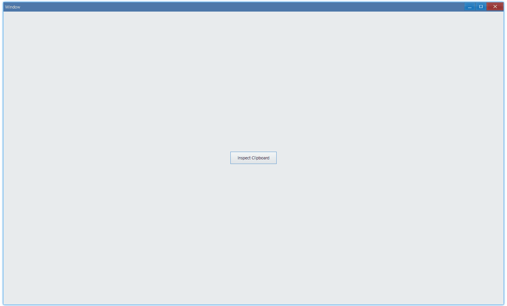

## 例子 {#examples}

### 基本用法 {#example-basic}

> [examples/unit/clipboard/clipboard-basic.ts](https://github.com/qber-soft/Ave-Nodejs/blob/main/Code/Avernakis%20Nodejs/Test-Nodejs/examples/unit/clipboard/clipboard-basic.ts)

这个例子演示了怎样从剪贴板读取内容：



```ts {7,13}
export function main(window: Window) {
    const clipboard = AveGetClipboard();

    const button = new Button(window);
    button.SetText('Inspect Clipboard');
    button.OnClick((sender) => {
        if (clipboard.HasImage()) {
            const aveImage = clipboard.GetImage();
            const imageData = aveImage.GetImage(0, 0, 0);
            console.log(
                `image found! width: ${imageData.Width} height: ${imageData.Height}`,
            );
        } else if (clipboard.HasFile()) {
            const [file] = clipboard.GetFile();
            console.log(`file found! path: ${file}`);
        } else {
            console.log(`nothing found in clipboard`);
        }
    });

    const container = getControlDemoContainer(window);
    container.ControlAdd(button).SetGrid(1, 1);
    window.SetContent(container);
}
```

当剪贴板里面没东西的时候，点按钮，控制台会有如下输出：

```bash
nothing found in clipboard
```

当复制了图片到剪贴板（比如通过演示中截屏的方式）：

```bash
# 类似这样的log（忽略具体值）：
image found! width: 413 height: 169
```

当复制了文件的时候：

```bash
file found! path: D:\GitHub\docs\xxx
```

#### API {#api-basic}

```ts
// get global clipboard instance
export function AveGetClipboard(): IClipboard;

export interface IClipboard {
    SetImage(img: AveImage): boolean;
    GetImage(): AveImage;
    HasImage(): boolean;

    SetFile(file: string[]): boolean;
    GetFile(): string[]; // return file paths
    HasFile(): boolean;
}
```

-   `AveImage`: 显示这种类型的数据请参考： [examples/unit/picture/picture-codec.ts](https://github.com/qber-soft/Ave-Nodejs/blob/main/Code/Avernakis%20Nodejs/Test-Nodejs/examples/unit/picture/picture-codec.ts)
