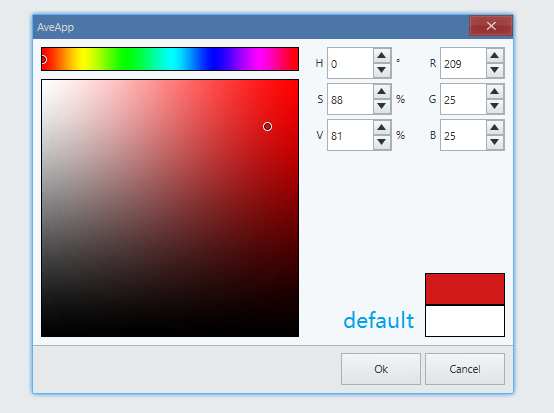

<!-- ## 简介 {#introduction}

TODO：以后添加对颜色选择器的整体介绍。 -->

## 例子 {#examples}

### 基本用法 {#example-basic}

```ts {7-9}
import { Window, Button, Vec4 } from 'ave-ui';

export function main(window: Window) {
    const button = new Button(window);
    button.SetText('Button');
    button.OnClick((sender) => {
        const commonUi = window.GetCommonUi();
        const result = commonUi.PickColor(new Vec4(255, 255, 255, 255), false);
        sender.SetTextColor(result);
    });

    const container = getControlDemoContainer(window);
    container.ControlAdd(button).SetGrid(1, 1);
    window.SetContent(container);
}
```

在这个例子中，我们演示了颜色选择器的基本用法: 获取用户选择的颜色，然后用它设置按钮上的文字颜色。


#### API {#api-basic}

```ts
export interface ICommonUi {
    PickColor(defaultColor: Vec4, allowAlpha: boolean): Vec4;
}
```

在例子中我们设置的`defaultColor`（每次打开取色器时候的默认颜色）是白色（`new Vec4(255, 255, 255, 255)`）:



如果希望每次打开取色器都是上一次的颜色，可以这样修改代码：

```diff
-   const result = commonUi.PickColor(new Vec4(255, 255, 255, 255), false);
+   const result = commonUi.PickColor(sender.GetTextColor(), false);
```


`allowAlpha` 则控制是否能选择颜色 alpha 值，值为 `false` 的时候最后返回的颜色 alpha 始终是 255。
