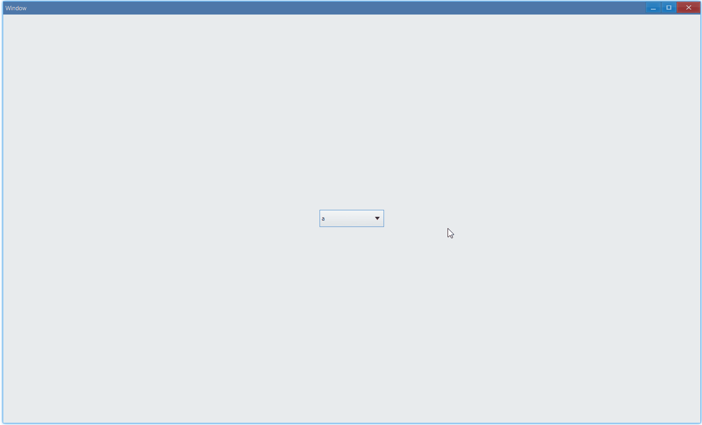
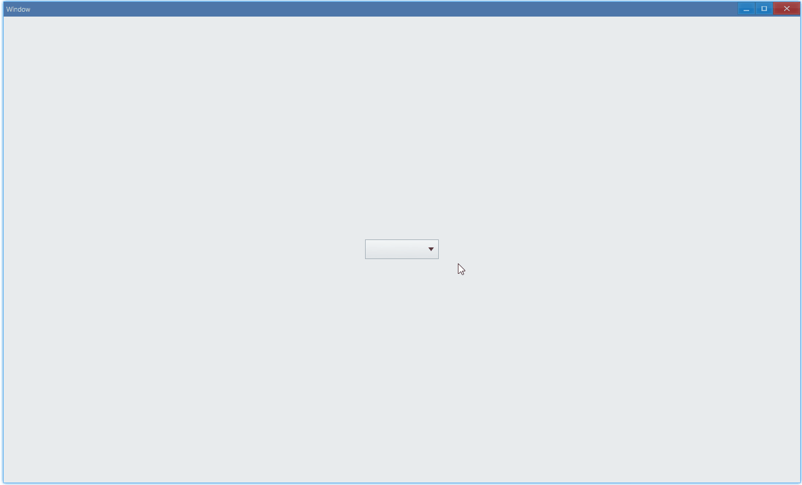

<!-- ## 简介 {#introduction}

TODO：以后添加对下拉列表的整体介绍。 -->

## 例子 {#examples}

### 基本用法 {#example-basic}

```ts {4-9}
import { Window, ComboBox } from 'ave-ui';

export function main(window: Window) {
    const comboBox = new ComboBox(window);
    // 添加下拉列表项，从第一个开始依次为a、b、c
    comboBox.Append('a', 'b', 'c');
    // 选择第一个（相当于默认显示"a"）
    comboBox.Select(0);
    comboBox.OnSelectionChange((comboBox: ComboBox) => {
        console.log(`current index: ${comboBox.GetSelection()}`);
    });

    const container = getControlDemoContainer(window);
    container.ControlAdd(comboBox).SetGrid(1, 1);
    window.SetContent(container);
}
```

在这个例子中，我们演示了设置并选择下拉列表内容：



同时，在控制台会有以下 log 输出：

```bash
current index: 1
current index: 2
current index: 0
```

#### API {#api-combo-box-basic}

```ts
export interface IComboBox extends IControl {
    // 添加列表项，最后显示顺序就是这里的添加顺序
    Append(...items: string[]): IComboBox;

    // 选中某一项，这里的index是指添加列表项时候的顺序
    Select(index: number): IComboBox;
    // 获取当前选中的列表项的index
    GetSelection(): number;

    // 当选择列表项的时候触发回调
    OnSelectionChange(callback: (sender: IComboBox) => void): IComboBox;
}
```

默认情况下，下拉列表不会默认选中任何列表项。所以，在以上例子中，如果没有调用`comboBox.Select(0)`，下拉列表显示是这样的:


