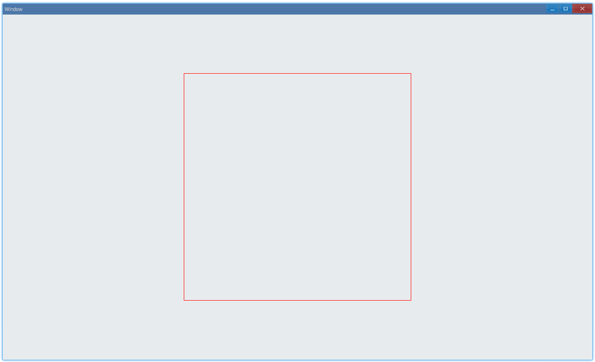
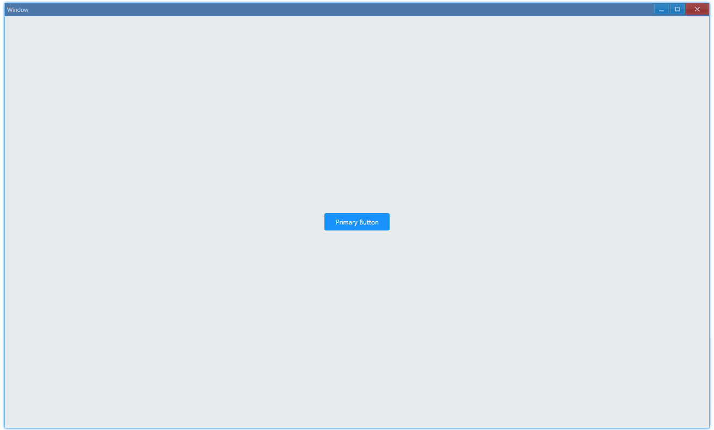

## 例子 {#examples}

### 最简单例子 {#example-basic}

我们使用 `Placeholder` 来实现自定义组件：

> [examples/unit/placeholder/placeholder-basic.ts](https://github.com/qber-soft/Ave-Nodejs/blob/main/Code/Avernakis%20Nodejs/Test-Nodejs/examples/unit/placeholder/placeholder-basic.ts)

```ts {3}
export function main(window: Window) {
    const placeholder = new Placeholder(window);
    placeholder.OnPaintPost((sender, painter, rect) => {
        painter.SetPenColor(new Vec4(255, 0, 0, 255));
        painter.DrawRectangle(0, 0, rect.w, rect.h);
    });
    const container = getControlDemoContainer(window, 1, 500, 500);
    container.ControlAdd(placeholder).SetGrid(1, 1);
    window.SetContent(container);
}
```

比如，这样画一个红色矩形：



自定义组件其实就是自己画 UI 并处理事件，画 UI 用的是 painter 相关的 API，painter 可以理解为类似 web 中 canvas 的东西。

#### API {#api-basic}

```ts
export interface IControl extends IControlExtension {
    OnPaintPost(
        fn: (sender: IControl, painter: IPainter, rect: Rect) => void,
    ): IControl;
}

export interface IPainter {
    SetPenColor(vColor: Vec4): void;
    DrawRectangle(x: number, y: number, w: number, h: number): void;
}
```

### 自定义按钮 {#example-button}

这个例子演示如何监听事件，然后实现一个自定义按钮：



> [examples/unit/placeholder/custom-button.ts](https://github.com/qber-soft/Ave-Nodejs/blob/main/Code/Avernakis%20Nodejs/Test-Nodejs/examples/unit/placeholder/custom-button.ts)

用法和内置组件一样的:

```ts
export function main(window: Window) {
    const button = new Button(window, 'Primary Button');
    const container = getControlDemoContainer(window, 1, 120, 32);
    container.ControlAdd(button.control).SetGrid(1, 1);
    window.SetContent(container);
}
```

#### 画 UI {#button-ui}

一个按钮其实就是一个矩形 + 上面的字：

```ts {14-17}
class Button {
	text: string;
	placeholder: Placeholder;
	font: Byo2Font;
	style: IButtonStyle;
	colors: { normal: Vec4; active: Vec4; hover: Vec4 };
	isEntered: boolean;
	isPressed: boolean;

	...

	onPaint(sender: IPlaceholder, painter: IPainter, rect: Rect) {
		const { border, color, backgroundColor } = this.style;
		painter.SetFillColor(backgroundColor);
		painter.FillRoundedRectangle(rect.x, rect.y, rect.w, rect.h, border.radius, border.radius);
		painter.SetTextColor(color);
		painter.DrawString(this.font, rect, this.text, DrawTextFlag.Center | DrawTextFlag.VCenter, this.text.length);
	}
}
```

#### 事件 {#button-event}

例子中处理了 4 种事件：Enter & Leave, Press & Release:

```ts {7-10}
class Button {
    ...
	constructor(window: Window, text: string) {
        ...
		this.placeholder = new Placeholder(window);
		this.placeholder.OnPaintPost(this.onPaint.bind(this));
		this.placeholder.OnPointerEnter(this.onEnter.bind(this));
		this.placeholder.OnPointerLeave(this.onLeave.bind(this));
		this.placeholder.OnPointerPress(this.onPress.bind(this));
		this.placeholder.OnPointerRelease(this.onRelease.bind(this));
        ...
		this.isEntered = false;
		this.isPressed = false;
	}

	onEnter() {
		this.isEntered = true;
		this.style.backgroundColor = this.colors.hover;
		this.placeholder.Redraw();
	}

	onPress() {
		this.isPressed = true;
		this.style.backgroundColor = this.colors.active;
		this.placeholder.Redraw();
	}

	onRelease() {
		this.isPressed = false;
		this.style.backgroundColor = this.colors.normal;
		this.placeholder.Redraw();
	}

	onLeave() {
		this.isEntered = false;
		if (!this.isPressed) {
			this.style.backgroundColor = this.colors.normal;
		}
		this.placeholder.Redraw();
	}
}
```

#### 样式 {#button-style}

样式是完全可定制的：

```ts {14}
class Button {
	...
	constructor(window: Window, text: string) {
		this.text = text;

        ...

		this.colors = {
			normal: new Vec4(24, 144, 255, 255),
			hover: new Vec4(64, 169, 255, 255),
			active: new Vec4(9, 109, 217, 255),
		};

		this.style = {
			border: {
				radius: 3,
			},
			color: new Vec4(255, 255, 255, 255),
			backgroundColor: this.colors.normal,
			font: {
				size: 9,
				family: ["Segoe UI", "Microsoft YaHei UI", "Meiryo UI", "SimSun-ExtB"],
			},
		};

		const fontDesc = new FontDescription();
		fontDesc.Name = this.style.font.family;
		fontDesc.Size = this.style.font.size;
		const font = new Byo2Font(window, fontDesc);
		this.font = font;
	}
    ...
}
```

#### API {#api-from-button-example}

```ts
export interface IControl extends IControlExtension {
    OnPointerEnter(
        fn: (sender: IControl, mp: MessagePointer) => void,
    ): IControl;
    OnPointerLeave(
        fn: (sender: IControl, mp: MessagePointer) => void,
    ): IControl;
    OnPointerPress(
        fn: (sender: IControl, mp: MessagePointer) => void,
    ): IControl;
    OnPointerRelease(
        fn: (sender: IControl, mp: MessagePointer) => void,
    ): IControl;
}

export interface IPainter {
    SetFillColor(vColor: Vec4): void;
    FillRoundedRectangle(
        x: number,
        y: number,
        w: number,
        h: number,
        rx: number,
        ry: number,
    ): void;

    SetTextColor(vColor: Vec4): void;
    DrawString(
        pFont: Byo2Font,
        rc: Rect,
        s: string,
        nFlag: DrawTextFlag,
        nCharCount: number,
    ): Rect;
}
```
