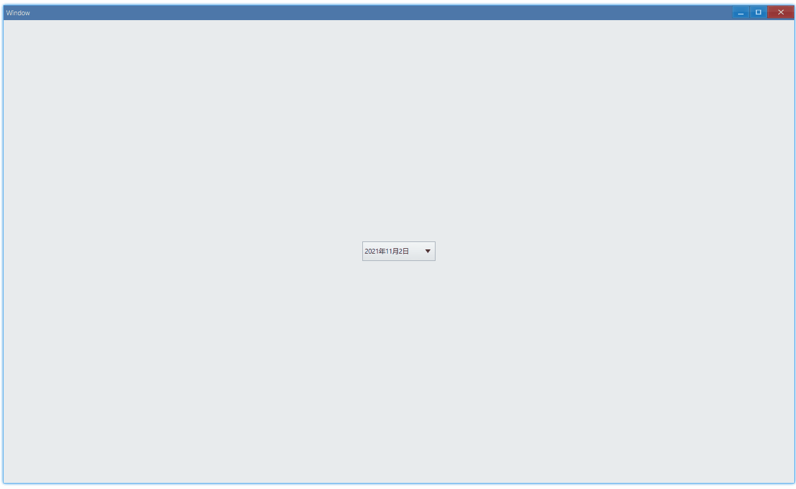

<!-- ## 简介 {#introduction}

TODO：以后添加对日期选择器的整体介绍。 -->

## 例子 {#examples}

### 基本用法 {#example-basic}

```ts {5-8}
import { Window, DatePicker } from 'ave-ui';

export function main(window: Window) {
    const datePicker = new DatePicker(window);
    datePicker.OnChange((sender) => {
        const timePoint = sender.GetDate();
        console.log(
            `Date: ${timePoint.Year}-${timePoint.Month}-${timePoint.Day}`,
        );
    });

    const container = getControlDemoContainer(window);
    container.ControlAdd(datePicker).SetGrid(1, 1);
    window.SetContent(container);
}
```

在这个例子中，我们演示了日期选择器的基本用法：选择并显示日期、响应点击事件获取日期。



控制台有如下输出：

```bash
Date: 2021-11-3
Date: 2021-11-4
```

#### API {#api-basic}

```ts
export interface IDatePicker extends IControl {
    GetDate(): TimePoint;
    OnChange(callback: (sender: DatePicker) => void): DatePicker;
}
```

### 设置日期 {#example-set}

设置日期与[日历](./calendar#example-set)中类似：

```ts {10-11}
import { Window, DatePicker } from 'ave-ui';

export function main(window: Window) {
    const datePicker = new DatePicker(window);
    datePicker.OnChange((sender) => {
        const timePoint = sender.GetDate();
        console.log(
            `Date: ${timePoint.Year}-${timePoint.Month}-${timePoint.Day}`,
        );
        datePicker.SetDate(timePoint);
        datePicker.SetDateMark(timePoint);
    });

    const container = getControlDemoContainer(window);
    container.ControlAdd(datePicker).SetGrid(1, 1);
    window.SetContent(container);
}
```

在这个例子中，我们使用获取到的日期来设置，效果就是，之后每次打开选择器，默认显示的就是上一次我们选择的日期：


#### API {#api-set}

```ts
export interface IDatePicker extends IControl {
    SetDate(timePoint: TimePoint): DatePicker;
    GetDate(): TimePoint;

    SetDateMark(timePoint: TimePoint): DatePicker;
    GetDateMark(): TimePoint;
}
```
