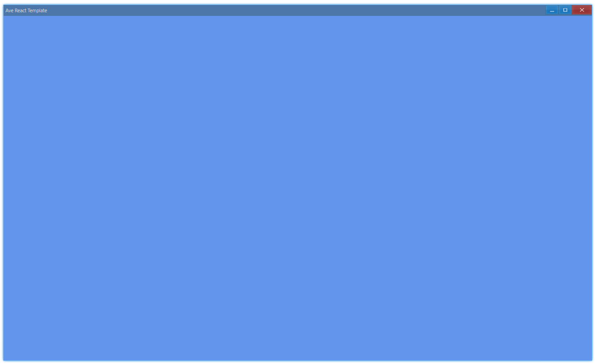
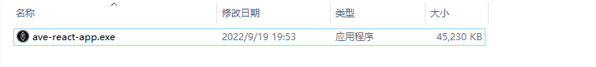

## 安装 {#install}

```bash
> npm i ave-ui
```

## 简单窗口 {#hello-window}

以下例子来自模板项目：[Ave-Nodejs-Template](https://github.com/qber-soft/Ave-Nodejs-Template)，目的是简要介绍：使用 Ave 开发，代码大致是怎样的：

> clone 模板项目，然后运行： `npm run dev`

```ts title="https://github.com/qber-soft/Ave-Nodejs-Template/blob/main/src/index.ts"
import {
    App,
    WindowCreation,
    Window,
    WindowFlag,
    Grid,
    Vec4,
    AveGetSDKVersion,
} from 'ave-ui';
import * as path from 'path';

export function main(window: Window) {
    const grid = new Grid(window);
    const lightBlue = new Vec4(0, 146, 255, 255 * 0.75);
    grid.SetBackColor(lightBlue);

    //
    const version = AveGetSDKVersion();
    console.log(
        `ave sdk version: ${JSON.stringify(
            version.VersionString,
            null,
            4,
        )}, is private: ${version.IsPrivateVersion}`,
    );
    window.SetContent(grid);
}

run(main);

export function run(main: Function) {
    const app = new App();

    const iconDataMap = {
        WindowIcon: [
            path.resolve(__dirname, '../assets/Ave#0.png'),
            path.resolve(__dirname, '../assets/Ave#1.png'),
            path.resolve(__dirname, '../assets/Ave#2.png'),
        ],
    };
    const resMap = app.CreateResourceMap(app, [16, 24, 32], iconDataMap);

    globalThis.app = app;

    //
    const cpWindow = new WindowCreation();
    cpWindow.Title = 'Ave Template';
    cpWindow.Flag |= WindowFlag.Layered;

    const window = new Window(cpWindow);
    globalThis._window = window;

    window.OnCreateContent((window) => {
        window.SetIcon(resMap.WindowIcon);
        main(window);
        return true;
    });

    if (!window.CreateWindow()) process.exit(-1);

    window.SetVisible(true);
    window.Activate();
}

export function get3x3Grid(window: Window, width = 120, height = 32) {
    const container = new Grid(window);
    container.ColAddSlice(1);
    container.ColAddDpx(width);
    container.ColAddSlice(1);

    container.RowAddSlice(1);
    container.RowAddDpx(height);
    container.RowAddSlice(1);
    return container;
}
```

运行成功后会弹出一个窗口，背景为浅蓝色：



让我们看看这个程序需要哪些代码。首先，创建一个 App 对象，并将它挂在全局对象上，目的是为了防止 gc（garbage collection，垃圾回收）。

```ts {1,3}
const app = new App();
...
globalThis.app = app;
```

还创建了 resource map，里面的 id 会被用来引用 icon 资源（就是说，需要用到 icon 的时候，就传这个 id 就行了）：

```ts {8}
const iconDataMap = {
    WindowIcon: [
        path.resolve(__dirname, '../assets/Ave#0.png'),
        path.resolve(__dirname, '../assets/Ave#1.png'),
        path.resolve(__dirname, '../assets/Ave#2.png'),
    ],
};
const resMap = app.CreateResourceMap(
    app,
    [16, 24, 32] /* icon size list */,
    iconDataMap,
);
```

还需要创建一个 window 对象：

```ts {2,6}
// cp: creation param
const cpWindow = new WindowCreation();
cpWindow.Title = 'Ave Template';
cpWindow.Flag |= WindowFlag.Layered;

const window = new Window(cpWindow);
globalThis._window = window;
```

之后是设置一个回调，我们绘制界面的代码都会写在这个回调里，在`OnCreateContent`中主要做这么几件事：

-   设置窗口图标，这里就用到了 resource map
-   创建窗口内容，只是一个淡蓝色背景的 grid
-   打印了 sdk 的版本信息

```ts {2,10,15,17}
window.OnCreateContent(window => {
    window.SetIcon(resMap.WindowIcon);
    main(window);
    return true
})

...

export function main(window: Window) {
    const grid = new Grid(window);
	const lightBlue = new Vec4(0, 146, 255, 255 * 0.75);
	grid.SetBackColor(lightBlue);

	//
	const version = AveGetSDKVersion();
	console.log(`ave sdk version: ${JSON.stringify(version.VersionString, null, 4)}, is private: ${version.IsPrivateVersion}`);
	window.SetContent(grid);
}
...
```

创建窗口的固定代码：

```ts
if (!window.CreateWindow()) process.exit(-1);

window.SetVisible(true);
window.Activate();
```

## 基本按钮 {#hello-button}

> clone 模板项目，然后运行： `npm run dev:button`

创建窗口后，就可以根据各组件的文档来组合打造成桌面应用了，比如这个基本按钮的使用:

```ts
export function main(window: Window) {
    const button = new Button(window);
    button.SetText('Button');
    button.OnClick((sender) => {
        sender.SetText('Button Clicked');
        console.log('button clicked');
    });

    const container = get3x3Grid(window);
    container.ControlAdd(button).SetGrid(1, 1);
    window.SetContent(container);
}
```

就只是替换了 main 函数里面的代码，运行后有一个可以点击的按钮：

<video src={require('./assets/getting-started-template-project.mp4').default} controls autoplay style={{width: 800}}/>

## 调试 {#debug}

Ave 应用只是普通的 node 应用，所以就像通常那样调试就行了。我们在模板项目中已经添加了 vscode 配置：

```json
{
    "configurations": [
        {
            "name": "Launch",
            "type": "node",
            "request": "launch",
            "args": ["./src/index.ts"],
            "runtimeArgs": ["--nolazy", "-r", "ts-node/register"],
            "sourceMaps": true,
            "cwd": "${workspaceRoot}",
            "protocol": "inspector"
        }
    ]
}
```

这样下好断点，直接点 `Launch` ，就能调了：

<video src={require('./assets/vscode-debug.mp4').default} controls autoplay style={{width: 800}}/>

## 打包 {#package}

clone 模板项目，然后运行 `npm run release`, 会产出单个 exe 文件:

> 大小构成：40M = 30M node 运行时 + 10M ave sdk 大小（那个 node 插件）



在`ave.config.ts`中可以配置各种 app 的信息：

```ts
import { IPackConfig } from 'ave-pack';

const config: IPackConfig = {
    build: {
        projectRoot: __dirname,
        target: 'node14-win-x64',
        input: './build/src/index.js',
        output: './bin/ave-app.exe',
    },
    resource: {
        icon: './assets/ave.ico',
        productVersion: '0.0.1',
        productName: 'Ave Template App',
        fileVersion: '0.0.1',
        companyName: 'QberSoft',
        fileDescription: 'The Template App of Ave',
        LegalCopyright: `© ${new Date().getFullYear()} Ave Copyright.`,
    },
};

export default config;
```
