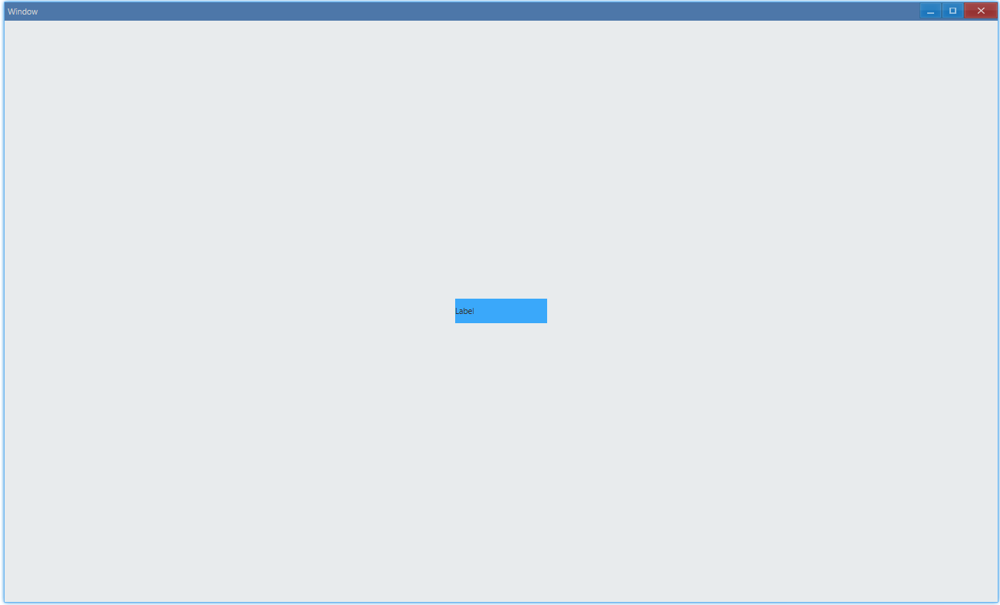
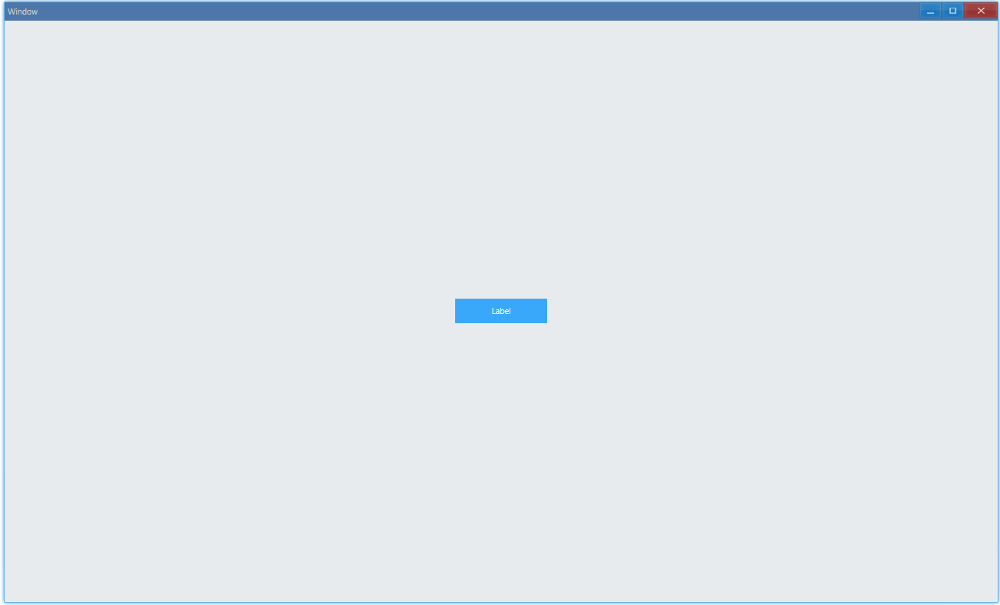

<!-- ## 简介 {#introduction}

TODO：以后添加对标签的整体介绍。 -->

## 例子 {#examples}

### 设置文案 {#example-set-text}

```ts {4-5}
import { Window, Label, Vec4, Grid } from 'ave-ui';

export function main(window: Window) {
    const label = new Label(window);
    label.SetText('Label');

    const backgroundGrid = new Grid(window);
    const lightBlue = new Vec4(0, 146, 255, 255 * 0.75);
    backgroundGrid.SetBackColor(lightBlue).ColAddSlice(1).RowAddSlice(1);
    backgroundGrid.ControlAdd(label).SetGrid(0, 0);

    const container = getControlDemoContainer(window);
    container.ControlAdd(backgroundGrid).SetGrid(1, 1);
    window.SetContent(container);
}
```

我们使用`SetText`来设置标签上的文案，运行之后：



从这个例子中我们可以看出，默认情况下，标签上的文案是左对齐的（为了突出这一点，我们给标签所在网格设置了背景颜色）。

#### API {#api-label-set-text}

```ts
export class Label {
    SetText(text: string): Label;
}
```

### 设置背景颜色 {#example-set-background-color}

```ts {7-8}
import { Window, Label, Vec4 } from 'ave-ui';

export function main(window: Window) {
    const label = new Label(window);
    label.SetText('Label');

    const lightBlue = new Vec4(0, 146, 255, 255 * 0.75);
    label.SetBackColor(lightBlue);

    const container = getControlDemoContainer(window);
    container.ControlAdd(label).SetGrid(1, 1);
    window.SetContent(container);
}
```

在[设置文案](#example-set-text)的例子中，我们设置的是标签所在网格的背景色，在这个例子中，我们演示了直接设置标签的背景色，效果是一样的，因为默认情况下，标签的背景色会填满标签所在网格。

#### API {#api-label-set-background-color}

```ts
export class Label {
    SetBackColor(color: Vec4): Label;
}
```

### 设置文字对齐方式 {#example-text-align}

```ts {10,19,28}
import { Window, Label, Vec4, AlignType } from 'ave-ui';

export function main(window: Window) {
    const container = getControlDemoContainer(window, 5);
    const lightBlue = new Vec4(0, 146, 255, 255 * 0.75);

    {
        const label = new Label(window);
        label.SetText('Label');
        label.SetAlignHorz(AlignType.Near);
        label.SetBackColor(lightBlue);

        container.ControlAdd(label).SetGrid(1, 3);
    }

    {
        const label = new Label(window);
        label.SetText('Label');
        label.SetAlignHorz(AlignType.Center);
        label.SetBackColor(lightBlue);

        container.ControlAdd(label).SetGrid(3, 3);
    }

    {
        const label = new Label(window);
        label.SetText('Label');
        label.SetAlignHorz(AlignType.Far);
        label.SetBackColor(lightBlue);

        container.ControlAdd(label).SetGrid(5, 3);
    }

    window.SetContent(container);
}
```

在这个例子中，我们演示了 3 种不同的文字对齐方式：


`AlignType.Center`是居中对齐，`AlignType.Near`在从左向右书写的文字系统中（例如中文、英文）就是我们常说的左对齐，`AlignType.Far`则对应右对齐。

#### API {#api-label-text-align}

```ts
export class Label {
    SetAlignHorz(align: Vec4): Label;
}

export enum AlignType {
    Near,
    Center,
    Far,
}
```

### 设置文字颜色 {#example-set-text-color}

```ts {7-8}
import { Window, Label, Vec4, AlignType } from 'ave-ui';

export function main(window: Window) {
    const label = new Label(window);
    label.SetText('Label');

    const white = new Vec4(255, 255, 255, 255);
    label.SetTextColor(white);

    const lightBlue = new Vec4(0, 146, 255, 255 * 0.75);
    label.SetBackColor(lightBlue);
    label.SetAlignHorz(AlignType.Center);

    const container = getControlDemoContainer(window);
    container.ControlAdd(label).SetGrid(1, 1);
    window.SetContent(container);
}
```

在这个例子中，我们演示了怎样设置文字颜色：



#### API {#api-label-set-text-color}

```ts
export class Label {
    SetTextColor(color: Vec4): Label;
}
```
