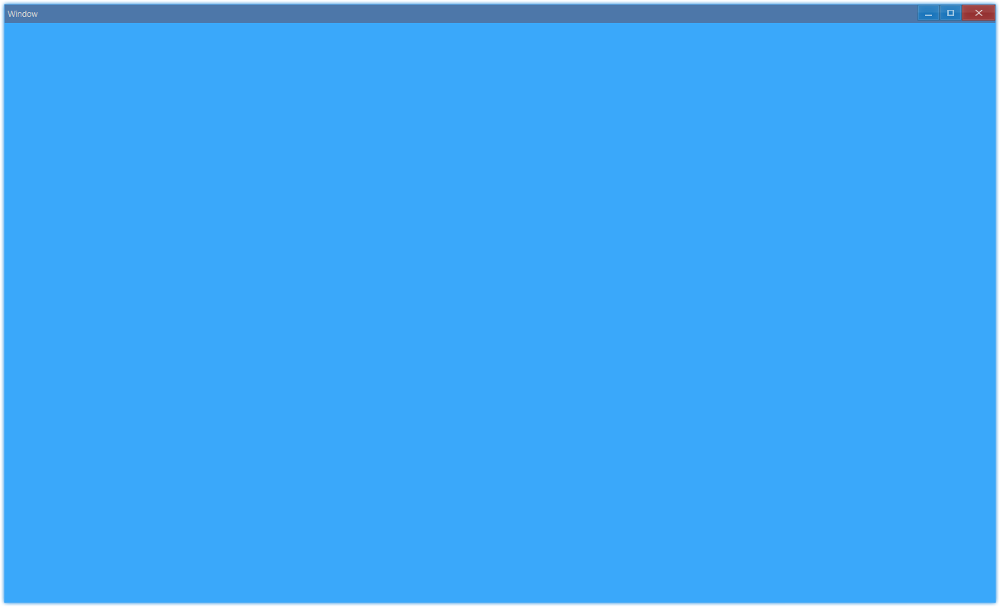
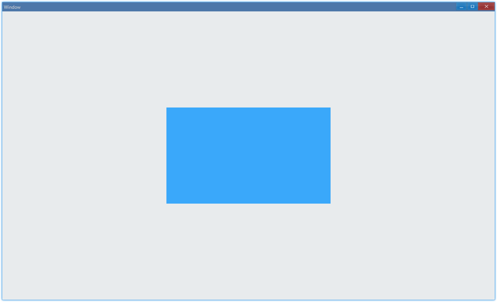
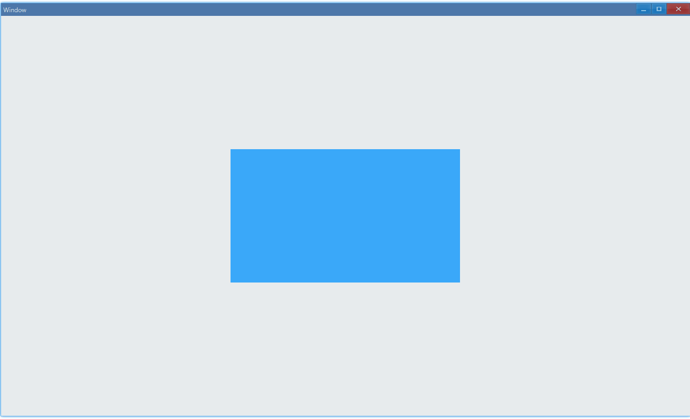
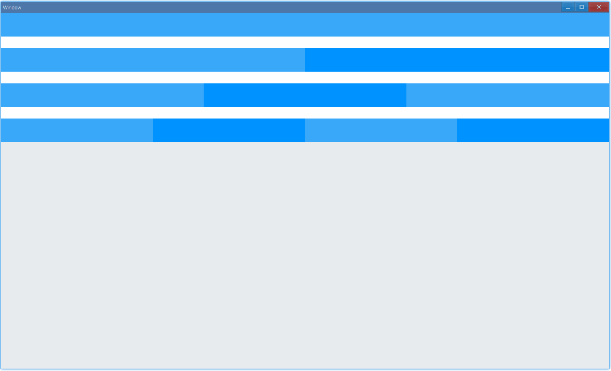
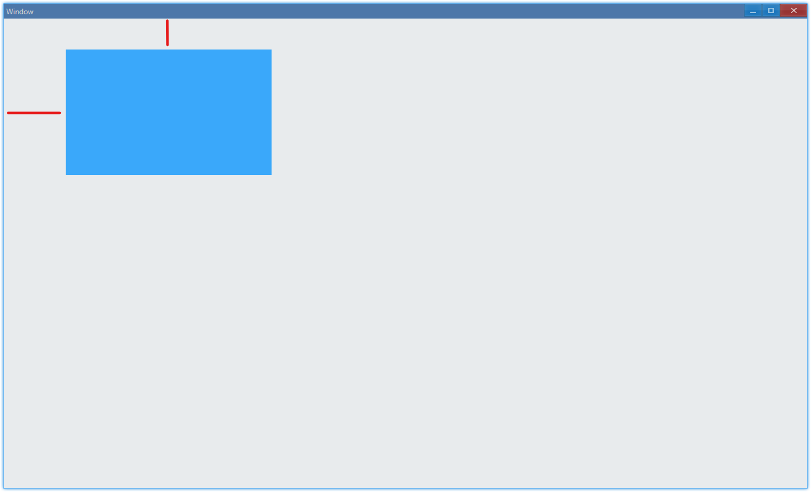
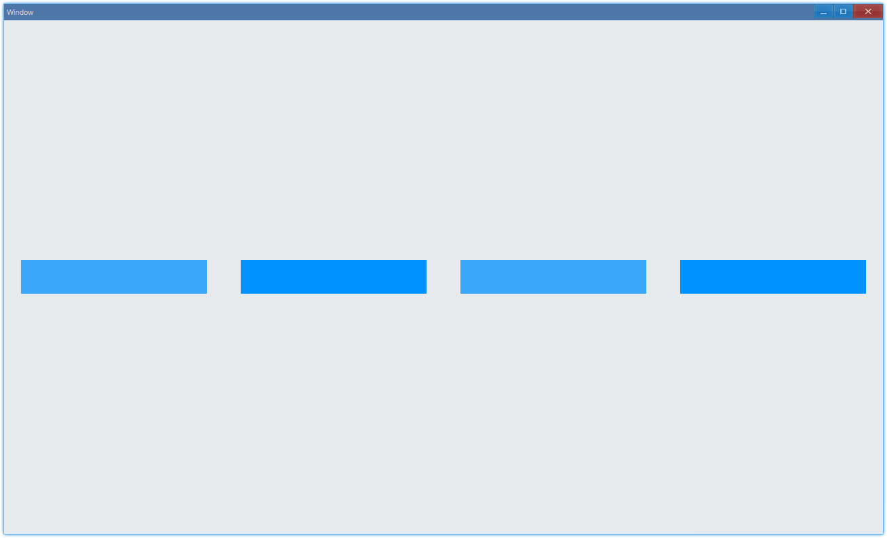
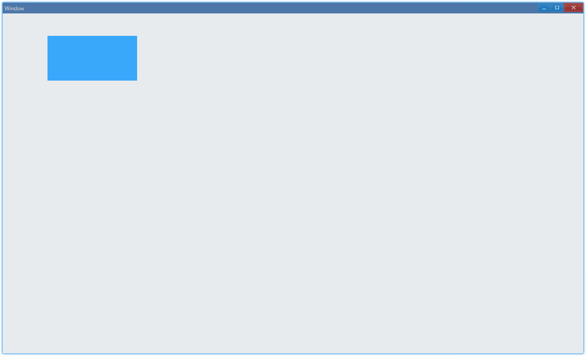
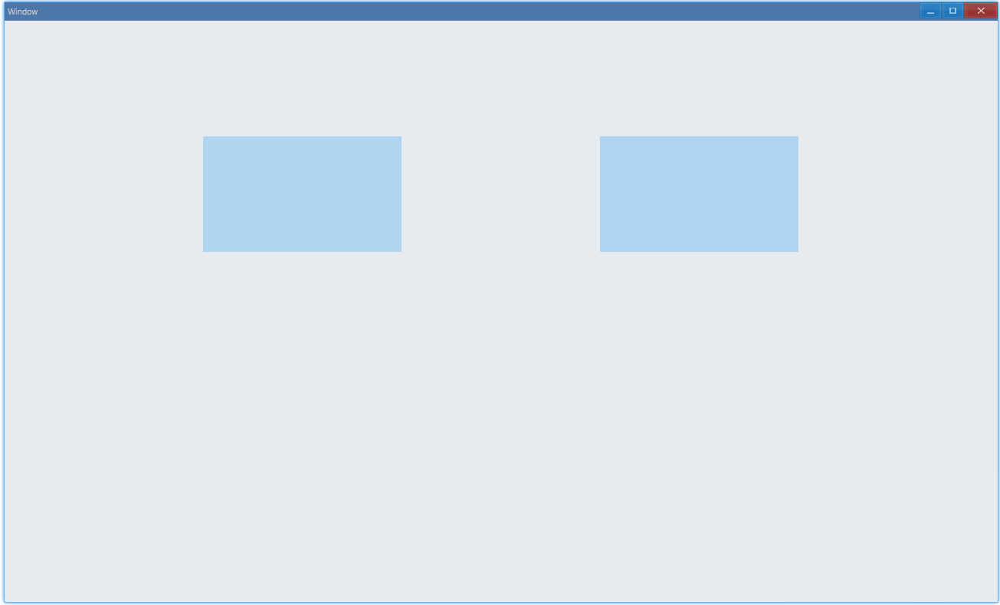

## 简介 {#introduction}

Ave 只支持 grid 的布局方式（web 中 flex 布局也可以基于此封装，不过 grid 其实是更灵活、强大的布局方式），所有控件都需要放在 grid 之中，因此组件部分首先从 grid 开始介绍。

Ave 中 grid 的含义和 web 中的（[A Complete Guide to Grid](https://css-tricks.com/snippets/css/complete-guide-grid/)）差不多，但是更加底层，也就是说，web 里的 grid css 也可以基于此实现。

## 例子 {#examples}

### 背景色 {#example-grid-background}

```ts {5,6}
import { Window, Grid, Vec4 } from 'ave-ui';

export function main(window: Window) {
    const grid = new Grid(window);
    const lightBlue = new Vec4(0, 146, 255, 255 * 0.75);
    grid.SetBackColor(lightBlue);
    window.SetContent(grid);
}
```

在 Ave 中我们使用`Vec4`类来表示颜色，其中每个颜色的取值范围都是`[0,255]`，然后调用 grid 的`SetBackColor`设置背景颜色。



#### API {#api-background}

```ts
export interface IGrid extends IControl {
    // 设置背景颜色
    SetBackColor(vColor: Vec4): Grid;
    // 获取背景颜色
    GetBackColor(): Vec4;
}
```

### 添加组件 {#example-grid-add-control}

```ts {5,6,12}
import { Window, Grid, Vec4 } from 'ave-ui';

export function main(window: Window) {
    const container = new Grid(window);
    container.ColAddSlice(1, 1, 1);
    container.RowAddSlice(1, 1, 1);

    const center = new Grid(window);
    const lightBlue = new Vec4(0, 146, 255, 255 * 0.75);
    center.SetBackColor(lightBlue);

    container.ControlAdd(center).SetGrid(1, 1, 1, 1);
    window.SetContent(container);
}
```

这里我们创建了一个 grid，并设置它为 3 行、3 列，也就是说，现在我们的界面相当于一个 3x3 的网格。然后我们在中间那格添加了另一个设置了背景色的格子，运行后界面如下：



`RowAddSlice`和`ColAddSlice`分别是为 grid 添加行和列，`slice`表明这里添加的行、列是成比例的，也就是说，添加的行和列都是 1：1：1，这样可以适应窗口大小变化：



我们使用`ControlAdd`将控件（grid 也是控件）添加到 grid 中，它返回一个类型为`IGridControl`对象，和原本添加的控件相比，这个对象多了一些方便使用的方法。

#### API {#api-add-control}

```ts
export class Grid implements IGrid {
	// 添加行，参数为每行的比例
	RowAddSlice(...x: number[]);
	ColAddSlice(...x: number[]);

	// 添加行，但参数不是比例了，而是固定可缩放像素大小（dpx），比如UI可以控制放大到120%，dpx会跟着缩放
	RowAddDpx(...x: number[]);
	ColAddDpx(...x: number[]);

	// 添加行，参数是固定像素大小（px）
	RowAddPx(...x: number[]);
	ColAddPx(...x: number[]);
}

export interface IGrid {
	// 将控件添加到grid中
	ControlAdd(control: IControl): IGridControl<IControl>;
}

export interface IGridControl<T extends IControl = IControl> {
	// 设置控件位置到grid的x列y行，占据xspan列，yspan行（横着是列，竖着是行）
	// 注意：控件会充满整个格子
	SetGrid(x: number, y: number, xspan = 1 yspan = 1): IGridControl<T>;
};
```

#### 练习: grid {#grid-practice-grid}

这个练习的目的是实现类似 web 中的 24 栅格系统，例如 [Ant Design Grid](https://ant.design/components/grid-cn/#components-grid-demo-basic) 。在 Ave 中怎样实现如下效果呢？



#### 练习: offset {#grid-practice-offset}

这个练习的目的是实现 grid 的偏移，例如 [Ant Design Grid: Offset](https://ant.design/components/grid-cn/#components-grid-demo-offset) 。在 Ave 中怎样实现如下效果呢？


### 边距 {#example-grid-margin}

```ts {13,21}
import { Window, Grid, Vec4 } from 'ave-ui';

export function main(window: Window) {
    const container = new Grid(window);
    container.ColAddSlice(1, 1, 1);
    container.RowAddSlice(1, 1, 1);

    const center = new Grid(window);
    const lightBlue = new Vec4(0, 146, 255, 255 * 0.75);
    center.SetBackColor(lightBlue);

    //
    const margin = new DpiMargin(
        DpiSize.FromPixelScaled(100), // margin left
        DpiSize.FromPixelScaled(50), // margin top
        DpiSize.FromPixelScaled(0), // margin right
        DpiSize.FromPixelScaled(0), // margin bottom
    );

    const gridControl = container.ControlAdd(center);
    gridControl.SetGrid(0, 0, 1, 1);
    gridControl.SetMargin(margin);

    window.SetContent(container);
}
```

在这个例子中，我们设置了蓝色方块的边距，它本身位于窗口的左上角，在设置了左边距和上边距之后，可以发现它不再紧贴窗口边缘：



#### API {#api-margin}

```ts
export interface IGridControl<T extends IControl = IControl> {
    SetMargin(margin: DpiMargin): IGridControl<T>;
}

export class DpiMargin {
    Left: DpiSize;
    Top: DpiSize;
    Right: DpiSize;
    Bottom: DpiSize;

    static FromPixelScaled(
        left: number,
        top: number,
        right: number,
        bottom: number,
    ): DpiMargin;
}
```

#### 练习: gutter {#grid-practice-gutter}

这个练习的目的是实现类似 web 中的 grid gutter，例如 [Ant Design Grid: Gutter](https://ant.design/components/grid-cn/#components-grid-demo-gutter) 。在 Ave 中怎样实现如下效果呢？



### 相对位置 {#example-set-post}

如果我们不想将控件放进 grid 的格子中（调用`SetGrid`），那么还可以采取设置相对位置的方式来设置它的位置。

```ts {17,24}
import { Window, Grid, Vec4, DpiSize, DpiSize_2 } from 'ave-ui';

export function main(window: Window) {
    const container = new Grid(window);
    container.ColAddSlice(1, 1, 1);
    container.RowAddSlice(1, 1, 1);

    const center = new Grid(window);
    const lightBlue = new Vec4(0, 146, 255, 255 * 0.75);
    center.SetBackColor(lightBlue);

    const gridControl = container.ControlAdd(center);
    const pos = {
        x: DpiSize.FromPixelScaled(100),
        y: DpiSize.FromPixelScaled(50),
    };
    gridControl.SetPos(pos.x, pos.y);

    // 与调用SetGrid时控件会充满整个格子不同，设置位置的同时，我们还需要设置它的大小
    const size = new DpiSize_2(
        DpiSize.FromPixelScaled(200),
        DpiSize.FromPixelScaled(100),
    );
    gridControl.SetSize(size);
    window.SetContent(container);
}
```

和 [边距](#example-grid-margin) 中的例子中类似，我们将一个蓝色矩形放在了左上角：



#### API {#set-pos-size}

```ts
export interface IGridControl<T extends IControl = IControl> {
    SetPos(x: DpiSize, y: DpiSize): IGridControl<T>;
    SetSize(size: DpiSize_2): IGridControl<T>;
}

export class DpiSize {
    static FromPixelScaled(x: number): DpiSize;
}

export class DpiSize_2 {
    constructor(x: DpiSize, y: DpiSize);
}
```

### 透明度 {#example-grid-opacity}

要想实现半透明的效果，有两种方式，一种是调整背景颜色的 alpha 值，一种是调用`SetOpacity`方法：

```ts {10,16}
import { Window, Grid, Vec4 } from 'ave-ui';

export function main(window: Window) {
    const container = new Grid(window);
    container.ColAddSlice(1, 1, 1, 1, 1);
    container.RowAddSlice(1, 1, 1, 1, 1);

    const gridA = new Grid(window);
    const aColor = new Vec4(0, 146, 255, 255 * 0.25);
    gridA.SetBackColor(aColor);
    container.ControlAdd(gridA).SetGrid(1, 1, 1, 1);

    const gridB = new Grid(window);
    const bColor = new Vec4(0, 146, 255, 255);
    gridB.SetBackColor(bColor);
    gridB.SetOpacity(0.25);
    container.ControlAdd(gridB).SetGrid(3, 1, 1, 1);

    window.SetContent(container);
}
```

在这个例子中，我们采取了两种不同的方式，画出了相同效果的半透明蓝色方块。



两种方式的区别如下：

-   opacity：设置整体透明度，包括放在里面的控件全部都会半透明
-   setBackColor：就只有 grid 本身的背景部分有影响

## 练习答案 {#practice-solutions}

### grid {#practice-solution-grid}

> [练习描述](#grid-practice-grid)

为了实现适应窗口拉伸，我们仍然使用`ColAddSlice`添加列。行之间的间隙则使用`RowAddDpx`。

```ts {17,19}
import { Window, Grid, Vec4 } from 'ave-ui';

const Color = {
    White: new Vec4(255, 255, 255, 255),
    DarkBlue: new Vec4(0, 146, 255, 255),
    LightBlue: new Vec4(0, 146, 255, 255 * 0.75),
};

function createGrid(color: Vec4, window: Window) {
    return new Grid(window).SetBackColor(color);
}

export function main(window: Window) {
    const grid = new Grid(window);

    // 添加24列
    grid.ColAddSlice(...Array.from<number>({ length: 24 }).fill(1));
    // 有颜色的那一行为50dpx，间隙（空白的行）为25dpx
    grid.RowAddDpx(...[50, 25, 50, 25, 50, 25, 50, 25]);

    //
    grid.ControlAdd(createGrid(Color.LightBlue, window)).SetGrid(0, 0, 24, 1);
    grid.ControlAdd(createGrid(Color.White, window)).SetGrid(0, 1, 24, 1);

    grid.ControlAdd(createGrid(Color.LightBlue, window)).SetGrid(0, 2, 12, 1);
    grid.ControlAdd(createGrid(Color.DarkBlue, window)).SetGrid(12, 2, 12, 1);
    grid.ControlAdd(createGrid(Color.White, window)).SetGrid(0, 3, 24, 1);

    grid.ControlAdd(createGrid(Color.LightBlue, window)).SetGrid(0, 4, 8, 1);
    grid.ControlAdd(createGrid(Color.DarkBlue, window)).SetGrid(8, 4, 8, 1);
    grid.ControlAdd(createGrid(Color.LightBlue, window)).SetGrid(16, 4, 8, 1);
    grid.ControlAdd(createGrid(Color.White, window)).SetGrid(0, 5, 24, 1);

    grid.ControlAdd(createGrid(Color.LightBlue, window)).SetGrid(0, 6, 6, 1);
    grid.ControlAdd(createGrid(Color.DarkBlue, window)).SetGrid(6, 6, 6, 1);
    grid.ControlAdd(createGrid(Color.LightBlue, window)).SetGrid(12, 6, 6, 1);
    grid.ControlAdd(createGrid(Color.DarkBlue, window)).SetGrid(18, 6, 6, 1);

    window.SetContent(grid);
}
```

### offset {#practice-solution-offset}

> [练习描述](#grid-practice-offset)

```ts {31-32}
import { Window, Grid, Vec4 } from 'ave-ui';

const Color = {
    White: new Vec4(255, 255, 255, 255),
    DarkBlue: new Vec4(0, 146, 255, 255),
    LightBlue: new Vec4(0, 146, 255, 255 * 0.75),
};

function createGrid(color: Vec4, window: Window) {
    return new Grid(window).SetBackColor(color);
}

export function main(window: Window) {
    const grid = new Grid(window);

    // 添加24列
    grid.ColAddSlice(...Array.from<number>({ length: 24 }).fill(1));

    // 中间固定高度的用来画例子
    // 50dpx: 画例子
    // 25dpx：间隙
    grid.RowAddSlice(1);
    grid.RowAddDpx(50, 25, 50, 25, 50);
    grid.RowAddSlice(1);

    {
        const span = 8;
        const offset1 = 0;
        const offset2 = offset1 + span + 8;
        grid.ControlAdd(createGrid(Color.DarkBlue, window)).SetGrid(
            offset1,
            1,
            span,
            1,
        );
        grid.ControlAdd(createGrid(Color.DarkBlue, window)).SetGrid(
            offset2,
            1,
            span,
            1,
        );
    }

    {
        const span = 6;
        const offset1 = 6;
        const offset2 = offset1 + span + 6;
        grid.ControlAdd(createGrid(Color.DarkBlue, window)).SetGrid(
            offset1,
            3,
            span,
            1,
        );
        grid.ControlAdd(createGrid(Color.DarkBlue, window)).SetGrid(
            offset2,
            3,
            span,
            1,
        );
    }

    {
        const span = 12;
        const offset = 6;
        grid.ControlAdd(createGrid(Color.DarkBlue, window)).SetGrid(
            offset,
            5,
            span,
            1,
        );
    }

    window.SetContent(grid);
}
```

### gutter {#practice-solution-gutter}

> [练习描述](#grid-practice-gutter)

我们使用边距来实现区块间隔的效果：

```ts {25,26-31,33}
import { Window, Grid, Vec4, DpiMargin, DpiSize } from 'ave-ui';

const Color = {
    White: new Vec4(255, 255, 255, 255),
    DarkBlue: new Vec4(0, 146, 255, 255),
    LightBlue: new Vec4(0, 146, 255, 255 * 0.75),
};

function createGrid(color: Vec4, window: Window) {
    return new Grid(window).SetBackColor(color);
}

export function main(window: Window) {
    const grid = new Grid(window);

    // 添加24列
    grid.ColAddSlice(...Array.from<number>({ length: 24 }).fill(1));

    // 添加3行，中间固定高度的用来画例子
    grid.RowAddSlice(1);
    grid.RowAddDpx(50);
    grid.RowAddSlice(1);

    const gutter = 50; // dpx
    const margin = new DpiMargin(
        DpiSize.FromPixelScaled(gutter / 2),
        DpiSize.FromPixelScaled(0),
        DpiSize.FromPixelScaled(gutter / 2),
        DpiSize.FromPixelScaled(0),
    );

    grid.ControlAdd(createGrid(Color.LightBlue, window))
        .SetGrid(0, 1, 6, 1)
        .SetMargin(margin);
    grid.ControlAdd(createGrid(Color.DarkBlue, window))
        .SetGrid(6, 1, 6, 1)
        .SetMargin(margin);
    grid.ControlAdd(createGrid(Color.LightBlue, window))
        .SetGrid(12, 1, 6, 1)
        .SetMargin(margin);
    grid.ControlAdd(createGrid(Color.DarkBlue, window))
        .SetGrid(18, 1, 6, 1)
        .SetMargin(margin);

    window.SetContent(grid);
}
```
