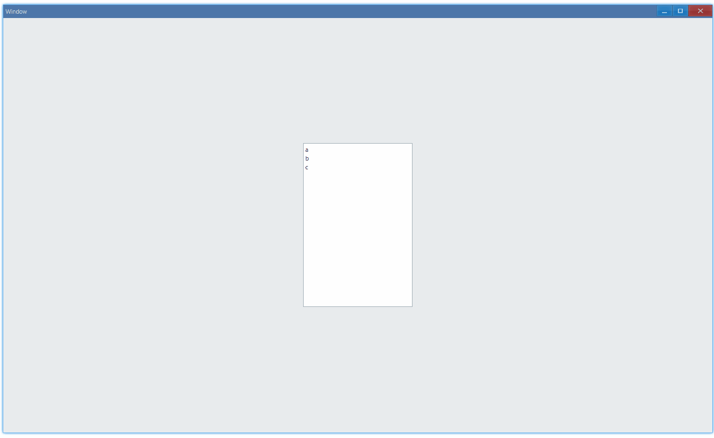

## 例子 {#examples}

### 基本用法 {#example-basic}

```tsx
export function App() {
    return (
        <Window>
            <DemoLayout width="200dpx" height="300dpx">
                <ListBox
                    items={['a', 'b', 'c']}
                    onSelectionEnd={(sender) => {
                        console.log(sender.GetSelection());
                    }}
                ></ListBox>
            </DemoLayout>
        </Window>
    );
}
```

在这个例子中，我们演示了列表框的基本用法：显示一系列可选项，点击，通过回调拿到选择项的索引（index）。



控制台中有这样的输出：

```bash
0
1
2
```

#### API {#api-basic}

```ts
export interface IListBoxComponentProps extends IComponentProps {
    items?: string[];
    onSelectionEnd?: Parameters<IListBox['OnSelectionEnd']>[0];
}
```
