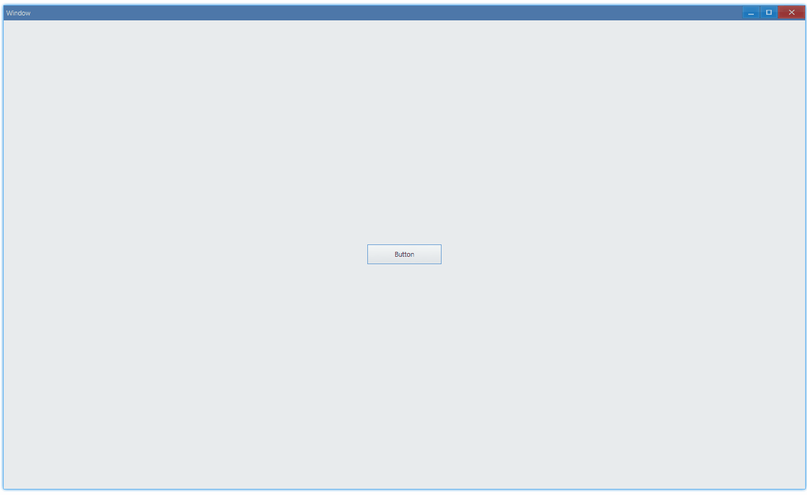

<!-- ## 简介 {#introduction}

TODO：以后添加对消息框的整体介绍。 -->

## 例子 {#examples}

### 基本用法 {#example-basic}

```ts {7-14}
import { Window, MessageIcon, MessageButton, Button } from 'ave-ui';

export function main(window: Window) {
    const button = new Button(window);
    button.SetText('Button');
    button.OnClick((sender) => {
        const commonUi = window.GetCommonUi();
        const result = commonUi.Message(
            'Message',
            'This is a message',
            MessageIcon.Infomation,
            MessageButton.YesNo,
            'Title',
        );
        console.log(`message result: ${result}(${MessageResult[result]})`);
    });

    const container = getControlDemoContainer(window);
    container.ControlAdd(button).SetGrid(1, 1);
    window.SetContent(container);
}
```

在这个例子中，我们演示了消息框的基本用法：点击其中的按钮，并获得相应结果。



同时控制台有这样的输出：

```bash
message result: 2(Yes)
message result: 3(No)
message result: 0(Default)
```

#### API {#api-basic}

```ts
export interface IWindow extends IControl {
    GetCommonUi(): ICommonUi;
}

export interface ICommonUi {
    /**
     * main: 消息的概要
     * detail：消息的详细内容
     * icon：消息的图标
     * buttonType：消息框中的按钮类型
     * title：消息框的标题
     */
    Message(
        main: string,
        detail: string,
        icon: MessageIcon,
        buttonType: MessageButton,
        title: string,
    ): MessageResult;
}

export enum MessageIcon {
    None,
    Infomation,
    Warning,
    Error,
}

export enum MessageButton {
    Ok = 0x01,
    Yes = 0x02,
    No = 0x04,
    Retry = 0x08,
    Cancel = 0x10,
    Close = 0x20,
    OkCancel = Ok | Cancel,
    YesNo = Yes | No,
    YesNoCancel = Yes | No | Cancel,
    RetryCancel = Retry | Cancel,
}

export enum MessageResult {
    Failed,
    Ok,
    Yes,
    No,
    Retry,
    Cancel,
    Close,
    Button,
    Default = Failed,
}
```
