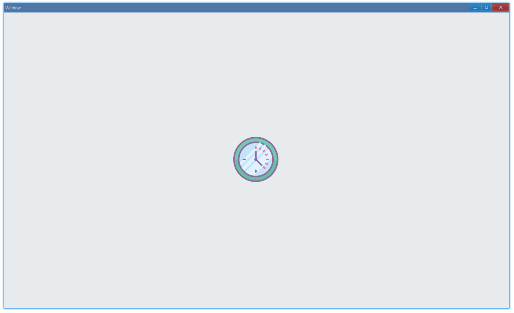

<!-- ## 简介 {#introduction}

TODO：以后添加对图片的整体介绍。 -->

## 例子 {#examples}

### 基本用法 {#example-basic}

```ts {4-5,8}
import { Window, Picture, ResourceSource } from 'ave-ui';
import * as fs from 'fs';
import * as path from 'path';

export function main(window: Window) {
    const picture = new Picture(window);
    const buffer = fs.readFileSync(path.resolve(__dirname, './Clock#6.png'));
    const source = ResourceSource.FromBuffer(buffer);
    picture.SetPicture(source);

    const container = getControlDemoContainer(window, 1, 300, 300);
    container.ControlAdd(picture).SetGrid(1, 1);
    window.SetContent(container);
}
```

这个例子演示了如何显示一张图片：



#### API {#api-basic}

```ts
export interface IPicture extends IVisual {
    // 设置图片来源
    SetPicture(rs: ResourceSource): Picture;
}

export class ResourceSource {
    Type: ResourceSourceType = ResourceSourceType.Resource;
    ResourceId: number = 0;
    InMemory: InMemoryData = new InMemoryData();

    static FromBuffer(
        buffer: Buffer,
        rowPitch: number = 0,
        slicePitch: number = 0,
    );
}

export enum ResourceSourceType {
    Resource,
    InMemory,
}
```
