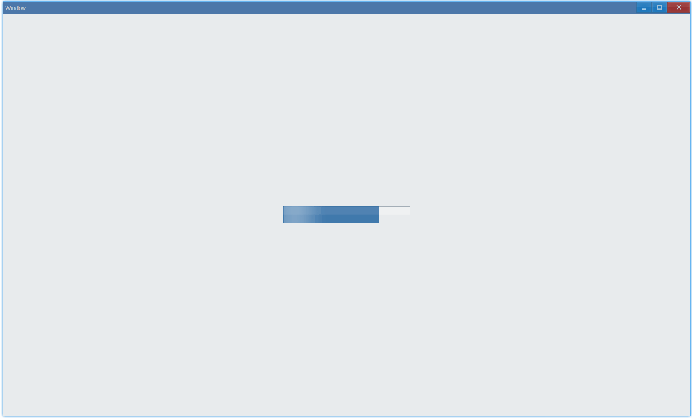
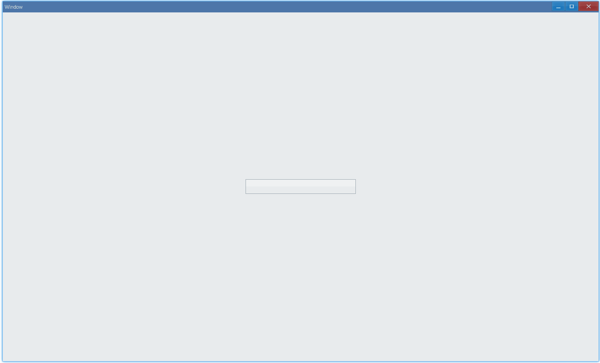

import Tabs from '@theme/Tabs';
import TabItem from '@theme/TabItem';

<!--
## 简介 {#introduction}

TODO：以后添加对进度条的整体介绍。
-->

## 例子 {#examples}

### 基本用法 {#example-basic}

```ts {5-6}
import { Window, ProgressBar, Grid } from 'ave-ui';

export function main(window: Window) {
    const progressBar = new ProgressBar(window);
    progressBar.SetMaximum(100).SetAnimation(true);
    progressBar.SetValue(75);

    const container = getControlDemoContainer(window);
    container.ControlAdd(progressBar).SetGrid(1, 1);
    window.SetContent(container);
}

function getControlDemoContainer(window: Window, count = 1) {
    const container = new Grid(window);
    container.ColAddSlice(1);
    container.ColAddDpx(...Array.from<number>({ length: count }).fill(240));
    container.ColAddSlice(1);

    container.RowAddSlice(1);
    container.RowAddDpx(...Array.from<number>({ length: count }).fill(32));
    container.RowAddSlice(1);
    return container;
}
```

在这个例子中，我们演示了进度条的基本用法：



其中`SetAnimation`设置的动画是进度条中光影的流动。

#### API {#api-basic}

```ts
export interface IProgressBar extends IControl {
    SetMaximum(value: number): ProgressBar;
    GetMaximum(): number;

    SetValue(value: number): ProgressBar;
    GetValue(): number;

    SetAnimation(enableAnimation: boolean): ProgressBar;

    // 是否启用了动画效果
    GetAnimation(): boolean;
}
```

### 状态 {#example-state}

通过 `SetState` 可以设置进度条状态:

```ts {7}
import { Window, ProgressBar, Grid, ProgressBarState } from 'ave-ui';

export function main(window: Window) {
    const progressBar = new ProgressBar(window);
    progressBar.SetMaximum(100).SetAnimation(true);
    progressBar.SetValue(75);
    progressBar.SetState(ProgressBarState.Normal);

    const container = getControlDemoContainer(window);
    container.ControlAdd(progressBar).SetGrid(1, 1);
    window.SetContent(container);
}
```

<Tabs
    defaultValue="normal"
    values={[
        { label: 'Normal', value: 'normal' },
        { label: 'Paused', value: 'paused' },
        { label: 'Error', value: 'error' },
        { label: 'Pulse', value: 'pulse' },
    ]}>
    <TabItem value="normal">
        
    </TabItem>
    <TabItem value="paused">
        
    </TabItem>
    <TabItem value="error">
        
    </TabItem>
    <TabItem value="pulse">
        
    </TabItem>
</Tabs>

#### API {#api-state}

```ts
export interface IProgressBar extends IControl {
    SetState(state: ProgressBarState): ProgressBar;
    GetState(): ProgressBarState;
}

export enum ProgressBarState {
    Normal,
    Paused,
    Error,
    Pulse,
    None,
}
```

<!--
ProgressBarState None: // Only for IWindowTaskbar, TODO: 之后添加相关文档、例子
-->

### 步长（每次增加多少） {#example-step}

```ts
import { Window, ProgressBar, Grid } from 'ave-ui';

export function main(window: Window) {
    const progressBar = new ProgressBar(window);
    progressBar.SetMaximum(100).SetAnimation(true);

    // 从0开始增长
    progressBar.SetValue(0);

    // 每次增加1
    progressBar.SetStep(1);

    const container = getControlDemoContainer(window);
    container.ControlAdd(progressBar).SetGrid(1, 1);
    window.SetContent(container);

    const id = setInterval(() => {
        if (progressBar.GetValue() < 100) {
            // 每隔100ms就增长一次
            progressBar.Step();
        } else {
            clearInterval(id);
        }
    }, 100);
}
```

这个例子演示了怎样实现通常我们看到的“进度条不断增长”的效果：



#### API {#api-step}

```ts
export interface IProgressBar extends IControl {
    SetStep(value: number): ProgressBar;
    GetStep(): number;
    Step(): ProgressBar;
}
```
