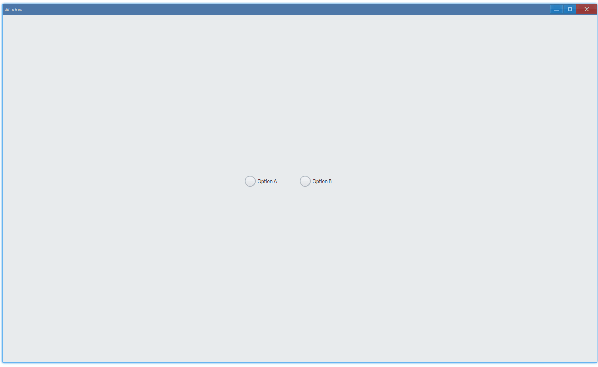

<!-- ## 简介 {#introduction}

TODO：以后添加对单选框的整体介绍。 -->

## 例子 {#examples}

### 基本用法 {#example-basic}

```ts {4-5,13}
import { Window, RadioBox } from 'ave-ui';

export function main(window: Window) {
    const radioBoxA = new RadioBox(window);
    radioBoxA.SetText('Option A');

    const radioBoxB = new RadioBox(window);
    radioBoxB.SetText('Option B');

    const handleCheck: Parameters<typeof RadioBox.OnCheck>[0] = (sender) => {
        console.log(`${sender.GetText()} onCheck`);
    };
    radioBoxA.OnCheck(handleCheck);
    radioBoxB.OnCheck(handleCheck);

    const container = getControlDemoContainer(window, 2);
    container.ControlAdd(radioBoxA).SetGrid(1, 1);
    container.ControlAdd(radioBoxB).SetGrid(2, 1);
    window.SetContent(container);
}
```

在这个例子中，我们演示了单选框的基本用法：在多个备选项中选择一个选项：



同时，控制台还有以下输出：

```bash
Option A onCheck
Option B onCheck
Option A onCheck
```

#### API {#api-basic}

```ts
export interface IRadioBox extends IControl {
    // 设置选项显示的文本
    SetText(text: string): RadioBox;
    GetText(): string;

    // 设置选项状态：选中状态/非选中状态
    SetValue(value: boolean): RadioBox;
    GetValue(): boolean;

    // 设置一个回调，它会在选项被选中时调用
    OnCheck(fn: (sender: RadioBox) => void): RadioBox;
}
```
