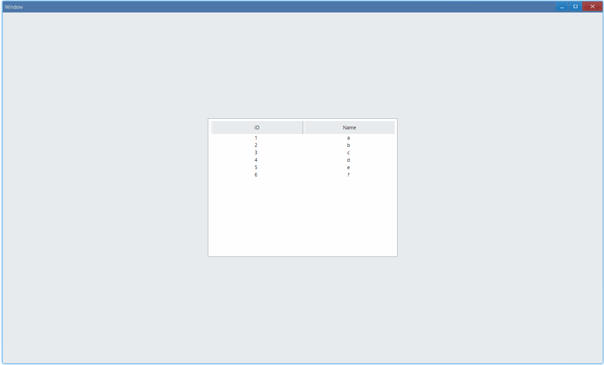

<!-- ## 简介 {#introduction}

TODO：以后添加对多格式列表框的整体介绍。 -->

## 例子 {#examples}

### 基本用法 {#example-basic}

```ts
import {
    Window,
    RichListBoxItemVirtual,
    Grid,
    RichListBox,
    HeaderItem,
    HeaderItemFormat,
    DpiSize,
} from 'ave-ui';

export function main(window: Window) {
    const richListBox = new RichListBox(window);

    // 创建列
    const headers = [
        {
            name: 'ID',
            align: HeaderItemFormat.Center,
            size: DpiSize.FromPixelScaled(200),
        },
        {
            name: 'Name',
            align: HeaderItemFormat.Center,
            size: DpiSize.FromPixelScaled(200),
        },
    ];
    headers.forEach((header) => {
        const headerItem = new HeaderItem(
            header.align,
            header.name,
            header.size,
        );
        richListBox.GetHeader().Add(headerItem);
    });

    // 设置数据
    const data = [
        { id: 1, name: 'a' },
        { id: 2, name: 'b' },
        { id: 3, name: 'c' },
        { id: 4, name: 'd' },
        { id: 5, name: 'e' },
        { id: 6, name: 'f' },
    ];
    richListBox.SetVirtual((sender, rowIndex, headerIndex) => {
        const item = new RichListBoxItemVirtual();
        const itemData = data[rowIndex];
        switch (headerIndex) {
            case 0:
                item.String = itemData.id.toString();
                break;
            case 1:
                item.String = itemData.name;
                break;
        }
        return item;
    });
    richListBox.ItemSetCount(data.length);

    // 处理选择事件
    richListBox.OnSelectionEnd((sender) => {
        const itemIndex = sender.ItemGetSelection();
        console.log(itemIndex);
    });

    //
    const container = getControlDemoContainer(window);
    container.ControlAdd(richListBox).SetGrid(1, 1);
    window.SetContent(container);
}

function getControlDemoContainer(window: Window, count = 1) {
    const container = new Grid(window);
    container.ColAddSlice(1);
    container.ColAddDpx(...Array.from<number>({ length: count }).fill(410));
    container.ColAddSlice(1);

    container.RowAddSlice(1);
    container.RowAddDpx(...Array.from<number>({ length: count }).fill(300));
    container.RowAddSlice(1);
    return container;
}
```

在这个例子中，我们演示了多格式列表框的基本用法：



同时，控制台有以下 log 打印：

```bash
0
2
4
```

可以看到，即使是简单地使用，代码也不少，不过它们的目的是很清晰的，首先是创建列表的大体结构：

```ts {17}
...
const headers = [
  {
	name: 'ID',
	align: HeaderItemFormat.Center,
	size: DpiSize.FromPixelScaled(200),
  },
  {
	name: 'Name',
	align: HeaderItemFormat.Center,
	size: DpiSize.FromPixelScaled(200),
  },
];

headers.forEach((header) => {
  const headerItem = new HeaderItem(header.align, header.name, header.size);
  richListBox.GetHeader().Add(headerItem);
});
...
```

这一部分代码给列表添加了 2 列，分别是`ID`和`Name`。列表的列是作为`HeaderItem`添加到列表的 header 中的。然后是设置列表的数据，也就是具体有哪些`ID`、`Name`：

```ts {11,25}
...
const data = [
  {id: 1, name: 'a'},
  {id: 2, name: 'b'},
  {id: 3, name: 'c'},
  {id: 4, name: 'd'},
  {id: 5, name: 'e'},
  {id: 6, name: 'f'},
];

richListBox.SetVirtual((sender, rowIndex /* 行的索引 */, headerIndex /* 列的索引 */) => {
  const item = new RichListBoxItemVirtual();
  const itemData = data[rowIndex];
  switch (headerIndex) {
	case 0:
	  item.String = itemData.id.toString();
	  break;
	case 1:
	  item.String = itemData.name;
	  break;
  }
  return item;
});

richListBox.ItemSetCount(data.length);
...
```

首先我们调用`SetVirtual`设置一个回调，用于确定列表中每项应该使用什么数据（注意，代码中的索引都是从 0 计数的）。然后调用`ItemSetCount`设置要展示的列表项个数。

最后为了响应选择事件，我们添加了一个回调，简单打印出选择的项的索引：

```ts
...
richListBox.OnSelectionEnd((sender) => {
  const itemIndex = sender.ItemGetSelection();
  console.log(itemIndex);
});
...
```

#### API {#api-basic}

添加`HeaderItem`：

```ts
export interface IRichListBox extends IControl {
    GetHeader(): Header;
}

export class Header extends (AveLib.UiHeader as IHeader) {}
export interface IHeader extends IControl {
    Add(item: HeaderItem): Header;
}
```

设置数据：

```ts
export interface IRichListBox extends IControl {
    // 设置每一项的数据（使用rowIndex和headerIndex定位）：RichListBoxItemVirtual实例
    SetVirtual(
        callback: (
            sender: RichListBox,
            rowIndex: number,
            headerIndex: number,
        ) => RichListBoxItemVirtual,
    ): RichListBox;

    // 设置要显示几行
    ItemSetCount(rowCount: number): RichListBox;
}

export class RichListBoxItemVirtual {
    // 列表项的文本内容
    String: string = '';
}
```

处理选择事件：

```ts
export interface IRichListBox extends IControl {
    OnSelectionEnd(callback: (sender: RichListBox) => void): RichListBox;
}
```
