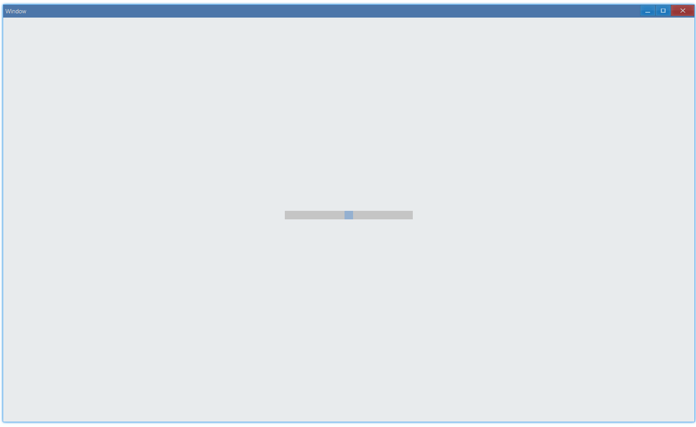

<!-- ## 简介 {#introduction}

TODO：以后添加对滚动条的整体介绍。 -->

## 例子 {#examples}

### 基本用法 {#example-basic}

```ts {5-8}
import { Window, ScrollBar } from 'ave-ui';

export function main(window: Window) {
    const scrollBar = new ScrollBar(window);
    scrollBar.SetMinimum(0).SetMaximum(100).SetValue(50).SetShrink(false);
    scrollBar.OnScrolling((sender: ScrollBar) => {
        console.log(sender.GetValue());
    });

    const container = getControlDemoContainer(window, 2, 120, 16);
    container.ControlAdd(scrollBar).SetGrid(1, 1, 2, 1);
    window.SetContent(container);
}
```

在这个例子中，我们演示了滚动条的基本用法：设置它的上下限（`0 ~ 100`）与当前值（`50`），拖动滑块，通过设置的回调获取变化的当前位置的值：



控制台将会有这样的输出：

```bash
50
49
49
48
48
47
...
36
36
35
35
34
34
```

另外，在这个例子中，我们设置了`shrink`为`false`，它的作用是使得滚动条大小不变，当设置为`true`时，效果如下：


#### API {#api-basic}

```ts
export interface IScrollBar extends IControl {
    SetMinimum(min: number): ScrollBar;
    GetMinimum(): number;

    SetMaximum(max: number): ScrollBar;
    GetMaximum(): number;

    SetValue(value: number): ScrollBar;
    GetValue(): number;

    SetShrink(shrink: boolean): ScrollBar;
    GetShrink(): boolean;

    OnScrolling(callback: (sender: ScrollBar) => void): ScrollBar;
}
```
