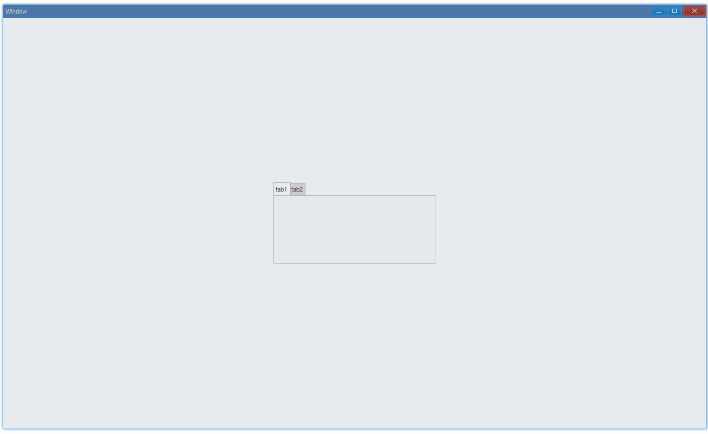

<!-- ## 简介 {#introduction}

TODO：以后添加对标签页的整体介绍。 -->

## 例子 {#examples}

### 基本用法 {#example-basic}

```ts {4,6,9}
import { Window, Tab, TabItem } from 'ave-ui';

export function main(window: Window) {
    const tab = new Tab(window);

    const tabItem1 = new TabItem();
    tabItem1.Id = 1;
    tabItem1.Text = 'tab1';
    tab.TabInsert(tabItem1);

    const tabItem2 = new TabItem();
    tabItem2.Id = 2;
    tabItem2.Text = 'tab2';
    tab.TabInsert(tabItem2);

    const container = getControlDemoContainer(window, 1, 300, 150);
    container.ControlAdd(tab).SetGrid(1, 1);
    window.SetContent(container);
}
```

在这个例子中，我们演示了标签页的基本用法：在 `tab1` 和 `tab2` 之间来回切换：



#### API {#api-basic}

```ts
export interface ITab extends IControl {
    // 新增一个tab，返回是否新增成功
    // 新增tab的信息由TabItem描述
    TabInsert(tabItem: TabItem): boolean;
}

export class TabItem {
    // 0是无效id，自己创建来用的话，不要设置为0
    Id: number = 0;
    Order: number = 0;
    Icon: IconCache = 0;
    // 标签上的文字内容
    Text: string = '';
    StackGroup: string = '';
    StackText: string = '';
    GroupId: number = 0;
    Misc: TabItemMisc = TabItemMisc.None;
    ButtonMask: number = 0;
    Color: Vec4 = new Vec4();
}
```

### 设置内容 {#set-content}

标签内可以设置任意控件，我们以 Grid 为例：

```ts {11-15}
import { Window, Tab, TabItem, Grid, Vec4 } from 'ave-ui';

export function main(window: Window) {
    const tab = new Tab(window);

    const tabItem1 = new TabItem();
    tabItem1.Id = 1;
    tabItem1.Text = 'tab1';
    tab.TabInsert(tabItem1);

    {
        const grid = new Grid(window);
        grid.SetBackColor(new Vec4(0, 146, 255, 255 * 0.75));
        tab.ContentSet(1, grid);
    }

    const tabItem2 = new TabItem();
    tabItem2.Id = 2;
    tabItem2.Text = 'tab2';
    tab.TabInsert(tabItem2);

    {
        const grid = new Grid(window);
        grid.SetBackColor(new Vec4(238, 39, 70, 255));
        tab.ContentSet(2, grid);
    }

    const container = getControlDemoContainer(window, 1, 300, 150);
    container.ControlAdd(tab).SetGrid(1, 1);
    window.SetContent(container);
}
```

`tab 1`中采用蓝色背景的 Grid，`tab 2`中使用红色的：


#### API {#api-set-content}

```ts
export interface ITab extends IControl {
    ContentSet(index: number, control: IControl);
}
```
