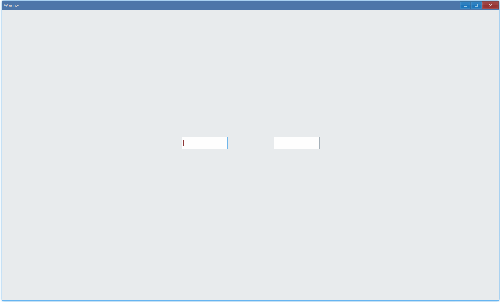

<!-- ## 简介 {#introduction}

TODO：以后添加对文本框的整体介绍。 -->

## 例子 {#examples}

### 基本用法 {#example-basic}

```ts {5}
import { Window, TextBox } from 'ave-ui';

export function main(window: Window) {
    const textBox = new TextBox(window);
    textBox.OnChange((sender, reason) => {
        console.log(reason);
        console.log(sender.GetText());
    });

    const container = getControlDemoContainer(window);
    container.ControlAdd(textBox).SetGrid(1, 1);
    window.SetContent(container);
}
```

在这个例子中，我们演示了使用文本框进行输入：


同时，控制台有以下 log 打印：

```bash
0
a
0
ab
0
abc
0
abc1
0
abc12
0
abc123
```

这是因为`textBox.OnChange`，我们设置了一个回调，当文本框中的内容发生改变时，我们可以打印出改变的原因，以及当前文本框内容。

#### API {#api-text-box-basic}

<!-- // TODO: 添加其它改变原因的例子和文档 -->

```ts
export enum TextBoxChangeReason {
    Input, // 0: 输入
    UpDown,
    Reset,
    Spin,
    SpinCommit,
    SpinCancel,
}

export class TextBox {
    SetText(text: string): TextBox;
    GetText(): string;

    OnChange(
        callback: (sender: TextBox, reason: TextBoxChangeReason) => void,
    ): TextBox;
}
```

### 输入法 {#example-use-ime}

默认情况下，文本框中只能输入英文字符和数字，如果想使用输入法来输入中文或其它字符，需要设置 IME(input method)：

```ts {9,15}
import { Window, TextBox } from 'ave-ui';

export function main(window: Window) {
    const container = getControlDemoContainer(window, 3);

    {
        // 默认情况下是禁用输入法的
        const textBox = new TextBox(window);
        console.log(textBox.GetIme()); // 预期是false
        container.ControlAdd(textBox).SetGrid(1, 1);
    }

    {
        const textBox = new TextBox(window);
        textBox.SetIme(true);
        container.ControlAdd(textBox).SetGrid(3, 1);
    }

    window.SetContent(container);
}
```

在这个例子中，我们对比演示了在文本框中使用输入法进行输入，同样是敲击键盘“z”，在禁用了输入法的文本框中，我们只能输入字符“z”，作为对比，调用`SetIme`启用输入法的情况下，我们输入了中文字符“在”：



#### API {#api-text-box-ime}

```ts
export class TextBox {
    SetIme(useIme: boolean): TextBox;
    GetIme(): boolean;
}
```
