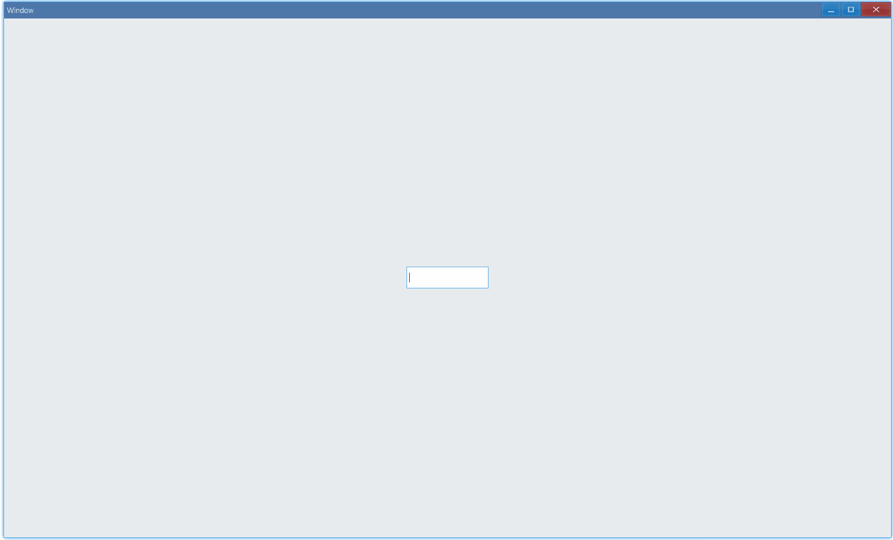

<!-- ## 简介 {#introduction}

TODO：以后添加对文本框的整体介绍。 -->

## 例子 {#examples}

### 基本用法 {#example-basic}

```tsx {6-9}
export function App() {
    return (
        <Window>
            <DemoLayout>
                <TextBox
                    onChange={(sender, reason) => {
                        console.log(reason);
                        console.log(sender.GetText());
                    }}
                ></TextBox>
            </DemoLayout>
        </Window>
    );
}
```

在这个例子中，我们演示了使用文本框进行输入：



同时，控制台有以下 log 打印：

```bash
0
a
0
ab
0
abc
0
abc1
0
abc12
0
abc123
```

这是因为`onChange`，我们设置了一个回调，当文本框中的内容发生改变时，我们可以打印出改变的原因，以及当前文本框内容。

#### API {#api-text-box-basic}

<!-- // TODO: 添加其它改变原因的例子和文档 -->

```ts
export interface ITextBoxComponentProps extends IComponentProps {
    onChange?: Parameters<ITextBox['OnChange']>[0];
}
```

### 输入法 {#example-use-ime}

默认情况下，文本框中只能输入英文字符和数字，如果想使用输入法来输入中文或其它字符，需要设置 IME(input method)：

```tsx {5-6}
export function App() {
	return (
		<Window>
			<DemoLayout>
				<TextBox></TextBox>
				<TextBox ime></TextBox>
			</DemoLayout>
		</Window>
	);
}

function DemoLayout(props: { children?: any[] }) {
	const demoLayout = {
		columns: `1 120dpx 120dpx 120dpx 1`,
		rows: `1 32dpx 1`,
		areas: {
			left: { row: 1, column: 1 },
			right: { row: 1, column: 3 },
		},
	};
	const [left, right] = props.children;
	return (
		<Grid style={{ layout: demoLayout }}>
			<Grid style={{ area: demoLayout.areas.left }}>{left}</Grid>
			<Grid style={{ area: demoLayout.areas.right }}>{right}</Grid>
		</Grid>
	);
}
```

在这个例子中，我们对比演示了在文本框中使用输入法进行输入，同样是敲击键盘“z”，在禁用了输入法的文本框中，我们只能输入字符“z”，作为对比，设置`ime`启用输入法的情况下，我们输入了中文字符“在”：


#### API {#api-text-box-ime}

```ts
export interface ITextBoxComponentProps extends IComponentProps {
  ime?: boolean;
}
```
